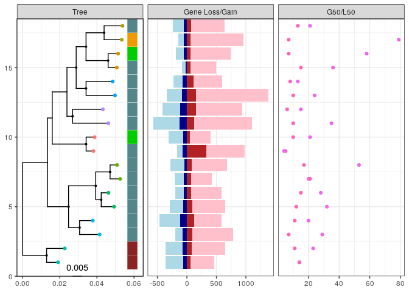

Figures and Tables
================

``` r
outdir='figures_tables'
system('rm -r figures_tables')
dir.create(outdir)
```

### Figure 1, tree plus cols A and B

``` r
species = 'Bacteroides_xylanisolvens'
dir = paste0('results/pangenome/',species)
tree_file = file.path(dir,paste0(species,'.tre'))
tree = read.tree(tree_file)

#drop outgroups from tree
metadata_file = file.path(dir,'metadata.txt')
metadata = read_tsv(metadata_file,col_types = cols())
outgroup = metadata %>% filter(taxonomy_Species!=species) %>% pull(isolate)
tree = drop.tip(tree,outgroup) 

#add PIC to tree
PI_comps_file = file.path(dir,'gene_gain_loss/PI_comps.txt')
PI_comps = read_tsv(PI_comps_file)
PI_comps_long = PI_comps %>% 
    mutate(compNum = 1:nrow(PI_comps)) %>% 
    tidyr::pivot_longer(cols=c(iso1,iso2), names_to='1vs2') %>%
    dplyr::rename('iso'='value') %>%
    select(iso,everything())
fig1_v1 <- ggtree(tree) %<+% PI_comps_long + 
    geom_tippoint(aes(subset=(label%in%PI_comps_long$iso),
                      color = factor(compNum))) +
    geom_nodepoint(aes(subset = suppressWarnings(as.numeric(label)) > 90),size=.75) + #add bootstrap 
    geom_treescale() #add scale

#add clade labels
cladeA_MCRA <- ape::getMRCA(tree,metadata$isolate[metadata$clade=='cladeA'])
cladeB_MCRA <- ape::getMRCA(tree,metadata$isolate[metadata$clade=='cladeB'])
cladeC_MCRA <- ape::getMRCA(tree,metadata$isolate[metadata$clade=='cladeC'])
mixedhostNode <- ape::getMRCA(tree,metadata$isolate[metadata$captive_clade=='mixedhost'])
gorilla1Node <- ape::getMRCA(tree,metadata$isolate[metadata$captive_clade=='gorilla1'])
gorilla2Node <- ape::getMRCA(tree,metadata$isolate[metadata$captive_clade=='gorilla2'])
fig1_v2 = fig1_v1 + #add clade labels
   geom_cladelabel(node=cladeA_MCRA,label="cladeA",offset = .005)+
   geom_cladelabel(node=cladeB_MCRA,label="cladeB",offset = .005)+
   geom_cladelabel(node=cladeC_MCRA,label="cladeC",offset = .005)+
   geom_cladelabel(node=mixedhostNode,label="mixedhost",offset = .01) +
   geom_cladelabel(node=gorilla1Node,label="gorilla1",offset = .01)+ 
   geom_cladelabel(node=gorilla2Node,label="gorilla2",offset = .01) +
   geom_tippoint(aes(subset=(label=='GCA.000210075.1.ASM21007v1')),color='red') 

#column A
HOST_table <- metadata %>% 
  select(isolate,host) %>%
  column_to_rownames(var='isolate') 
offset_val1 = .022

get_color_palette <- function(tips,metadata) {
  metadata <- metadata %>% filter(isolate %in% tips)
  vec <- sort(unique(metadata$host))
  return(recode(vec,
                          'human'='cadetblue4',
                          'rumen' = 'brown4',
                          'bonobo'='red2',
                          'chimpanzee'='orange2',
                          'orangutan'='purple4',
                          'gorilla'='green3',
                          'chicken'='tan',
                          'mouse' = 'yellow2',
                          'pig' = 'pink',
                          'missing'='white'))}

fig1_v3 <- gheatmap(fig1_v2 + ylim(-10,NA),colnames = FALSE,offset=.05,
    HOST_table,width=.1,colnames_angle=90,hjust=1)  + 
    scale_fill_manual(values=get_color_palette(fig1_v2$data$label,metadata))
#column B
predicted.genes = metadata %>% select(isolate,predicted.genes) %>%
  mutate(predicted.genes=as.numeric(predicted.genes)) %>%
  column_to_rownames(var='isolate')
fig1_v3 <- fig1_v3 + new_scale_fill()
fig1_v4 <- gheatmap(fig1_v3,predicted.genes,
                               colnames_angle=90,hjust=1,width=.1,offset = .06) + 
    scale_fill_viridis_c(direction = -1, option="D")
fig1_v4 <- fig1_v4 + new_scale_fill()
```

### Table S3 and Table S4

``` r
#Table S3: Functional groups enriched in all three captive ape clade since their mcra with closest human-associated strain 

copyNumTable = read_tsv(file.path(dir,'gene_gain_loss/PIC_gene_gain_loss_summary/Bacteroides_xylanisolvens_window5_gp2_copynum.txt'))
annotation = read_tsv(file= file.path(dir,'Bxy_roary_nosplitparalogs_annotation.txt'),
                      col_types = cols())

copyNumTable_annotation = copyNumTable  %>% #add annotation info to copy number table 
  left_join(select(annotation,Gene,func_group,func_annot,Annotation),by='Gene')
copyNum_funcGroup = copyNumTable_annotation %>% #
  group_by(func_group,func_annot,iso1,iso2) %>% 
  summarise(copyChangeMrca_iso1 = sum(copynum_iso1)-sum(mrca),
            copyChangeMrca_iso2 = sum(copynum_iso2)-sum(mrca)) %>% 
  as.data.frame()
iso1 = copyNum_funcGroup %>% dplyr::select(func_group,func_annot,iso1,copyChangeMrca_iso1) %>% 
  dplyr::rename(isolate = iso1,copyChangeMrca = copyChangeMrca_iso1)
iso2 = copyNum_funcGroup %>% dplyr::select(func_group,func_annot,iso2,copyChangeMrca_iso2) %>%
  dplyr::rename(isolate = iso2,copyChangeMrca = copyChangeMrca_iso2)
TableS3 = rbind(iso1,iso2) %>% 
  as.data.frame() %>% 
  pivot_wider(names_from = isolate, values_from = copyChangeMrca) %>% 
  select(func_group,func_annot,P21.11A,P14.E4,P21.6E) %>% 
  filter(P21.11A>0,P14.E4>0,P21.6E>0) %>%
  as.data.frame() %>% 
  filter(func_group != 'NA_NA_NA') %>% 
  mutate(total = as.numeric(P21.11A+P14.E4+P21.6E))%>% 
  dplyr::rename(gorilla1_P21.11A = P21.11A,
                gorilla2_P21.6E = P21.6E,
                mixedhost_P14.E4 = P14.E4) %>%
  arrange(desc(total))

head(TableS3)
```

    ##                      func_group
    ## 1      COG3119@2|Bacteria_NA_NA
    ## 2 COG3250@2|Bacteria_K01190_GH2
    ## 3     COG0438@2|Bacteria_NA_GT4
    ## 4      COG0582@2|Bacteria_NA_NA
    ## 5        2ZA7H@2|Bacteria_NA_NA
    ## 6  COG1435@2|Bacteria_K21572_NA
    ##                                                                                                                                                                                                                                                                                                                                                                                                                                                                                                                                                                                                                                                                                                                                                                                                                                                                                                                                                                                                                                                    func_annot
    ## 1                                                                                                                                                                                                                                                                                                                                                                                                                                                                                                                                                                                                                                                                                                                                                                               N-acetylgalactosamine-6-O-sulfatase,Endo-4-O-sulfatase,Delta 4,5-hexuronate-2-O-sulfatase,Alkaline phosphatase PafA,hypothetical protein,N-acetylglucosamine-6-O-sulfatase,Arylsulfatase,Ulvan-active sulfatase,Bifunctional sulfatase/alpha-L-rhamnosidase,Choline-sulfatase
    ## 2                                                                                                                                                                                                                                                                                                                                                                                                                                                                                                                                                                                                                                                                                                                                                                                                                                                                                                                                           Beta-galactosidase,Evolved beta-galactosidase subunit alpha,Beta-galactosidase BoGH2A,Putative beta-glucuronidase
    ## 3 Alpha-D-kanosaminyltransferase,D-inositol-3-phosphate glycosyltransferase,Putative teichuronic acid biosynthesis glycosyltransferase TuaC,N,N'-diacetylbacillosaminyl-diphospho-undecaprenol alpha-1,3-N-acetylgalactosaminyltransferase,GDP-mannose-dependent alpha-(1-6)-phosphatidylinositol monomannoside mannosyltransferase,Glycogen synthase,O-antigen biosynthesis glycosyltransferase WbnH,hypothetical protein,UDP-N-acetylglucosamine--peptide N-acetylglucosaminyltransferase GtfA subunit,Putative glycosyltransferase EpsF,Alpha-maltose-1-phosphate synthase,N-acetylgalactosamine-N,N'-diacetylbacillosaminyl-diphospho-undecaprenol 4-alpha-N-acetylgalactosaminyltransferase,GalNAc-alpha-(1->4)-GalNAc-alpha-(1->3)-diNAcBac-PP-undecaprenol alpha-1,4-N-acetyl-D-galactosaminyltransferase,N-acetyl-alpha-D-glucosaminyl L-malate synthase,Putative glycosyltransferase EpsD,Spore coat protein SA,D-inositol 3-phosphate glycosyltransferase,Alpha-monoglucosyldiacylglycerol synthase,GDP-mannose-dependent alpha-mannosyltransferase
    ## 4                                                                                                                                                                                                                                                                                                                                                                                                                                                                                                                                                                                                                                                                                                                                                                                                                                                                                                                                                                                    hypothetical protein,Tyrosine recombinase XerC,Tyrosine recombinase XerD
    ## 5                                                                                                                                                                                                                                                                                                                                                                                                                                                                                                                                                                                                                                                                                                                                                                                                                                                                                                                                                                                                                                        hypothetical protein
    ## 6                                                                                                                                                                                                                                                                                                                                                                                                                                                                                                                                                                                                                                                                                                                                                                                                                                                                                                                                                     hypothetical protein,SusD-like protein P25,SusD-like protein P2,SusD-like protein,SusD-like protein P38
    ##   gorilla1_P21.11A mixedhost_P14.E4 gorilla2_P21.6E total
    ## 1                9               24               8    41
    ## 2                5               13               4    22
    ## 3                4               11               2    17
    ## 4                2                9               4    15
    ## 5                4                7               2    13
    ## 6                1                7               5    13

``` r
write_tsv(TableS3,file.path(outdir,'TableS3.txt'))

#Table S4: break up func group COG3119 to see which sulfatase Annotations are convergently gained
sulfatase_Annotation = copyNumTable_annotation  %>% #
  filter(str_detect(func_group,'COG3119')) %>%
  group_by(Annotation,iso1,iso2) %>% 
  summarise(copyChangeMrca_iso1 = sum(copynum_iso1)-sum(mrca),
            copyChangeMrca_iso2 = sum(copynum_iso2)-sum(mrca)) %>% 
  as.data.frame()
iso1 = sulfatase_Annotation %>% dplyr::select(Annotation,iso1,copyChangeMrca_iso1) %>% 
  dplyr::rename(isolate = iso1,copyChangeMrca = copyChangeMrca_iso1)
iso2 = sulfatase_Annotation %>% dplyr::select(Annotation,iso2,copyChangeMrca_iso2) %>%
  dplyr::rename(isolate = iso2,copyChangeMrca = copyChangeMrca_iso2)
TableS4 = rbind(iso1,iso2) %>% 
  as.data.frame() %>% 
  pivot_wider(names_from = isolate, values_from = copyChangeMrca) %>% 
  select(Annotation,P21.11A,P14.E4,P21.6E) %>% 
  filter(P21.11A>0,P14.E4>0,P21.6E>0) %>%
  as.data.frame() %>% 
  mutate(total = P21.11A+P14.E4+P21.6E) %>% 
  dplyr::rename(gorilla1_P21.11A = P21.11A,
                gorilla2_P21.6E = P21.6E,
                mixedhost_P14.E4 = P14.E4)
print(TableS4)
```

    ##                            Annotation gorilla1_P21.11A mixedhost_P14.E4
    ## 1                       Arylsulfatase                3                5
    ## 2 N-acetylgalactosamine-6-O-sulfatase                2                3
    ## 3   N-acetylglucosamine-6-O-sulfatase                2                4
    ## 4              Ulvan-active sulfatase                6                7
    ##   gorilla2_P21.6E total
    ## 1               2    10
    ## 2               2     7
    ## 3               2     8
    ## 4               5    18

``` r
write_tsv(TableS4,file.path(outdir,'TableS4.txt'))
```

### Figure 1 columns C & D

Visualize function groups and sulfatase annotations convergently
enriched

``` r
#inputs: annotation,gene table
pres_abs <- read_csv(file.path(dir,'roary_nosplitparalogs/gene_presence_absence.csv'),col_types = cols())
isblank <- function(x) {as.numeric(str_count(x, pattern = "_"))}
gene_table <- pres_abs %>% 
      select(Gene,all_of(metadata$isolate))  %>%
      mutate_at(vars(-Gene),isblank) %>%
      column_to_rownames(var = 'Gene') %>% 
      as.matrix()
gene_table[is.na(gene_table)] <- 0
gene_table <- as.data.frame(gene_table) %>% rownames_to_column(var='Gene')

get_func_copynumber_table <- function(list_of_func){
  #given list of function groups returns table with gene copy numbers for each isolate
  func_copynumber_table  <- annotation %>% 
    left_join(gene_table,by='Gene') %>%
    filter(func_group %in% list_of_func) %>%
    pivot_longer(cols=metadata$isolate,
               names_to='isolate',values_to='present') %>%
    select(func_group,isolate,present) %>%
    group_by(func_group,isolate) %>%
    summarise(count = sum(present)) %>%
    pivot_wider(names_from = func_group, values_from = count) %>% 
    column_to_rownames(var='isolate')
    func_copynumber_table[func_copynumber_table==0] <- NA
  return(func_copynumber_table)
}  

mucin <- get_func_copynumber_table(c(
                                     'COG3119@2|Bacteria_K01565_NA', 
                                     'COG1649@2|Bacteria_K05970_NA', 
                                     'COG5434@2|Bacteria_NA_GH110' , 
                                     'COG3250@2|Bacteria_K01190_GH2' 
                                   )) 

mucin <- mucin %>% as.data.frame() %>%
                                    dplyr::rename(
                                           'N-sulfoglucosamine sulfohydrolase(K01565)'='COG3119@2|Bacteria_K01565_NA',
                                           'sialate O-acetylesterase(K05970)'='COG1649@2|Bacteria_K05970_NA',
                                           'alpha-1,3-galactosidase(GH110)'='COG5434@2|Bacteria_NA_GH110',
                                           'beta-galactosidase(K01190)'='COG3250@2|Bacteria_K01190_GH2')

susCD <- get_func_copynumber_table(c(
                                     'COG1435@2|Bacteria_K21572_NA', 
                                     'COG4206@2|Bacteria_K21573_NA'
                                   )) 
susCD<- susCD %>% as.data.frame() %>%
                                    dplyr::rename('SusD family protein(K21572)' = 'COG1435@2|Bacteria_K21572_NA',
                                                  'SusC family protein(K21573)' = 'COG4206@2|Bacteria_K21573_NA')
                                      
carrageenen <- get_func_copynumber_table(c('COG1874@2|Bacteria_NA_GH167','NA_NA_GH167',
                                           '33PQM@2|Bacteria_NA_GH150','COG5434@2|Bacteria_NA_GH82')) 
carrageenen <- carrageenen %>% as.data.frame() %>%
                                        dplyr::rename('Lambda-carrageenase(GH150)'='33PQM@2|Bacteria_NA_GH150',
                                               'Iota-carrageenase(GH82)'='COG5434@2|Bacteria_NA_GH82',
                                               'GH167a'='COG1874@2|Bacteria_NA_GH167',
                                               'GH167b'='NA_NA_GH167') %>%
                                        mutate(beta_carrageenase=GH167a+GH167b) %>%
                                        dplyr::rename('beta_carrageenase(GH167)'='beta_carrageenase') %>%
                                        select(-GH167a,-GH167b)

#get gene counts for each func group for all isolates 
get_annot_copynumber_table <- function(list_of_annot){
  #given list of function groups returns table with gene copy numbers for each isolate
  annot_copynumber_table  <- annotation %>% 
    left_join(gene_table,by='Gene') %>%
    filter(Annotation %in% list_of_annot) %>%
    pivot_longer(cols=metadata$isolate,
               names_to='isolate',values_to='present') %>%
    select(Annotation,isolate,present) %>%
    group_by(Annotation,isolate) %>%
    summarise(count = sum(present)) %>%
    pivot_wider(names_from = Annotation, values_from = count) %>% 
    column_to_rownames(var='isolate')
    annot_copynumber_table[annot_copynumber_table==0] <- NA
  return(annot_copynumber_table)
}  
sulfatase = get_annot_copynumber_table(c('N-acetylgalactosamine-6-O-sulfatase',
                                         'N-acetylglucosamine-6-O-sulfatase',
                                         'Ulvan-active sulfatase','Arylsulfatase')) 
sulfatase = sulfatase %>% as.data.frame() %>%
                  dplyr::rename('N-acetylgalactosamine-6-O-sulfatase(K01132)'='N-acetylgalactosamine-6-O-sulfatase',
                         'N-acetylglucosamine-6-O-sulfatase(K01137)'='N-acetylglucosamine-6-O-sulfatase'
                         )
sulfa_mucin = cbind(susCD,sulfatase,mucin)   
sulfa_mucin = sulfa_mucin[c(
              'SusC family protein(K21573)',
              'SusD family protein(K21572)',
              "beta-galactosidase(K01190)",
              "N-acetylgalactosamine-6-O-sulfatase(K01132)",
              "N-acetylglucosamine-6-O-sulfatase(K01137)",
              'Arylsulfatase',
              'Ulvan-active sulfatase',
              "sialate O-acetylesterase(K05970)",
              "alpha-1,3-galactosidase(GH110)"
              )]
fig1_v5 <- gheatmap(fig1_v4,sulfa_mucin,colnames_angle=90,hjust=1,offset=.07,width=.9) + 
    scale_fill_viridis_c(direction = -1, option="B")
fig1_v5  <- fig1_v5 + new_scale_fill()
(fig1_v6 <- gheatmap(fig1_v5,carrageenen,colnames_angle=90,hjust=1,offset=.13,width=.3)+ 
    scale_fill_viridis_c(option="D",direction = -1))
```

<!-- -->

``` r
ggsave(fig1_v6,file = file.path(outdir,'Figure1_long.pdf'),width = 10, height=12)
ggsave(fig1_v6,file = file.path(outdir,'Figure1_short.pdf'),width = 10, height=6)
```

### Figure S1, S2, S3

``` r
Fig1_sup <- function(species, offset_val1, offset_val2) {
dir = paste0('results/pangenome/',species)

#read in tree
tree_file = file.path(dir,paste0(species,'.tre'))
tree = read.tree(tree_file)

#drop outgroups from tree
metadata_file = file.path(dir,'metadata.txt')
metadata = read_tsv(metadata_file,col_types = cols())
outgroup = metadata %>% filter(taxonomy_Species!=species) %>% pull(isolate)
tree = drop.tip(tree,outgroup) 

#add PIC to tree
PI_comps_file = file.path(dir,'gene_gain_loss/PI_comps.txt')
PI_comps = read_tsv(PI_comps_file)
PI_comps_long = PI_comps %>% 
    mutate(compNum = 1:nrow(PI_comps)) %>% 
    tidyr::pivot_longer(cols=c(iso1,iso2), names_to='1vs2') %>%
    dplyr::rename('iso'='value') %>%
    select(iso,everything())
fig1_v1 <- ggtree(tree) %<+% PI_comps_long + 
    geom_tippoint(aes(subset=(label%in%PI_comps_long$iso),
                      color = factor(compNum))) +
    geom_nodepoint(aes(subset = suppressWarnings(as.numeric(label)) > 90),size=.75) + #add bootstrap 
    geom_treescale() #add scale

#column A
HOST_table <- metadata %>% 
  select(isolate,host) %>%
  column_to_rownames(var='isolate') 

fig1_v2 <- gheatmap(fig1_v1 + ylim(-10,NA),colnames = FALSE,offset = offset_val1,
    HOST_table,width=.1,colnames_angle=90,hjust=1)  + 
    scale_fill_manual(values=get_color_palette(fig1_v1$data$label,metadata))

#column B
predicted.genes = metadata %>% select(isolate,predicted.genes) %>%
  mutate(predicted.genes=as.numeric(predicted.genes)) %>%
  column_to_rownames(var='isolate')
fig1_v2 <- fig1_v2 + new_scale_fill()
(fig1_v3 <- gheatmap(fig1_v2,predicted.genes,
                               colnames_angle=90,hjust=1,width=.1,offset = offset_val2) + 
    scale_fill_viridis_c(direction = -1, option="D"))
return(fig1_v3)
}

(Fig1_Bov = Fig1_sup('Bacteroides_ovatus',0,.012))
```

<!-- -->

``` r
ggsave(Fig1_Bov,file=file.path(outdir,'FigureSX_BovTree.pdf'))
(Fig1_Bfr = Fig1_sup('Bacteroides_fragilis',0,.001))
```

<!-- -->

``` r
ggsave(Fig1_Bfr,file=file.path(outdir,'FigureSX_BfrTree.pdf'))
(Fig1_Bth = Fig1_sup('Bacteroides_thetaiotaomicron',0,.004))
```

<!-- -->

``` r
ggsave(Fig1_Bth,file=file.path(outdir,'FigureSX_BthTree.pdf'))
```

### Figure 2A

``` r
Bt_metadata = 
  read_tsv('results/pangenome/Bacteroides_xylanisolvens/metadata.txt',col_types = cols()) %>%
  sjmisc::add_rows(read_tsv('results/pangenome/Bacteroides_ovatus/metadata.txt',col_types = cols())) %>%
  sjmisc::add_rows(read_tsv('results/pangenome/Bacteroides_fragilis/metadata.txt',col_types = cols())) %>%
  sjmisc::add_rows(read_tsv('results/pangenome/Bacteroides_thetaiotaomicron/metadata.txt',col_types = cols())) 

Bt_rep = 
  read_tsv('results/pangenome/Bacteroides_xylanisolvens/gene_gain_loss/pw_50strain.txt',col_types = cols()) %>%
  sjmisc::add_rows(read_tsv('results/pangenome/Bacteroides_ovatus/gene_gain_loss/pw_50strain.txt',col_types = cols())) %>%
  sjmisc::add_rows(read_tsv('results/pangenome/Bacteroides_fragilis/gene_gain_loss/pw_50strain.txt',col_types = cols())) %>%
  sjmisc::add_rows(read_tsv('results/pangenome/Bacteroides_thetaiotaomicron/gene_gain_loss/pw_50strain.txt',col_types = cols())) 

Bt_rep_metadata = Bt_metadata %>% 
  filter(isolate %in% c(Bt_rep$iso1,Bt_rep$iso2))

colors = recode(sort(unique(Bt_rep_metadata$host)),
                          'human'='cadetblue4',
                          'rumen' = 'brown4',
                          'bonobo'='red2',
                          'chimpanzee'='orange2',
                          'orangutan'='purple4',
                          'gorilla'='green3',
                          'chicken'='tan',
                          'mouse' = 'yellow2',
                          'pig' = 'pink',
                          'missing'='white')

Figure2A = Bt_metadata %>% 
  filter(isolate %in% c(Bt_rep$iso1,Bt_rep$iso2)) %>% 
  ggplot(aes(x =taxonomy_Species,y=predicted.genes,fill=host)) +
  geom_dotplot(binaxis = "y", stackdir = "centerwhole") +
  theme_bw() +
  scale_fill_manual(values=colors)

Bt_rep = Bt_rep %>% group_by(taxonomy_Species.iso1) %>% 
  mutate(norm_tree_dist = (tree_dist-mean(tree_dist)) /sd(tree_dist)) %>%
  filter(norm_tree_dist<1,norm_tree_dist>-1)

#compare models with quadratic and linear relationship with tree dist
(m1 = summary(lm_robust(bray_curtis ~ I(norm_tree_dist^2) + norm_tree_dist + taxonomy_Species.iso1 + 
                    norm_tree_dist * taxonomy_Species.iso1, data = Bt_rep)))
```

    ## 
    ## Call:
    ## lm_robust(formula = bray_curtis ~ I(norm_tree_dist^2) + norm_tree_dist + 
    ##     taxonomy_Species.iso1 + norm_tree_dist * taxonomy_Species.iso1, 
    ##     data = Bt_rep)
    ## 
    ## Standard error type:  HC2 
    ## 
    ## Coefficients:
    ##                                                                   Estimate
    ## (Intercept)                                                       0.212668
    ## I(norm_tree_dist^2)                                              -0.001132
    ## norm_tree_dist                                                    0.013265
    ## taxonomy_Species.iso1Bacteroides_ovatus                           0.082961
    ## taxonomy_Species.iso1Bacteroides_thetaiotaomicron                 0.045791
    ## taxonomy_Species.iso1Bacteroides_xylanisolvens                    0.086627
    ## norm_tree_dist:taxonomy_Species.iso1Bacteroides_ovatus            0.019303
    ## norm_tree_dist:taxonomy_Species.iso1Bacteroides_thetaiotaomicron  0.007200
    ## norm_tree_dist:taxonomy_Species.iso1Bacteroides_xylanisolvens     0.034454
    ##                                                                  Std. Error
    ## (Intercept)                                                        0.001342
    ## I(norm_tree_dist^2)                                                0.002063
    ## norm_tree_dist                                                     0.001847
    ## taxonomy_Species.iso1Bacteroides_ovatus                            0.001553
    ## taxonomy_Species.iso1Bacteroides_thetaiotaomicron                  0.001625
    ## taxonomy_Species.iso1Bacteroides_xylanisolvens                     0.001668
    ## norm_tree_dist:taxonomy_Species.iso1Bacteroides_ovatus             0.002806
    ## norm_tree_dist:taxonomy_Species.iso1Bacteroides_thetaiotaomicron   0.002806
    ## norm_tree_dist:taxonomy_Species.iso1Bacteroides_xylanisolvens      0.002885
    ##                                                                   t value
    ## (Intercept)                                                      158.4854
    ## I(norm_tree_dist^2)                                               -0.5488
    ## norm_tree_dist                                                     7.1808
    ## taxonomy_Species.iso1Bacteroides_ovatus                           53.4177
    ## taxonomy_Species.iso1Bacteroides_thetaiotaomicron                 28.1830
    ## taxonomy_Species.iso1Bacteroides_xylanisolvens                    51.9269
    ## norm_tree_dist:taxonomy_Species.iso1Bacteroides_ovatus             6.8802
    ## norm_tree_dist:taxonomy_Species.iso1Bacteroides_thetaiotaomicron   2.5657
    ## norm_tree_dist:taxonomy_Species.iso1Bacteroides_xylanisolvens     11.9412
    ##                                                                    Pr(>|t|)
    ## (Intercept)                                                       0.000e+00
    ## I(norm_tree_dist^2)                                               5.832e-01
    ## norm_tree_dist                                                    8.438e-13
    ## taxonomy_Species.iso1Bacteroides_ovatus                           0.000e+00
    ## taxonomy_Species.iso1Bacteroides_thetaiotaomicron                1.401e-157
    ## taxonomy_Species.iso1Bacteroides_xylanisolvens                    0.000e+00
    ## norm_tree_dist:taxonomy_Species.iso1Bacteroides_ovatus            7.060e-12
    ## norm_tree_dist:taxonomy_Species.iso1Bacteroides_thetaiotaomicron  1.034e-02
    ## norm_tree_dist:taxonomy_Species.iso1Bacteroides_xylanisolvens     3.055e-32
    ##                                                                   CI Lower
    ## (Intercept)                                                       0.210037
    ## I(norm_tree_dist^2)                                              -0.005178
    ## norm_tree_dist                                                    0.009643
    ## taxonomy_Species.iso1Bacteroides_ovatus                           0.079916
    ## taxonomy_Species.iso1Bacteroides_thetaiotaomicron                 0.042606
    ## taxonomy_Species.iso1Bacteroides_xylanisolvens                    0.083356
    ## norm_tree_dist:taxonomy_Species.iso1Bacteroides_ovatus            0.013802
    ## norm_tree_dist:taxonomy_Species.iso1Bacteroides_thetaiotaomicron  0.001698
    ## norm_tree_dist:taxonomy_Species.iso1Bacteroides_xylanisolvens     0.028797
    ##                                                                  CI Upper   DF
    ## (Intercept)                                                      0.215299 3479
    ## I(norm_tree_dist^2)                                              0.002913 3479
    ## norm_tree_dist                                                   0.016887 3479
    ## taxonomy_Species.iso1Bacteroides_ovatus                          0.086006 3479
    ## taxonomy_Species.iso1Bacteroides_thetaiotaomicron                0.048977 3479
    ## taxonomy_Species.iso1Bacteroides_xylanisolvens                   0.089897 3479
    ## norm_tree_dist:taxonomy_Species.iso1Bacteroides_ovatus           0.024804 3479
    ## norm_tree_dist:taxonomy_Species.iso1Bacteroides_thetaiotaomicron 0.012702 3479
    ## norm_tree_dist:taxonomy_Species.iso1Bacteroides_xylanisolvens    0.040111 3479
    ## 
    ## Multiple R-squared:  0.6695 ,    Adjusted R-squared:  0.6688 
    ## F-statistic: 989.6 on 8 and 3479 DF,  p-value: < 2.2e-16

``` r
#use linear because quad tree_dist term large, 
(m2 = summary(lm_robust(bray_curtis ~  norm_tree_dist + taxonomy_Species.iso1 + norm_tree_dist * taxonomy_Species.iso1, 
                       data = Bt_rep)))
```

    ## 
    ## Call:
    ## lm_robust(formula = bray_curtis ~ norm_tree_dist + taxonomy_Species.iso1 + 
    ##     norm_tree_dist * taxonomy_Species.iso1, data = Bt_rep)
    ## 
    ## Standard error type:  HC2 
    ## 
    ## Coefficients:
    ##                                                                  Estimate
    ## (Intercept)                                                      0.212300
    ## norm_tree_dist                                                   0.013433
    ## taxonomy_Species.iso1Bacteroides_ovatus                          0.083064
    ## taxonomy_Species.iso1Bacteroides_thetaiotaomicron                0.045835
    ## taxonomy_Species.iso1Bacteroides_xylanisolvens                   0.086652
    ## norm_tree_dist:taxonomy_Species.iso1Bacteroides_ovatus           0.018823
    ## norm_tree_dist:taxonomy_Species.iso1Bacteroides_thetaiotaomicron 0.007066
    ## norm_tree_dist:taxonomy_Species.iso1Bacteroides_xylanisolvens    0.034074
    ##                                                                  Std. Error
    ## (Intercept)                                                        0.001137
    ## norm_tree_dist                                                     0.001833
    ## taxonomy_Species.iso1Bacteroides_ovatus                            0.001534
    ## taxonomy_Species.iso1Bacteroides_thetaiotaomicron                  0.001622
    ## taxonomy_Species.iso1Bacteroides_xylanisolvens                     0.001665
    ## norm_tree_dist:taxonomy_Species.iso1Bacteroides_ovatus             0.002630
    ## norm_tree_dist:taxonomy_Species.iso1Bacteroides_thetaiotaomicron   0.002798
    ## norm_tree_dist:taxonomy_Species.iso1Bacteroides_xylanisolvens      0.002754
    ##                                                                  t value
    ## (Intercept)                                                      186.760
    ## norm_tree_dist                                                     7.329
    ## taxonomy_Species.iso1Bacteroides_ovatus                           54.146
    ## taxonomy_Species.iso1Bacteroides_thetaiotaomicron                 28.257
    ## taxonomy_Species.iso1Bacteroides_xylanisolvens                    52.042
    ## norm_tree_dist:taxonomy_Species.iso1Bacteroides_ovatus             7.156
    ## norm_tree_dist:taxonomy_Species.iso1Bacteroides_thetaiotaomicron   2.526
    ## norm_tree_dist:taxonomy_Species.iso1Bacteroides_xylanisolvens     12.373
    ##                                                                    Pr(>|t|)
    ## (Intercept)                                                       0.000e+00
    ## norm_tree_dist                                                    2.872e-13
    ## taxonomy_Species.iso1Bacteroides_ovatus                           0.000e+00
    ## taxonomy_Species.iso1Bacteroides_thetaiotaomicron                2.517e-158
    ## taxonomy_Species.iso1Bacteroides_xylanisolvens                    0.000e+00
    ## norm_tree_dist:taxonomy_Species.iso1Bacteroides_ovatus            1.005e-12
    ## norm_tree_dist:taxonomy_Species.iso1Bacteroides_thetaiotaomicron  1.158e-02
    ## norm_tree_dist:taxonomy_Species.iso1Bacteroides_xylanisolvens     1.927e-34
    ##                                                                  CI Lower
    ## (Intercept)                                                      0.210071
    ## norm_tree_dist                                                   0.009839
    ## taxonomy_Species.iso1Bacteroides_ovatus                          0.080056
    ## taxonomy_Species.iso1Bacteroides_thetaiotaomicron                0.042654
    ## taxonomy_Species.iso1Bacteroides_xylanisolvens                   0.083387
    ## norm_tree_dist:taxonomy_Species.iso1Bacteroides_ovatus           0.013666
    ## norm_tree_dist:taxonomy_Species.iso1Bacteroides_thetaiotaomicron 0.001581
    ## norm_tree_dist:taxonomy_Species.iso1Bacteroides_xylanisolvens    0.028674
    ##                                                                  CI Upper   DF
    ## (Intercept)                                                       0.21453 3480
    ## norm_tree_dist                                                    0.01703 3480
    ## taxonomy_Species.iso1Bacteroides_ovatus                           0.08607 3480
    ## taxonomy_Species.iso1Bacteroides_thetaiotaomicron                 0.04901 3480
    ## taxonomy_Species.iso1Bacteroides_xylanisolvens                    0.08992 3480
    ## norm_tree_dist:taxonomy_Species.iso1Bacteroides_ovatus            0.02398 3480
    ## norm_tree_dist:taxonomy_Species.iso1Bacteroides_thetaiotaomicron  0.01255 3480
    ## norm_tree_dist:taxonomy_Species.iso1Bacteroides_xylanisolvens     0.03947 3480
    ## 
    ## Multiple R-squared:  0.6695 ,    Adjusted R-squared:  0.6688 
    ## F-statistic:  1129 on 7 and 3480 DF,  p-value: < 2.2e-16

``` r
write.table(m2$coefficients,file=file.path(outdir,'TableS5_model_coef.txt'))

(Figure2C = Bt_rep  %>% 
  ggplot() + 
  aes(x=norm_tree_dist,y=bray_curtis) +
  geom_point(aes(color=taxonomy_Species.iso1),alpha=1,size=2) +
  theme_bw() +
  scale_colour_manual(values=c('red3','orange','green4','blue4')) +
  stat_smooth(data = filter(Bt_rep ,taxonomy_Species.iso1 == 'Bacteroides_fragilis'),
             method = "lm",color='red3', formula = y ~ x, size = 1, se=TRUE)+
  stat_smooth(data = filter(Bt_rep ,taxonomy_Species.iso1 == 'Bacteroides_ovatus'),
             method = "lm",color='orange', formula = y ~ x, size = 1, se=TRUE)+
  stat_smooth(data = filter(Bt_rep ,taxonomy_Species.iso1 == 'Bacteroides_thetaiotaomicron'),
             method = "lm",color='green4', formula = y ~ x, size = 1, se=TRUE) +
  stat_smooth(data = filter(Bt_rep ,taxonomy_Species.iso1 == 'Bacteroides_xylanisolvens'),
              method = "lm",color='blue4', formula = y ~  x, size = 1, se=TRUE)+
  ylab('Pangenome distance (Bray-Curtis)')+
  xlab('Normalized phylogenetic distance'))
```

<!-- -->

``` r
Figure2B <- get_legend(Figure2C)

left = plot_grid(Figure2A+theme(axis.title.x= element_blank()),Figure2B,ncol=1,rel_heights = c(1,.5))
Figure2 = plot_grid(left,Figure2C+theme(legend.position="none"))
ggsave(Figure2,file=file.path(outdir,'Figure2_geneContentBt.pdf'))
```

### Figure 3

``` r
species = 'Bacteroides_xylanisolvens'
suffix = 'window5_gp2'
dir = file.path('results/pangenome/',species)
summary_filename = paste0('gene_gain_loss/PIC_gene_gain_loss_summary/',species,'_',suffix,'_summary.txt')
summary_df = read_tsv(file.path(dir,summary_filename))
island_filename = paste0('gene_gain_loss/PIC_gene_gain_loss_summary/',species,'_',suffix,'_island.txt')
island_df = read_tsv(file.path(dir,island_filename))

#Panel A: tree 
tree_file = file.path(dir,paste0(species,'.tre'))
tree = read.tree(tree_file)

PI_comps_file = file.path(dir,'gene_gain_loss/PI_comps.txt')
PI_comps = read_tsv(PI_comps_file)
PI_comps_long = PI_comps %>% 
    mutate(compNum = 1:nrow(PI_comps)) %>% 
    tidyr::pivot_longer(cols=c(iso1,iso2), names_to='1vs2') %>%
    dplyr::rename('iso'='value') %>%
    select(iso,everything())
tree_PI = drop.tip(tree,setdiff(tree$tip.label,PI_comps_long$iso))  
tree_PI
```

    ## 
    ## Phylogenetic tree with 18 tips and 17 internal nodes.
    ## 
    ## Tip labels:
    ##   GCA.009102105.1.ASM910210v1, GCA.015547545.1.ASM1554754v1, GCA.009102805.1.ASM910280v1, GCA.009101945.1.ASM910194v1, GCA.015551805.1.ASM1555180v1, GCA.000210075.1.ASM21007v1, ...
    ## Node labels:
    ##   60, 61, 100, 100, 100, 100, ...
    ## 
    ## Rooted; includes branch lengths.

``` r
fig3_v1 <- ggtree(tree_PI ) %<+% PI_comps_long + 
    geom_tippoint(aes(subset=(label%in%PI_comps_long$iso),
                      color = factor(compNum))) +
    geom_nodepoint(aes(subset = suppressWarnings(as.numeric(label)) > 90),size=.75) + #add bootstrap 
    geom_treescale() #add scale

#Panel B: Number of gene gain/loss panel
iso1 = summary_df %>% select(iso1,iso1_gain_events,iso1_gain,iso1_loss_events,iso1_loss)
colnames(iso1) = c('isolate','gain_events','gain_numGenes','loss_events','loss_numGenes')
iso2 = summary_df %>% select(iso2,iso2_gain_events,iso2_gain,iso2_loss_events,iso2_loss)
colnames(iso2) = c('isolate','gain_events','gain_numGenes','loss_events','loss_numGenes')
df = rbind(iso1,iso2) %>% 
  as.data.frame() %>% 
  mutate(diff_gain_numGenes = gain_numGenes-gain_events,
         diff_loss_numGenes = loss_numGenes-loss_events) %>%
  select(isolate,gain_events,diff_gain_numGenes,loss_events,diff_loss_numGenes) %>%
  pivot_longer(cols=c(gain_events,diff_gain_numGenes,loss_events,diff_loss_numGenes),
               names_to='cat',values_to='count') %>%
  mutate(count=as.numeric(count),cat=as.factor(cat),
         count = ifelse(cat %in% c('loss_events','diff_loss_numGenes'),-count,count)) %>%
  as.data.frame()
fig3_v2 <- facet_plot(fig3_v1, panel = 'Gene Loss/Gain', data = df, 
                geom = geom_barh, 
                mapping = aes(x = count, fill = as.factor(cat)), 
                stat='identity') +
  scale_fill_manual(values=c('pink','lightblue','firebrick','blue4'))


#Panel C: G50/L50
iso1 = select(summary_df,iso1,iso1_G50,iso1_L50)
colnames(iso1) <- c('isolate','G50','L50')
iso2 = select(summary_df,iso2,iso2_G50,iso2_L50)
colnames(iso2) <- c('isolate','G50','L50')
G50L50 = rbind(iso1,iso2) %>% 
  pivot_longer(cols = c('G50','L50'),values_to = 'count') %>% 
  as.data.frame()
fig3_v3 <- facet_plot(fig3_v2, panel = 'G50/L50', data = G50L50 , 
                geom = geom_point, 
                mapping = aes(x = count, color = as.factor(name)), 
                stat='identity')
fig3_v4 = fig3_v3  + 
  theme_cowplot()  +
  theme(legend.position="top")

#Panels D & E event size distribution
island_df2 = island_df  %>% 
    separate(col=geneGainLoss,into=c('iso','gainloss'),remove=F,sep='_') %>%
    mutate(iso_category = 
          dplyr::if_else(iso == 'iso1',paste0(iso1,gainloss),paste0(iso2,gainloss)), 
    size_category=cut(cluster_size, breaks=c(0,5,10,15,20,25,50,250)), 
    size_category = recode(size_category,
                                '(0,5]'='01-5',
                                '(5,10]'='06-10',
                                '(10,15]'='11-15',
                                '(15,20]'='16-20',
                                '(20,25]'='21-25',
                                '(25,50]'='26-50',
                                '(50,250]'='50-250'))
#get total number of event/genes by size cat 
island_df3 = island_df2 %>% 
  group_by(iso_category,gainloss,size_category) %>%
  summarise(number_events = n(),
  number_genes = sum(cluster_size)) 
#convert to proportion for each isolate 
island_df4 = island_df3 %>% group_by(gainloss,iso_category) %>%
         mutate(total_events = sum(number_events),
                prop_events = number_events / total_events,
                total_genes = sum(number_genes),
                prop_genes = number_genes / total_genes) 
#pivot magic, some isolates don't have events of a size category, need to put in a 0.
island_df5 = island_df4 %>% 
  select(iso_category,size_category,prop_events,prop_genes) %>%
  pivot_longer(cols = c(prop_events,prop_genes), names_to = 'category', values_to = 'proportion') %>%
  pivot_wider(names_from = size_category,values_from = proportion,values_fill = 0 ) %>%
  pivot_longer(cols = unique(island_df4$size_category), names_to = 'size_category', values_to = 'proportion')
island_df5$gainloss <- factor(island_df5$gainloss, levels = c('loss','gain'))

#Panel D: proportion of gain/loss EVENTS by event size
gain_loss_events_prop = island_df5  %>% 
      filter(category=='prop_events') %>% 
      ggplot(aes(x=size_category,y=proportion,fill=gainloss)) +
      geom_boxplot(position=position_dodge(width = 1)) + 
      theme_bw() +
      xlab('Event size')+
      scale_y_continuous(
        name = "Proportion of events",
        ) + 
      theme(
        legend.position = c(.95, .95), 
        legend.justification = c(.95, .95)
        ) +
      scale_fill_manual(values = c('blue4','firebrick'))
#Panel E: proportion of GENES gained/lost by event size
gain_loss_gene_prop = island_df5 %>% 
      filter(category=='prop_genes') %>% 
      ggplot(aes(x=size_category,y=proportion,fill=gainloss)) +
      geom_boxplot(position=position_dodge(width = .9)) + 
      theme_bw() +
      xlab('Event size')+
      scale_y_continuous(
        name = "Proportion of genes",
        ) + 
      theme(
        legend.position = c(.95, .95), 
        legend.justification = c(.95, .95)
        ) +
      scale_fill_manual(values = c('lightblue','pink'))
bottom = plot_grid(gain_loss_events_prop, gain_loss_gene_prop)

(Figure3 = plot_grid(fig3_v4,bottom,ncol=1))
```

<!-- -->

``` r
ggsave(Figure3,file=file.path(outdir,'Figure3_geneGainLoss.pdf'))
```

### Duplications

``` r
dup = island_df2  %>% 
    group_by(iso_category,gainloss,size_category,is_dup) %>%
    summarise(number_events = n(),
              number_genes = sum(cluster_size)) 

#what fraction of gain events are duplications?
dup %>% filter(gainloss == 'gain') %>%
  group_by(is_dup) %>% 
  summarize(number_events = sum(number_events)) %>%
  mutate(proportion = number_events/sum(number_events))
```

    ## # A tibble: 2 x 3
    ##   is_dup number_events proportion
    ##    <dbl>         <int>      <dbl>
    ## 1      0          1585      0.860
    ## 2      1           259      0.140

``` r
#what fraction of SMALL(1-5) gene gain events are duplications?
dup %>% filter(gainloss == 'gain',size_category == '01-5') %>%
  group_by(is_dup) %>% 
  summarize(number_events = sum(number_events)) %>%
  mutate(proportion = number_events/sum(number_events))
```

    ## # A tibble: 2 x 3
    ##   is_dup number_events proportion
    ##    <dbl>         <int>      <dbl>
    ## 1      0          1088      0.808
    ## 2      1           259      0.192

### Gain penalty of 1

``` r
species = 'Bacteroides_xylanisolvens'
suffix = 'window5_gp1'
dir = file.path('results/pangenome/',species)
summary_filename = paste0('gene_gain_loss/PIC_gene_gain_loss_summary/',species,'_',suffix,'_summary.txt')
summary_df = read_tsv(file.path(dir,summary_filename))

#Panel B: Number of gene gain/loss panel
iso1 = summary_df %>% select(iso1,iso1_gain_events,iso1_gain,iso1_loss_events,iso1_loss)
colnames(iso1) = c('isolate','gain_events','gain_numGenes','loss_events','loss_numGenes')
iso2 = summary_df %>% select(iso2,iso2_gain_events,iso2_gain,iso2_loss_events,iso2_loss)
colnames(iso2) = c('isolate','gain_events','gain_numGenes','loss_events','loss_numGenes')
df = rbind(iso1,iso2) %>% 
  as.data.frame() %>% 
  mutate(diff_gain_numGenes = gain_numGenes-gain_events,
         diff_loss_numGenes = loss_numGenes-loss_events) %>%
  select(isolate,gain_events,diff_gain_numGenes,loss_events,diff_loss_numGenes) %>%
  pivot_longer(cols=c(gain_events,diff_gain_numGenes,loss_events,diff_loss_numGenes),
               names_to='cat',values_to='count') %>%
  mutate(count=as.numeric(count),cat=as.factor(cat),
         count = ifelse(cat %in% c('loss_events','diff_loss_numGenes'),-count,count)) %>%
  as.data.frame()
(FigSX_gainpenalty1 <- facet_plot(fig3_v1, panel = 'Gene Loss/Gain', data = df, 
                geom = geom_barh, 
                mapping = aes(x = count, fill = as.factor(cat)), 
                stat='identity') +
  scale_fill_manual(values=c('pink','lightblue','firebrick','blue4'))+
  theme_cowplot()  +
  theme(legend.position="top"))
```

<!-- -->

``` r
ggsave(FigSX_gainpenalty1,file=file.path(outdir,'FigureSX_gainpenalty1.pdf'))
```

### G50/L50 - sliding window 1 vs sl

``` r
species = 'Bacteroides_xylanisolvens'
suffix = 'window5_gp2'
dir = file.path('results/pangenome/',species)
summary_filename = paste0('gene_gain_loss/PIC_gene_gain_loss_summary/',species,'_',suffix,'_summary.txt')
window5_summary_df = read_tsv(file.path(dir,summary_filename)) %>% mutate(window = 'window5')
suffix = 'window1_gp2'
summary_filename = paste0('gene_gain_loss/PIC_gene_gain_loss_summary/',species,'_',suffix,'_summary.txt')
window1_summary_df = read_tsv(file.path(dir,summary_filename)) %>% mutate(window = 'window1')
summary_df = window5_summary_df %>% sjmisc::add_rows(window1_summary_df)

iso1 = select(summary_df,window,iso1,iso1_G50,iso1_L50)
colnames(iso1) <- c('window','isolate','G50','L50')
iso2 = select(summary_df,window,iso2,iso2_G50,iso2_L50)
colnames(iso2) <- c('window','isolate','G50','L50')
G50L50 = rbind(iso1,iso2) %>% 
  pivot_longer(cols = c('G50','L50'),values_to = 'count') %>% 
  mutate(name = as.factor(name),
         count = as.numeric(count)) %>%
  as.data.frame()

(G50L50_window1_vs_window5 = G50L50 %>% ggplot(aes(x=name,y=count,fill=window)) + 
  geom_boxplot() +
  theme_bw())
```

<!-- -->

``` r
ggsave(G50L50_window1_vs_window5,file=file.path(outdir,'FigureSX_G50L50_window1_vs_window5.pdf'))
```

``` r
species = 'Bacteroides_xylanisolvens'
suffix = 'window5_gp2'
dir = file.path('results/pangenome/',species)
summary_filename = paste0('gene_gain_loss/PIC_gene_gain_loss_summary/',species,'_',suffix,'_summary.txt')
Bxy_summary_df = read_tsv(file.path(dir,summary_filename)) %>% mutate(taxonomy_Species = species)

species = 'Bacteroides_ovatus'
dir = file.path('results/pangenome/',species)
summary_filename = paste0('gene_gain_loss/PIC_gene_gain_loss_summary/',species,'_',suffix,'_summary.txt')
Bov_summary_df = read_tsv(file.path(dir,summary_filename)) %>% mutate(taxonomy_Species = species)

species = 'Bacteroides_fragilis'
dir = file.path('results/pangenome/',species)
summary_filename = paste0('gene_gain_loss/PIC_gene_gain_loss_summary/',species,'_',suffix,'_summary.txt')
Bfr_summary_df = read_tsv(file.path(dir,summary_filename)) %>% mutate(taxonomy_Species = species)

species = 'Bacteroides_thetaiotaomicron'
dir = file.path('results/pangenome/',species)
summary_filename = paste0('gene_gain_loss/PIC_gene_gain_loss_summary/',species,'_',suffix,'_summary.txt')
Bth_summary_df = read_tsv(file.path(dir,summary_filename)) %>% mutate(taxonomy_Species = species)
library(sjmisc)
summary_df = Bxy_summary_df %>% 
  sjmisc::add_rows(Bov_summary_df) %>% 
  sjmisc::add_rows(Bfr_summary_df) %>% 
  sjmisc::add_rows(Bth_summary_df)

iso1 = select(summary_df,taxonomy_Species,iso1,iso1_G50,iso1_L50)
colnames(iso1) <- c('taxonomy_Species','isolate','G50','L50')
iso2 = select(summary_df,taxonomy_Species,iso2,iso2_G50,iso2_L50)
colnames(iso2) <- c('taxonomy_Species','isolate','G50','L50')
G50L50 = rbind(iso1,iso2) %>% 
  pivot_longer(cols = c('G50','L50'),values_to = 'count') %>% 
  mutate(name = as.factor(name),
         count = as.numeric(count)) %>%
  as.data.frame()

(G50L50_Btspecies = G50L50 %>% ggplot(aes(x=taxonomy_Species,y=count,fill=name)) + 
  geom_boxplot() +
  theme_bw())
```

<!-- -->

``` r
ggsave(G50L50_Btspecies,file=file.path(outdir,'FigureSX_G50L50_Btspecies.pdf'))
```

### Figure 4

``` r
species = 'Bacteroides_xylanisolvens'
dir = paste0('results/pangenome/',species)
metadata_file = file.path(dir,'metadata.txt')
metadata = read_tsv(metadata_file,col_types = cols())

#gene table
pres_abs <- read_csv(file.path(dir,'roary_nosplitparalogs/gene_presence_absence.csv'),col_types = cols())
isblank <- function(x) {as.numeric(str_count(x, pattern = "_"))}
gene_table <- pres_abs %>% 
      select(Gene,all_of(metadata$isolate))  %>%
      mutate_at(vars(-Gene),isblank) %>%
      column_to_rownames(var = 'Gene') %>% 
      as.matrix()
gene_table[is.na(gene_table)] <- 0
gene_table <- as.data.frame(gene_table) %>% rownames_to_column(var='Gene')

#generate table genes distributed across captive ape clades
captive_clade_table <- gene_table %>% 
  pivot_longer(cols=metadata$isolate,
               names_to='isolate',values_to='present') %>% 
  filter(present>0) %>%
  left_join(select(metadata,isolate,host,human_ape,captive_clade),by='isolate') %>%
  group_by(Gene,captive_clade) %>%
  tally() %>%
  pivot_wider(names_from=captive_clade,values_from=n,values_fill=0) 
head(captive_clade_table)  
```

    ## # A tibble: 6 x 5
    ## # Groups:   Gene [6]
    ##   Gene  unassigned gorilla1 gorilla2 mixedhost
    ##   <chr>      <int>    <int>    <int>     <int>
    ## 1 aadK          37        0        0         0
    ## 2 aaeB           1        0        0         0
    ## 3 abf2          93        4       13        22
    ## 4 abgT          93        4       13        22
    ## 5 abnA          47        0        0         0
    ## 6 accA           1        0        0         0

``` r
#identify  as genes present in 2 or 3 clades and fewer than 3 humans
captive_clade_table <- captive_clade_table %>%  
  mutate(mixedhost = as.numeric(mixedhost),
         gorilla1 = as.numeric(gorilla1),
         gorilla2 = as.numeric(gorilla2),
         cladecount = sum(if_else(mixedhost>0 & (mixedhost>.5*max(captive_clade_table$mixedhost)),1,0),
                          if_else(gorilla1>0 & (gorilla1>.5*max(captive_clade_table$gorilla1)),1,0),
                          if_else(gorilla2>0 & (gorilla2>.5*max(captive_clade_table$gorilla2)),1,0))) %>%  
  filter(unassigned<3,cladecount>1) 

#subset gene table to captive_convergent_genes
captive_convergent_genes <- captive_clade_table$Gene
print(length(captive_clade_table$Gene))
```

    ## [1] 178

``` r
captive_gene_table <- gene_table %>% 
  filter(Gene %in% captive_convergent_genes) %>%
  column_to_rownames(var='Gene') %>%
  t()


#generate host table
HOST_table <- metadata %>% 
  dplyr::select(isolate,host_site) %>%
  column_to_rownames(var='isolate') 

get_color_palette <- function(tips) {
  metadata <- metadata %>% filter(isolate %in% tips)
  vec <- sort(unique(metadata$host_site))
  return(recode(vec,
                          'human_USA_Europe'='cadetblue4',
                          'human_China' = 'deepskyblue',
                          'rumen_USA' = 'brown4',
                          'bonobo_Columbus_Zoo'='red2',
                          'chimpanzee_Houston_Zoo'='orange2',
                          'orangutan_Houston_Zoo'='purple4',
                          'gorilla_Columbus_Zoo'='green3',
                          'chicken_Europe'='tan',
                          'missing_siteUnknown'='brown4'))}
#visualize genes
p <- gheatmap(ggtree(tree) + ylim(-10,NA),
              HOST_table,width=.1,colnames_angle=90,hjust=1)  +
              scale_fill_manual(values=get_color_palette(tree$tip.label)) 
p <- p + new_scale_fill()
(p2 <- gheatmap(p,captive_gene_table,offset=.05,colnames_angle=90,hjust=1) +
                scale_fill_viridis_c(option="C"))
```

<!-- -->

``` r
dir.create(file.path(dir,'captive_convergent_genes'))
saveRDS(captive_convergent_genes,file=file.path(dir,'captive_convergent_genes','gene_list.RDS'))
```

### Figure 5

Compare distribution of sulfatase genes in XB1A model to strains
isolated from captive apes

``` r
sulfa_outdir = file.path(dir,'sulfatase_circle')
dir.create(sulfa_outdir)

#filter to orthologous genes that are within the sulfatlas
sulfatase_genes <- annotation %>% 
  filter(str_detect(eggnog_best_OG_name,'COG3119@2'),
         Gene != 'pafA', #Gene doesn't align well
         Gene!= 'group_4698', #Gene doesn't align well
         No..isolates > 5
         )  #remove single gene group 
### make tree of sulfa genes
set.seed(131)


###subset from all protein seqs to only sulfatase genes in captive ape strains
#all_prot file not uploaded to github showing how sulftase.faa was generated
all_prot_file = file.path(dir,'all_prot.faa') 
all_prot = readAAStringSet(all_prot_file)
names(all_prot) <- sapply(strsplit(names(all_prot)," "), `[`, 1)
sulfatase_prot = all_prot[names(all_prot) %in% sulfatase_genes$Gene.ID] 
sulfatase_prot_file = file.path(sulfa_outdir,'sulfatase.faa')
writeXStringSet(sulfatase_prot,sulfatase_prot_file)
system(paste0('mafft --auto ',sulfatase_prot_file,' > ',sulfatase_prot_file,'.align'))
system(paste0('fasttree ',sulfatase_prot_file,'.align > ',sulfatase_prot_file,'.tree'))
  
present_in_isolates <- function(list_of_genes,list_of_isolates,name) {
  #given list of genes and isolates, determine the total number of genes present in isolates
  isolate_gene_table <- annotation %>% 
    left_join(gene_table,by='Gene') %>%
    filter(Gene %in% list_of_genes) %>%
    select(Gene,list_of_isolates) %>%
    mutate(total = rowSums(select_(., "-Gene"))) %>%
    select(Gene,total) 
    
  isolate_gene_table = isolate_gene_table %>%
         mutate(binary = ifelse(total>0,name,NA)) %>%
         column_to_rownames('Gene')
  colnames(isolate_gene_table) <-c(paste0(name,'_total'),name)
  return(isolate_gene_table)
}

#determine which of the sulfatase_genes are present in XBA1 and captive ape lineages
mixedhost_cladeA =  metadata %>% filter(captive_clade=='mixedhost') %>% pull(isolate)
mixedhost_cladeA = present_in_isolates(sulfatase_genes$Gene,mixedhost_cladeA,'mixedhost_cladeA')
gorilla1_cladeA =  metadata %>% filter(captive_clade=='gorilla1') %>% pull(isolate)
gorilla1_cladeA = present_in_isolates(sulfatase_genes$Gene,gorilla1_cladeA,'gorilla1_cladeA')
gorilla2_cladeB =  metadata %>% filter(captive_clade=='gorilla2') %>% pull(isolate)
gorilla2_cladeB = present_in_isolates(sulfatase_genes$Gene,gorilla2_cladeB,'gorilla2_cladeB')
human_cladeA =  metadata %>% filter(clade=='cladeA',host=='human') %>% pull(isolate)
human_cladeA = present_in_isolates(sulfatase_genes$Gene,human_cladeA,'human_cladeA')
human_cladeB =  metadata %>% filter(clade=='cladeB',host=='human') %>% pull(isolate)
human_cladeB = present_in_isolates(sulfatase_genes$Gene,human_cladeB,'human_cladeB')
human_cladeC =  metadata %>% filter(clade=='cladeC',host=='human') %>% pull(isolate)
human_cladeC = present_in_isolates(sulfatase_genes$Gene,human_cladeC,'human_cladeC')

pres <- cbind(mixedhost_cladeA,gorilla1_cladeA,gorilla2_cladeB,human_cladeA,human_cladeB,human_cladeC) 
pres = pres %>% select(!contains('total')) 
#remove sulfastase group only present in outgroup Bxy strains
pres = pres[rowSums(is.na(pres)) != ncol(pres), ]
#total number of sulfatase groups
nrow(pres)
```

    ## [1] 91

``` r
#total number of sulfatase groups
core = pres[rowSums(!is.na(pres)) == ncol(pres), ]
nrow(core)
```

    ## [1] 14

``` r
#captive only number of sulfatase groups
captive_only = pres %>% filter(is.na(human_cladeC),is.na(human_cladeB),is.na(human_cladeA))
captive_only %>% group_by_all() %>% tally()
```

    ## # A tibble: 2 x 7
    ## # Groups:   mixedhost_cladeA, gorilla1_cladeA, gorilla2_cladeB, human_cladeA,
    ## #   human_cladeB [2]
    ##   mixedhost_cladeA gorilla1_cladeA gorilla2_cladeB human_cladeA human_cladeB
    ##   <chr>            <chr>           <chr>           <chr>        <chr>       
    ## 1 mixedhost_cladeA gorilla1_cladeA gorilla2_cladeB <NA>         <NA>        
    ## 2 mixedhost_cladeA <NA>            gorilla2_cladeB <NA>         <NA>        
    ## #  with 2 more variables: human_cladeC <chr>, n <int>

``` r
#human only number of sulfatase groups
human_only = pres %>% filter(is.na(mixedhost_cladeA),is.na(gorilla1_cladeA),is.na(gorilla2_cladeB))
human_only %>% group_by_all() %>% tally()
```

    ## # A tibble: 2 x 7
    ## # Groups:   mixedhost_cladeA, gorilla1_cladeA, gorilla2_cladeB, human_cladeA,
    ## #   human_cladeB [2]
    ##   mixedhost_cladeA gorilla1_cladeA gorilla2_cladeB human_cladeA human_cladeB
    ##   <chr>            <chr>           <chr>           <chr>        <chr>       
    ## 1 <NA>             <NA>            <NA>            human_cladeA <NA>        
    ## 2 <NA>             <NA>            <NA>            <NA>         <NA>        
    ## #  with 2 more variables: human_cladeC <chr>, n <int>

``` r
#mixedhost_cladeA number of sulfatase groups
pres %>% filter(!is.na(mixedhost_cladeA)) %>% nrow()
```

    ## [1] 68

``` r
#gorilla1_cladeA number of sulfatase groups
pres %>% filter(!is.na(gorilla1_cladeA)) %>% nrow()
```

    ## [1] 38

``` r
#gorilla2_cladeB number of sulfatase groups
pres %>% filter(!is.na(gorilla2_cladeB)) %>% nrow()
```

    ## [1] 51

``` r
#human_cladeA number of sulfatase groups
pres %>% filter(!is.na(human_cladeA)) %>% nrow()
```

    ## [1] 77

``` r
#human_cladeB number of sulfatase groups
pres %>% filter(!is.na(human_cladeB)) %>% nrow()
```

    ## [1] 38

``` r
#human_cladeC number of sulfatase groups
pres %>% filter(!is.na(human_cladeC)) %>% nrow()
```

    ## [1] 23

``` r
sulfadata  <- pres %>%
  rownames_to_column(var='Gene')%>%
  left_join(annotation,by='Gene') 

#reorder pres abs table
pres = pres[c('human_cladeC','human_cladeB','gorilla2_cladeB',
              'human_cladeA','mixedhost_cladeA','gorilla1_cladeA')]

#label tree tips with sulfatase gene ortholog
sulfa_tree <- read.tree(paste0(sulfatase_prot_file,'.tree')) #read in tree
get_group <- function(prot){sulfadata$Gene[sulfadata$Gene.ID == prot]}
sulfa_tree$tip.label <- as.character(lapply(sulfa_tree$tip.label,get_group))
sulfa_tree <- keep.tip(sulfa_tree,rownames(pres)) #remove tips not in dataframe

#format table for display with ggtree
#annotated function
func <- sulfadata %>% 
  dplyr::select(Gene,Annotation) %>% 
  column_to_rownames(var='Gene') %>% as.matrix() 
#sulfatase subfamily
subfamily <- sulfadata %>% 
  dplyr::select(Gene,sulfatlas_subfamily) %>% 
  filter(Gene %in% sulfa_tree$tip.label) %>% 
  mutate(sulfatase_subfamily = as.character(sulfatlas_subfamily)) %>%
  column_to_rownames(var='Gene') %>% as.matrix() 
colourCount = length(unique(subfamily[,'sulfatlas_subfamily'])) #increase color palette
subfamily_pal = colorRampPalette(brewer.pal(colourCount, "Paired"))(colourCount)

#identify sulfatase genes only present in captive ape clades
coregenes = rownames(pres)[rowSums(!is.na(pres)) == ncol(pres)]

#build sulfatase tree
sulfa_tree_gg = ggtree(sulfa_tree,layout='circular') +
  geom_point2(aes(subset=(label%in%coregenes)), 
              shape=21, size=1, fill='black') + 
  geom_treescale() 

#determine internal tree nodes for sulfatase subfamilies
got_subfam_node <- function(sub){
  subfam = sulfadata$Gene[sulfadata$sulfatlas_subfamily==sub]
  subfam = intersect(subfam,sulfa_tree$tip.label)
  subfam_node = getMRCA(sulfa_tree,subfam)
  return(subfam_node)
}
#got_subfam_node(15)

#number of orthologous gene groups per sulfatase subfamily
table(sulfadata$sulfatlas_subfamily)
```

    ## 
    ##  4  7  8  9 11 14 15 16 19 20 22 24 25 27 28 30 31 46 50 53 55 62 67 
    ##  7  3 12  2  2  3  6  3  1  3  2  1  1  2  2  3  1  1  1  1  1  1  2

``` r
nodes = lapply(unique(sulfadata$sulfatlas_subfamily),got_subfam_node)
names(nodes) = unique(sulfadata$sulfatlas_subfamily)
unlist(nodes) #subfamily & node
```

    ##  15  27   9  20  11  67   4  14   8  22   7  16  30  28 
    ## 153 114 108 149 118 105 143 133 163 160  97 138 112 180

``` r
#singleton subfamilies with 1 rep
singleton_S1 = names(table(sulfadata$sulfatlas_subfamily))[table(sulfadata$sulfatlas_subfamily)==1]
singleton_S1 = sulfadata %>% filter(sulfatlas_subfamily %in% singleton_S1) 
#groups with unassigned subfamilies
unassigned_S1 = sulfadata %>% filter(is.na(sulfatlas_subfamily))
nrow(unassigned_S1)
```

    ## [1] 30

``` r
#add sulfatase subfamilies to tree
sulfa_tree_gg_v2 = sulfa_tree_gg +
  geom_hilight(node=153, fill="darkgreen", alpha=.1) + 
  geom_cladelabel(node=153,label="S1_15") +  
  geom_hilight(node=114, fill="darkgreen", alpha=.1) + 
  geom_cladelabel(node=114,label="S1_27") +  
  geom_hilight(node=108, fill="blue", alpha=.1) +
  geom_cladelabel(node=108,label="S1_9") +  
  geom_hilight(node=149, fill="red", alpha=.1) +
  geom_cladelabel(node=149,label="S1_20") +  
  geom_hilight(node=118, fill="orange", alpha=.1) +
  geom_cladelabel(node=118,label="S1_11") +
  geom_hilight(node=105, fill="yellow", alpha=.1) + 
  geom_cladelabel(node=105,label="S1_67") +  
  geom_hilight(node=143, fill="purple", alpha=.1) +
  geom_cladelabel(node=143,label="S1_4") +  
  geom_hilight(node=133, fill="blue4", alpha=.1) +
  geom_cladelabel(node=133,label="S1_14") +  
  geom_hilight(node=163, fill="pink", alpha=.1) +
  geom_cladelabel(node=163,label="S1_8") +
  geom_hilight(node=160, fill="darkorange", alpha=.1) +
  geom_cladelabel(node=160,label="S1_22") +  
  geom_hilight(node=138, fill="green", alpha=.1) +
  geom_cladelabel(node=138,label="S1_16") +  
  geom_hilight(node=112, fill="red2", alpha=.1) +
  geom_cladelabel(node=112,label="S1_30") +  
  geom_hilight(node=180, fill="yellow4", alpha=.1) +
  geom_cladelabel(node=180,label="S1_28") + 
  geom_treescale() 

sulfa_tree_gg_v3 = sulfa_tree_gg_v2 %<+% sulfadata + xlim(NA, 5) +
    geom_tiplab(aes(label=sulfatlas_subfamily, subset=(label%in%singleton_S1$Gene)), parse=T) +
    geom_tippoint(aes(label=sulfatlas_subfamily, subset=(label%in%singleton_S1$Gene)),fill = 'blue',shape=23,parse=T)
sulfa_tree_gg_v3
```

<!-- -->

``` r
color_vec <- recode(sort(colnames(pres)),
      "gorilla1_cladeA"="#1B9E77", #darkgreen
      "mixedhost_cladeA"="#7570B3", #purple
      "gorilla2_cladeB" = "#D95F02", #orange 
      "human_cladeA" = 'dodgerblue4',
      "human_cladeB"= "#E6AB02",
      "human_cladeC"='brown')

p <- gheatmap(sulfa_tree_gg_v3,pres,colnames_angle=90,hjust=1,width=.4)  + 
  scale_fill_manual(values=color_vec) 
p <- p + new_scale_fill()
(p2 <- gheatmap(p,func,colnames_angle=90,hjust=1,offset=1,width=.05) +
    scale_fill_manual(values = brewer.pal(15, "Paired")))
```

<!-- -->

``` r
ggsave(p2,file=file.path(outdir,'Figure5_sulfatase_circle.pdf'),height=12,width=10)
```

#### Determine AAI within orthologous genes

Shows leg work behind how AAI is calculated, requires all\_prot.faa
generated from processing\_pangenome final table with AAI among
sulfatase genes is uploaded

``` r
AAI_outdir = file.path(dir,'gene_AAI')
dir.create(AAI_outdir)

get_ave_AAI <- function(gene){
  #given a orthologous gene extracts faa of all seqs, performs alignment,
  #writes matrix of AAI among seqs
  GeneIDs <- pres_abs %>% filter(Gene==gene) %>% select(metadata$isolate) %>% as.character()
  GeneIDs <- unlist(strsplit(GeneIDs, "[\t]"))
  GeneIDs = GeneIDs[!is.na(GeneIDs)]
  GeneID_seqs = all_prot[names(all_prot) %in% GeneIDs]
  print(paste(gene,length(GeneID_seqs)))
  if (length(GeneID_seqs)>1){
    file = file.path(AAI_outdir,paste0(gene,'.faa'))
    writeXStringSet(GeneID_seqs,file)
    system(paste0('mafft --auto ',file,' > ',file,'.align'))
    prot_align = read.alignment(file=paste0(file,'.align'),format='fasta')
    dist = dist.alignment(prot_align,"identity")
    dist = as.matrix(dist)
    dist[lower.tri(dist,diag = TRUE)] <- NA
    dist = 1-dist
    dist_file = file.path(AAI_outdir,paste0(gene,'_dist.txt'))
    write_tsv(as.data.frame(dist),file=dist_file)
    ave_AAI = mean(dist,na.rm=TRUE)*100
    return(c(gene,ave_AAI))}
  else {
    return(NA)}}
#get_ave_AAI(gene = "group_683") 

get_AAI_from_dist <- function(gene){
   #given gene reads dist matrix and 
   #return average amino acid identity 
   dist_file = file.path(AAI_outdir,paste0(gene,'_dist.txt'))
   dist = as.matrix(read_tsv(file=dist_file),col_types=cols())
   ave_AAI = mean(dist,na.rm=TRUE)*100
   return(data.frame(gene,ave_AAI))
}
#get_AAI_from_dist(gene = "group_683") 


#completed = list.files(AAI_outdir,pattern = '_dist.txt')
#completed = unique(sapply(str_split(completed,'_dist'), `[`, 1))
#sulfatase_to_do = setdiff(sulfatase_genes$Gene,completed)
#mclapply(sulfatase_to_do,get_ave_AAI,mc.cores=20)
#sulfatase_OG_AAI = lapply(sulfatase_genes$Gene,get_AAI_from_dist) %>% bind_rows()
#write_tsv(sulfatase_OG_AAI,file=file.path(sulfa_outdir,'sulfatase_OG_AAI.txt'))
sulfatase_OG_AAI = read_tsv(file=file.path(sulfa_outdir,'sulfatase_OG_AAI.txt'))
summary(sulfatase_OG_AAI$ave_AAI)
```

    ##    Min. 1st Qu.  Median    Mean 3rd Qu.    Max. 
    ##   86.27   94.18   97.88   96.75   99.67  100.00

#### blastp of sulfatase genes to sulfatlas

requires download of sulfatlas as show in processing\_pangenome, blastp
results uploads

``` bash
#cd results/pangenome/Bacteroides_xylanisolvens
#blastp -query sulfatase_circle/sulfatase.faa -db sulfatlas/sulfatlas_v1.3.faa -qcov_hsp_perc 80 -outfmt "6 qseqid sseqid #salltitles pident evalue" -out sulfatase_circle/sulfatase_blastp.txt
```

``` r
#read in blast results
sulfa_blastp = read_tsv(file.path(sulfa_outdir,'sulfatase_blastp.txt'),
                      comment='#',col_names = FALSE, col_types = cols())

colnames(sulfa_blastp) <- c('Gene.ID', 'sseqid','salltitles', 'pident', 'evalue_sulfa')
sulfa_blastp <- sulfa_blastp %>%
  #mutate(Gene.ID=str_sub(Gene.ID, end=-3)) %>% 
  filter(pident > 85) %>% 
  separate(col = 'salltitles',into=c(NA,'id','full_descripton'),extra='drop',sep='[|]') %>%
  separate(col='id',into=c('lcl','sulfatase_family','sulfatase_subfamily'),sep='_') %>%
  separate(col='full_descripton',into=c('description','species'),sep='OS=') %>%
  separate(col='description',into=c('front','description'),sep='BACE |BACOV |BACO1 |_BACSE ')  %>%
  separate(col='species',into=c('species',NA),sep='OX=') %>% 
  separate(col='species',into=c('Genus','species'),sep=' ') %>% 
  mutate(Genus_sp = paste(Genus,species,sep='_')) %>%
  select('Gene.ID', 'sseqid','pident', 'evalue_sulfa',
                  'sulfatase_family','sulfatase_subfamily','description','Genus_sp') 

#get best blastp for each Bacteroides species 
sulfa_blastp <- sulfa_blastp %>% 
  select(Gene.ID,Genus_sp,pident) %>% 
  distinct() %>%  
  group_by(Gene.ID,Genus_sp) %>%
     slice_max(order_by=pident,n = 1) %>%
     as.data.frame() %>%
  pivot_wider(names_from=Genus_sp,values_from=pident,values_fill=NA)
head(sulfa_blastp)
```

    ## # A tibble: 6 x 32
    ##   Gene.ID   Bacteroides_ovat Bacteroides_sp. Bacteroides_acid Bacteroides_cac
    ##   <chr>                 <dbl>           <dbl>             <dbl>            <dbl>
    ## 1 AAFILABK             100               100              NA               NA  
    ## 2 AAFILABK             100                NA              NA               NA  
    ## 3 AAFILABK              99.4              NA              NA               NA  
    ## 4 AAFILABK              98.4              NA              NA               NA  
    ## 5 AAFILABK              89.8              NA              NA               NA  
    ## 6 BALBAENG             100               100              92.5             92.7
    ## #  with 27 more variables: Bacteroides_xylanisolvens <dbl>,
    ## #   Bacteroides_thetaiotaomicron <dbl>, Bacteroides_finegoldii <dbl>,
    ## #   Bacteroides_caecimuris <dbl>, Bacteroides_faecichinchillae <dbl>,
    ## #   Bacteroides_faecis <dbl>, uncultured_Bacteroides <dbl>,
    ## #   Bacteroides_nordii <dbl>, Bacteroides_pyogenes <dbl>,
    ## #   Bacteroides_salyersiae <dbl>, gut_metagenome <dbl>,
    ## #   Parabacteroides_merdae <dbl>, Bacteroides_cellulosilyticus <dbl>,
    ## #   Bacteroides_dorei <dbl>, Bacteroides_fragilis <dbl>,
    ## #   Bacteroides_intestinalis <dbl>, Bacteroides_oleiciplenus <dbl>,
    ## #   Bacteroides_plebeius <dbl>, Bacteroides_stercorirosoris <dbl>,
    ## #   Bacteroides_vulgatus <dbl>, Phocaeicola_vulgatus <dbl>,
    ## #   Bacteroides_clarus <dbl>, Bacteroides_eggerthii <dbl>,
    ## #   Bacteroides_helcogenes <dbl>, Bacteroides_reticulotermitis <dbl>,
    ## #   Bacteroides_stercoris <dbl>, Bacteroides_uniformis <dbl>

``` r
#combine with AAI results
table_sulfadata_captive = sulfadata %>% 
  select(Gene,Gene.ID,Annotation,sulfatlas_subfamily,mixedhost_cladeA,gorilla1_cladeA,gorilla2_cladeB,human_cladeA,human_cladeB,human_cladeC)  %>%
  left_join(sulfatase_OG_AAI,by=c('Gene'='gene')) %>% 
  left_join(sulfa_blastp,by=c('Gene.ID')) %>%
  select(Gene:ave_AAI,Bacteroides_xylanisolvens,Bacteroides_ovatus,Bacteroides_thetaiotaomicron,
         Bacteroides_finegoldii,Bacteroides_caecimuris,Bacteroides_faecis,
         gut_metagenome,Parabacteroides_merdae,everything()) 

#get max pident for other Bacteroides species
Bt_sp = table_sulfadata_captive %>%
  select(Bacteroides_sp.:Bacteroides_uniformis) %>% 
  replace(is.na(.), 0)  %>% 
  mutate_all(as.numeric) %>% 
  rowwise() %>% 
  summarize(max = max(c_across(),na.rm=T)) %>%
  pull(max)

table_sulfadata_captive = table_sulfadata_captive %>% 
  select(Gene:ave_AAI,Bacteroides_xylanisolvens,Bacteroides_ovatus,Bacteroides_thetaiotaomicron,
         Bacteroides_finegoldii,Bacteroides_caecimuris,Bacteroides_faecis,
         gut_metagenome,Parabacteroides_merdae)
table_sulfadata_captive$Bt_sp = Bt_sp
head(table_sulfadata_captive)
```

    ##         Gene        Gene.ID                          Annotation
    ## 1 group_1490 KENJADKH_01220 N-acetylgalactosamine-6-O-sulfatase
    ## 2 group_5562 KENJADKH_04792                  Endo-4-O-sulfatase
    ## 3 group_2339 KENJADKH_02809  Delta 4,5-hexuronate-2-O-sulfatase
    ## 4     atsA_2 KENJADKH_00964 N-acetylgalactosamine-6-O-sulfatase
    ## 5  group_683 KENJADKH_00378 N-acetylgalactosamine-6-O-sulfatase
    ## 6 group_1598 KENJADKH_02788   N-acetylglucosamine-6-O-sulfatase
    ##   sulfatlas_subfamily mixedhost_cladeA gorilla1_cladeA gorilla2_cladeB
    ## 1                  15 mixedhost_cladeA gorilla1_cladeA gorilla2_cladeB
    ## 2                  27 mixedhost_cladeA gorilla1_cladeA gorilla2_cladeB
    ## 3                   9 mixedhost_cladeA gorilla1_cladeA gorilla2_cladeB
    ## 4                  20 mixedhost_cladeA gorilla1_cladeA gorilla2_cladeB
    ## 5                  15 mixedhost_cladeA gorilla1_cladeA gorilla2_cladeB
    ## 6                  11 mixedhost_cladeA gorilla1_cladeA gorilla2_cladeB
    ##   human_cladeA human_cladeB human_cladeC  ave_AAI Bacteroides_xylanisolvens
    ## 1 human_cladeA human_cladeB human_cladeC 91.36276                       100
    ## 2 human_cladeA human_cladeB human_cladeC 96.47488                       100
    ## 3 human_cladeA human_cladeB human_cladeC 94.03305                       100
    ## 4 human_cladeA human_cladeB human_cladeC 91.45549                       100
    ## 5 human_cladeA human_cladeB human_cladeC 86.92707                       100
    ## 6 human_cladeA human_cladeB human_cladeC 93.03145                       100
    ##   Bacteroides_ovatus Bacteroides_thetaiotaomicron Bacteroides_finegoldii
    ## 1             99.022                       89.041                 91.585
    ## 2             97.868                       91.535                 92.636
    ## 3             97.131                       94.467                 93.840
    ## 4             95.745                       87.835                 88.660
    ## 5             99.803                       87.598                 98.819
    ## 6             97.154                       92.220                 93.416
    ##   Bacteroides_caecimuris Bacteroides_faecis gut_metagenome
    ## 1                 96.673             88.650         86.301
    ## 2                 98.643             91.929         85.328
    ## 3                 97.336             92.828             NA
    ## 4                     NA             86.804             NA
    ## 5                 98.622                 NA             NA
    ## 6                     NA             91.841             NA
    ##   Parabacteroides_merdae Bt_sp
    ## 1                     NA   100
    ## 2                     NA   100
    ## 3                     NA   100
    ## 4                     NA   100
    ## 5                     NA   100
    ## 6                     NA   100

``` r
write_tsv(table_sulfadata_captive,file.path(outdir,'TableS6_sulfatase_blastp.txt'))
```
