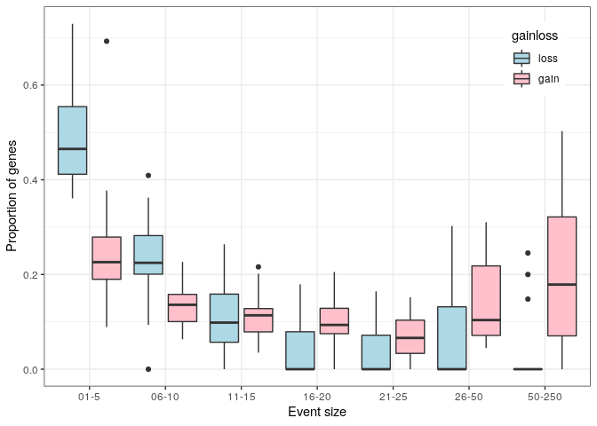
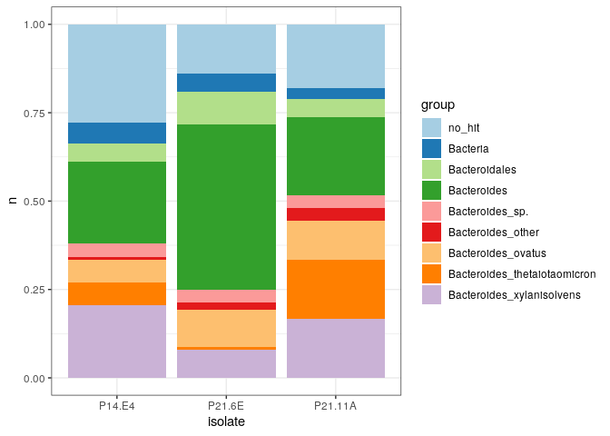

Figures and Tables
================

``` r
outdir='figures_tables'
system('rm -r figures_tables')
dir.create(outdir)
```

### Copy over metadata Table S1 & S2

``` r
system('cp metadata/TableS1_isolate_genomes.txt figures_tables/TableS1_isolate_genomes.txt')
system('cp metadata/TableS2_ncbi_genomes.txt figures_tables/TableS2_ncbi_genomes.txt')
```

### Read in metadata

``` r
species = 'Bacteroides_xylanisolvens'
dir = paste0('results/pangenome/',species)
metadata_file = file.path(dir,'metadata.txt')
metadata = read_tsv(metadata_file,col_types = cols())
metadata %>% 
  filter(taxonomy_Species==species) %>%
  group_by(clade,captive_clade) %>% 
  tally()
```

    ## # A tibble: 7 x 3
    ## # Groups:   clade [4]
    ##   clade      captive_clade     n
    ##   <chr>      <chr>         <int>
    ## 1 cladeA     gorilla1          4
    ## 2 cladeA     mixedhost        22
    ## 3 cladeA     unassigned       17
    ## 4 cladeB     gorilla2         13
    ## 5 cladeB     unassigned        9
    ## 6 cladeC     unassigned       60
    ## 7 unassigned unassigned        6

### Figure 1, tree plus cols A and B

``` r
#read in tree
tree_file = file.path(dir,paste0(species,'.tre'))
tree = read.tree(tree_file)

#drop outgroups from tree
outgroup = metadata %>% filter(taxonomy_Species!=species) %>% pull(isolate)
tree = drop.tip(tree,outgroup) 

#add PIC to tree
PI_comps_file = file.path(dir,'gene_gain_loss/PI_comps.txt')
PI_comps = read_tsv(PI_comps_file)
PI_comps_long = PI_comps %>% 
    mutate(compNum = 1:nrow(PI_comps)) %>% 
    tidyr::pivot_longer(cols=c(iso1,iso2), names_to='1vs2') %>%
    dplyr::rename('iso'='value') %>%
    select(iso,everything())
fig1_v1 <- ggtree(tree) %<+% PI_comps_long + 
    geom_tippoint(aes(subset=(label%in%PI_comps_long$iso),
                      color =  factor(compNum)),show.legend = FALSE) +
    geom_nodepoint(  #add bootstrap 
      aes(subset = suppressWarnings(as.numeric(label)) > 90),size=.75) +
    geom_treescale() #add scale

#add clade labels
cladeA_MCRA <- ape::getMRCA(tree,metadata$isolate[metadata$clade=='cladeA'])
cladeB_MCRA <- ape::getMRCA(tree,metadata$isolate[metadata$clade=='cladeB'])
cladeC_MCRA <- ape::getMRCA(tree,metadata$isolate[metadata$clade=='cladeC'])
mixedhostNode <- ape::getMRCA(tree,metadata$isolate[metadata$captive_clade=='mixedhost'])
gorilla1Node <- ape::getMRCA(tree,metadata$isolate[metadata$captive_clade=='gorilla1'])
gorilla2Node <- ape::getMRCA(tree,metadata$isolate[metadata$captive_clade=='gorilla2'])

fig1_v2 = fig1_v1 + #add clade labels
   geom_cladelabel(node=cladeA_MCRA,label="cladeA",offset = .005)+
   geom_cladelabel(node=cladeB_MCRA,label="cladeB",offset = .005)+
   geom_cladelabel(node=cladeC_MCRA,label="cladeC",offset = .005)+
   geom_cladelabel(node=mixedhostNode,label="mixedhost",offset = .01) +
   geom_cladelabel(node=gorilla1Node,label="gorilla1",offset = .01)+ 
   geom_cladelabel(node=gorilla2Node,label="gorilla2",offset = .01) +
   geom_tippoint(aes(subset=(label=='GCA.000210075.1.ASM21007v1')),color='red') 

#column A
HOST_table <- metadata %>% 
  select(isolate,host) %>%
  column_to_rownames(var='isolate') 

get_color_palette <- function(tips,metadata) {
  #recode hosts species by color
  metadata <- metadata %>% filter(isolate %in% tips)
  vec <- sort(unique(metadata$host))
  return(recode(vec,
                          'human'='cadetblue4',
                          'rumen' = 'brown4',
                          'bonobo'='red2',
                          'chimpanzee'='orange2',
                          'orangutan'='purple4',
                          'gorilla'='green3',
                          'chicken'='tan',
                          'mouse' = 'yellow2',
                          'pig' = 'pink',
                          'missing'='white'))}

fig1_v3 <- gheatmap(fig1_v2 + ylim(-10,NA),offset=.05,
    HOST_table,width=.1,colnames_angle=90,hjust=1)  + 
    scale_fill_manual(values=get_color_palette(fig1_v2$data$label,metadata))

#column B
predicted.genes = metadata %>% select(isolate,predicted.genes) %>%
  mutate(predicted.genes=as.numeric(predicted.genes)) %>%
  column_to_rownames(var='isolate')
fig1_v3 <- fig1_v3 + new_scale_fill()
fig1_v4 <- gheatmap(fig1_v3,predicted.genes,
                               colnames_angle=90,hjust=1,width=.1,offset = .06) + 
    scale_fill_viridis_c(direction = -1, option="D")
fig1_v4 <- fig1_v4 + new_scale_fill()
fig1_v4
```

<!-- -->

### Table S3

``` r
#Table S3: Functional groups enriched in all three captive ape clade since their mcra with closest human-associated strain 

#read input files
copyNumTable_file = file.path(dir,
  'gene_gain_loss/PIC_gene_gain_loss_summary/Bacteroides_xylanisolvens_window5_gp2_copynum.txt')
copyNumTable = read_tsv(copyNumTable_file)
annotation_file = file.path(dir,'Bxy_roary_nosplitparalogs_annotation.txt')
annotation = read_tsv(file=annotation_file,
                      col_types = cols())

#merge copy number table and annotation
copyNumTable_annotation = copyNumTable  %>% #add annotation info to copy number table 
  left_join(select(annotation,Gene,func_group,func_annot,Annotation),by='Gene')
copyNum_funcGroup = copyNumTable_annotation %>% # group copy numbers by functional group 
  group_by(func_group,func_annot,iso1,iso2) %>% 
  summarise(copyChangeMrca_iso1 = sum(copynum_iso1)-sum(mrca),
            copyChangeMrca_iso2 = sum(copynum_iso2)-sum(mrca)) %>% 
  as.data.frame()
iso1 = copyNum_funcGroup %>% #select isolate1-mcra comparisons
  dplyr::select(func_group,func_annot,iso1,copyChangeMrca_iso1) %>% 
  dplyr::rename(isolate = iso1,copyChangeMrca = copyChangeMrca_iso1)
iso2 = copyNum_funcGroup %>% #select isolate2-mcra comparisons
  dplyr::select(func_group,func_annot,iso2,copyChangeMrca_iso2) %>%
  dplyr::rename(isolate = iso2,copyChangeMrca = copyChangeMrca_iso2)
TableS3 = rbind(iso1,iso2) %>% #merge isolate 1 and isolate 2
  as.data.frame() %>% 
  pivot_wider(names_from = isolate, values_from = copyChangeMrca) %>% 
  select(func_group,func_annot,P21.11A,P14.E4,P21.6E) %>% #select 3 rep isolates
  filter(P21.11A>0,P14.E4>0,P21.6E>0) %>% #identify functional groups that 
  as.data.frame() %>%                     #increased in copy number in all 3
  filter(func_group != 'NA_NA_NA') %>% 
  mutate(total = as.numeric(P21.11A+P14.E4+P21.6E))%>% #new column that sums copy number increases
  dplyr::rename(gorilla1_P21.11A = P21.11A,
                gorilla2_P21.6E = P21.6E,
                mixedhost_P14.E4 = P14.E4) %>%
  arrange(desc(total))

write_tsv(TableS3,file.path(outdir,'TableS3_genefunc_gained.txt'))
head(select(TableS3,-func_annot)) #see Table S3 for func group annotations 
```

    ##                      func_group gorilla1_P21.11A mixedhost_P14.E4
    ## 1      COG3119@2|Bacteria_NA_NA                9               24
    ## 2 COG3250@2|Bacteria_K01190_GH2                5               13
    ## 3     COG0438@2|Bacteria_NA_GT4                4               11
    ## 4      COG0582@2|Bacteria_NA_NA                2                9
    ## 5        2ZA7H@2|Bacteria_NA_NA                4                7
    ## 6  COG1435@2|Bacteria_K21572_NA                1                7
    ##   gorilla2_P21.6E total
    ## 1               8    41
    ## 2               4    22
    ## 3               2    17
    ## 4               4    15
    ## 5               2    13
    ## 6               5    13

#### Sulfatase functional groups convergently enriched in captive ape associated lineages

``` r
sulfatase_Annotation = copyNumTable_annotation  %>% 
  filter(str_detect(func_group,'COG3119')) %>% #Select func group COG3119 
  group_by(Annotation,iso1,iso2) %>%  #groupby annotation 
  summarise(copyChangeMrca_iso1 = sum(copynum_iso1)-sum(mrca),
            copyChangeMrca_iso2 = sum(copynum_iso2)-sum(mrca)) %>% 
  as.data.frame()
iso1 = sulfatase_Annotation %>% #select isolate1-mcra comparisons
  dplyr::select(Annotation,iso1,copyChangeMrca_iso1) %>% 
  dplyr::rename(isolate = iso1,copyChangeMrca = copyChangeMrca_iso1)  
iso2 = sulfatase_Annotation %>% #select isolate2-mcra comparisons
  dplyr::select(Annotation,iso2,copyChangeMrca_iso2) %>%
  dplyr::rename(isolate = iso2,copyChangeMrca = copyChangeMrca_iso2)
sulfatase_convergent_gain = rbind(iso1,iso2) %>% 
  as.data.frame() %>% 
  pivot_wider(names_from = isolate, values_from = copyChangeMrca) %>% 
  select(Annotation,P21.11A,P14.E4,P21.6E) %>% 
  filter(P21.11A>0,P14.E4>0,P21.6E>0) %>%
  as.data.frame() %>% 
  mutate(total = P21.11A+P14.E4+P21.6E) %>% 
  dplyr::rename(gorilla1_P21.11A = P21.11A,
                gorilla2_P21.6E = P21.6E,
                mixedhost_P14.E4 = P14.E4)
print(sulfatase_convergent_gain)
```

    ##                            Annotation gorilla1_P21.11A mixedhost_P14.E4
    ## 1                       Arylsulfatase                3                5
    ## 2 N-acetylgalactosamine-6-O-sulfatase                2                3
    ## 3   N-acetylglucosamine-6-O-sulfatase                2                4
    ## 4              Ulvan-active sulfatase                6                7
    ##   gorilla2_P21.6E total
    ## 1               2    10
    ## 2               2     7
    ## 3               2     8
    ## 4               5    18

### Figure 1 columns C & D

Visualize function groups and sulfatase annotations convergently
enriched

``` r
#inputs: annotation,gene table
pres_abs_file = file.path(dir,'roary_nosplitparalogs/gene_presence_absence.csv')
pres_abs <- read_csv(pres_abs_file,col_types = cols())
isblank <- function(x) {as.numeric(str_count(x, pattern = "_"))} #counts # of GeneIDs
gene_table <- pres_abs %>% 
      select(Gene,all_of(metadata$isolate))  %>% #eliminate extra columns output by roary
      mutate_at(vars(-Gene),isblank) %>% #converts from values from list of GeneIDs to numeric
      column_to_rownames(var = 'Gene') %>% 
      as.matrix()
gene_table[is.na(gene_table)] <- 0 #set NAs to 0
gene_table <- as.data.frame(gene_table) %>% rownames_to_column(var='Gene')

get_func_copynumber_table <- function(list_of_func){
  #given list of function groups returns table with gene copy numbers for each isolate
  func_copynumber_table  <- annotation %>% 
    left_join(gene_table,by='Gene') %>% #add annotations to gene table
    filter(func_group %in% list_of_func) %>% #subset to function groups given
    pivot_longer(cols=metadata$isolate, #flatten matrix so there's one isolate column
               names_to='isolate',values_to='present') %>%
    select(func_group,isolate,present) %>% 
    group_by(func_group,isolate) %>% #get copy number per func group
        summarise(count = sum(present)) %>%
    pivot_wider(names_from = func_group, values_from = count) %>% #each column is a func group
    column_to_rownames(var='isolate')
    func_copynumber_table[func_copynumber_table==0] <- NA 
  return(func_copynumber_table)
}  

#get copy numbers of mucin func groups
mucin <- get_func_copynumber_table(c(
                                     'COG3119@2|Bacteria_K01565_NA', 
                                     'COG1649@2|Bacteria_K05970_NA', 
                                     'COG5434@2|Bacteria_NA_GH110' , 
                                     'COG3250@2|Bacteria_K01190_GH2' 
                                   )) 
#rename function groups
mucin <- mucin %>% 
  as.data.frame() %>% 
  dplyr::rename('N-sulfoglucosamine sulfohydrolase(K01565)'='COG3119@2|Bacteria_K01565_NA',
                'sialate O-acetylesterase(K05970)'='COG1649@2|Bacteria_K05970_NA',
                'alpha-1,3-galactosidase(GH110)'='COG5434@2|Bacteria_NA_GH110',
                'beta-galactosidase(K01190)'='COG3250@2|Bacteria_K01190_GH2')

#get copy numbers of Sus C and D func groups
susCD <- get_func_copynumber_table(c(
                                     'COG1435@2|Bacteria_K21572_NA', 
                                     'COG4206@2|Bacteria_K21573_NA'
                                   )) 
#rename function groups
susCD<- susCD %>% as.data.frame() %>%
                                    dplyr::rename(
                                      'SusD family protein(K21572)' = 
                                        'COG1435@2|Bacteria_K21572_NA',
                                       'SusC family protein(K21573)' = 
                                        'COG4206@2|Bacteria_K21573_NA')

#get copy numbers of carrageenan functional groups                                       
carrageenan<- get_func_copynumber_table(c(
                                          'COG1874@2|Bacteria_NA_GH167', 
                                          'NA_NA_GH167',
                                          '33PQM@2|Bacteria_NA_GH150',
                                          'COG5434@2|Bacteria_NA_GH82'
                                          )) 
carrageenan <- carrageenan %>% 
  as.data.frame() %>%
  dplyr::rename('Lambda-carrageenase(GH150)'='33PQM@2|Bacteria_NA_GH150',
                'Iota-carrageenase(GH82)'='COG5434@2|Bacteria_NA_GH82',
                'GH167a'='COG1874@2|Bacteria_NA_GH167',
                'GH167b'='NA_NA_GH167') %>%
  mutate(beta_carrageenase=GH167a+GH167b) %>%
  dplyr::rename('beta_carrageenase(GH167)'='beta_carrageenase') %>%
  select(-GH167a,-GH167b)


#get gene counts for sulfatase annotations
get_annot_copynumber_table <- function(list_of_annot){
  #given list of Annotations returns table with gene copy numbers for each isolate
  annot_copynumber_table  <- annotation %>% 
    left_join(gene_table,by='Gene') %>%
    filter(Annotation %in% list_of_annot) %>% #group by Annotation
    pivot_longer(cols=metadata$isolate,
               names_to='isolate',values_to='present') %>%
    select(Annotation,isolate,present) %>%
    group_by(Annotation,isolate) %>%
    summarise(count = sum(present)) %>%
    pivot_wider(names_from = Annotation, values_from = count) %>% 
    column_to_rownames(var='isolate')
    annot_copynumber_table[annot_copynumber_table==0] <- NA
  return(annot_copynumber_table)
}  

#get copy numbers of sulfatase annotations
sulfatase = get_annot_copynumber_table(c('N-acetylgalactosamine-6-O-sulfatase',
                                         'N-acetylglucosamine-6-O-sulfatase',
                                         'Ulvan-active sulfatase','Arylsulfatase')) 
#rename annotation groups
sulfatase = sulfatase %>% 
  as.data.frame() %>%
  dplyr::rename(
    'N-acetylgalactosamine-6-O-sulfatase(K01132)'='N-acetylgalactosamine-6-O-sulfatase',
    'N-acetylglucosamine-6-O-sulfatase(K01137)'='N-acetylglucosamine-6-O-sulfatase'
     )

#bind together to create C columns 
sulfa_mucin = cbind(susCD,sulfatase,mucin)   
sulfa_mucin = sulfa_mucin[c(
              'SusC family protein(K21573)',
              'SusD family protein(K21572)',
              "beta-galactosidase(K01190)",
              "N-acetylgalactosamine-6-O-sulfatase(K01132)",
              "N-acetylglucosamine-6-O-sulfatase(K01137)",
              'Arylsulfatase',
              'Ulvan-active sulfatase',
              "sialate O-acetylesterase(K05970)",
              "alpha-1,3-galactosidase(GH110)"
              )]
fig1_v5 <- gheatmap(fig1_v4,sulfa_mucin,colnames_angle=90,hjust=1,offset=.07,width=.9) + 
    scale_fill_viridis_c(direction = -1, option="B")
fig1_v5  <- fig1_v5 + new_scale_fill()
(fig1_v6 <- gheatmap(fig1_v5,carrageenan,colnames_angle=90,hjust=1,offset=.13,width=.3)+ 
    scale_fill_viridis_c(option="D",direction = -1))
```

<!-- -->

``` r
ggsave(fig1_v6,file = file.path(outdir,'Figure1_long.pdf'),width = 10, height=25)
ggsave(fig1_v6,file = file.path(outdir,'Figure1_short.pdf'),width = 10, height=6)
```

### Figures S1, S2, S3

``` r
Fig1_sup <- function(species, offset_val1, offset_val2) {
  # generates a verison of figure1 for other Bacteroides species 
  # phylogenetic tree of isolates, PICs labeled, with host species and # of genes
  dir = paste0('results/pangenome/',species)

  #read in tree
  tree_file = file.path(dir,paste0(species,'.tre'))
  tree = read.tree(tree_file)

  #drop outgroups from tree
  metadata_file = file.path(dir,'metadata.txt')
  metadata = read_tsv(metadata_file,col_types = cols())
  outgroup = metadata %>% filter(taxonomy_Species!=species) %>% pull(isolate)
  tree = drop.tip(tree,outgroup) 
  print(c(species,length(tree$tip.label)))

  #read in and format PIC dataframe
  PI_comps_file = file.path(dir,'gene_gain_loss/PI_comps.txt')
  PI_comps = read_tsv(PI_comps_file)
  PI_comps_long = PI_comps %>% 
    mutate(compNum = 1:nrow(PI_comps)) %>% 
    tidyr::pivot_longer(cols=c(iso1,iso2), names_to='1vs2') %>%
    dplyr::rename('iso'='value') %>%
    select(iso,everything())
  
  #add PIC to tree
  fig1_v1 <- ggtree(tree) %<+% PI_comps_long + 
    geom_tippoint(aes(subset=(label%in%PI_comps_long$iso),
                      color = factor(compNum)),show.legend = FALSE) +
    geom_nodepoint(
      aes(subset = suppressWarnings(as.numeric(label)) > 90),size=.75) + #add bootstrap 
    geom_treescale() +#add scale
    theme(legend.position="none")
  fig1_v1<- fig1_v1 + new_scale_fill()
  
  #column A
  HOST_table <- metadata %>% 
    select(isolate,host) %>%
    column_to_rownames(var='isolate') 
  fig1_v2 <- gheatmap(fig1_v1 + ylim(-10,NA),colnames = FALSE,offset = offset_val1,
    HOST_table,width=.1,colnames_angle=90,hjust=1)  + 
    scale_fill_manual(values=get_color_palette(fig1_v1$data$label,metadata))

  #column B
  predicted.genes = metadata %>% select(isolate,predicted.genes) %>%
    mutate(predicted.genes=as.numeric(predicted.genes)) %>%
    column_to_rownames(var='isolate')
  fig1_v2 <- fig1_v2 + new_scale_fill()
  fig1_v3 <- gheatmap(fig1_v2, predicted.genes,
                               colnames_angle=90,
                               hjust=1,width=.1,
                               offset = offset_val2) + 
    scale_fill_viridis_c(direction = -1, option="D")
  
return(fig1_v3)
}

(Fig1_Bov = Fig1_sup('Bacteroides_ovatus',0,.012))
```

    ## [1] "Bacteroides_ovatus" "95"

<!-- -->

``` r
ggsave(Fig1_Bov,file=file.path(outdir,'FigureS1_BovTree.pdf'),height=5,width=5)
(Fig1_Bfr = Fig1_sup('Bacteroides_fragilis',0,.001))
```

    ## [1] "Bacteroides_fragilis" "182"

<!-- -->

``` r
ggsave(Fig1_Bfr,file=file.path(outdir,'FigureS2_BfrTree.pdf'),height=5,width=5)
(Fig1_Bth = Fig1_sup('Bacteroides_thetaiotaomicron',0,.004))
```

    ## [1] "Bacteroides_thetaiotaomicron" "74"

<!-- -->

``` r
ggsave(Fig1_Bth,file=file.path(outdir,'FigureS3_BthTree.pdf'),height=5,width=5)
```

### Figure 2

``` r
#read in metadata
Bxy_metadata_file = 'results/pangenome/Bacteroides_xylanisolvens/metadata.txt'
Bov_metadata_file = 'results/pangenome/Bacteroides_ovatus/metadata.txt'
Bfr_metadata_file = 'results/pangenome/Bacteroides_fragilis/metadata.txt'
Bth_metadata_file = 'results/pangenome/Bacteroides_thetaiotaomicron/metadata.txt'

Bt_metadata = 
  read_tsv(Bxy_metadata_file,col_types = cols()) %>%
  dplyr::add_row(read_tsv(Bov_metadata_file,col_types = cols())) %>%
  dplyr::add_row(read_tsv(Bfr_metadata_file,col_types = cols())) %>%
  dplyr::add_row(read_tsv(Bth_metadata_file,col_types = cols())) %>%
  filter(taxonomy_Species != 'Bacteroides_fragilis_A') %>%
  distinct()

#read in 50 representative genomes generated by gene_gain_loss.Rmd
Bxy_pw_50_file = 'results/pangenome/Bacteroides_xylanisolvens/gene_gain_loss/pw_50strain.txt'
Bov_pw_50_file = 'results/pangenome/Bacteroides_ovatus/gene_gain_loss/pw_50strain.txt'
Bfr_pw_50_file = 'results/pangenome/Bacteroides_fragilis/gene_gain_loss/pw_50strain.txt'
Bth_pw_50_file = 'results/pangenome/Bacteroides_thetaiotaomicron/gene_gain_loss/pw_50strain.txt'

Bt_rep = 
  read_tsv(Bxy_pw_50_file,col_types = cols()) %>%
  dplyr::add_row(read_tsv(Bov_pw_50_file,col_types = cols())) %>%
  dplyr::add_row(read_tsv(Bfr_pw_50_file,col_types = cols())) %>%
  dplyr::add_row(read_tsv(Bth_pw_50_file,col_types = cols())) %>%
  distinct()

Bt_rep_metadata = Bt_metadata %>% 
  filter(isolate %in% c(Bt_rep$iso1,Bt_rep$iso2))

colors = recode(sort(unique(Bt_rep_metadata$host)),
                          'human'='cadetblue4',
                          'rumen' = 'brown4',
                          'bonobo'='red2',
                          'chimpanzee'='orange2',
                          'orangutan'='purple4',
                          'gorilla'='green3',
                          'chicken'='tan',
                          'mouse' = 'yellow2',
                          'pig' = 'pink',
                          'missing'='white')

Figure2A = Bt_metadata %>% 
  filter(isolate %in% c(Bt_rep$iso1,Bt_rep$iso2)) %>% 
  ggplot(aes(x =taxonomy_Species,y=predicted.genes,fill=host)) +
  geom_dotplot(binaxis = "y", stackdir = "centerwhole") +
  theme_bw() +
  scale_fill_manual(values=colors)

#determine which Bacteroides species exhibit higher numbers of genes
summary(kwAllPairsDunnTest(predicted.genes~as.factor(taxonomy_Species),
         data=Bt_metadata,
         method="fdr")) 
```

    ##                                                               z value Pr(>|z|)
    ## Bacteroides_ovatus - Bacteroides_fragilis == 0                 13.798  < 2e-16
    ## Bacteroides_thetaiotaomicron - Bacteroides_fragilis == 0        9.832  < 2e-16
    ## Bacteroides_xylanisolvens - Bacteroides_fragilis == 0          12.637  < 2e-16
    ## Bacteroides_thetaiotaomicron - Bacteroides_ovatus == 0          2.424 0.046101
    ## Bacteroides_xylanisolvens - Bacteroides_ovatus == 0             2.185 0.057812
    ## Bacteroides_xylanisolvens - Bacteroides_thetaiotaomicron == 0   0.572 0.567260
    ##                                                                  
    ## Bacteroides_ovatus - Bacteroides_fragilis == 0                ***
    ## Bacteroides_thetaiotaomicron - Bacteroides_fragilis == 0      ***
    ## Bacteroides_xylanisolvens - Bacteroides_fragilis == 0         ***
    ## Bacteroides_thetaiotaomicron - Bacteroides_ovatus == 0          *
    ## Bacteroides_xylanisolvens - Bacteroides_ovatus == 0             .
    ## Bacteroides_xylanisolvens - Bacteroides_thetaiotaomicron == 0

``` r
#determine whether this trend is consistent when controlling for phylogenetic distance
Bt_rep = Bt_rep %>% group_by(taxonomy_Species.iso1) %>% 
  mutate(norm_tree_dist = (tree_dist-mean(tree_dist)) /sd(tree_dist)) %>%
  filter(norm_tree_dist<1,norm_tree_dist>-1)

#compare models with quadratic and linear relationship with tree dist
quad = summary(lm_robust(
  bray_curtis ~ I(norm_tree_dist^2) + norm_tree_dist + taxonomy_Species.iso1 + 
                    norm_tree_dist * taxonomy_Species.iso1, data = Bt_rep))
quad$coefficients['I(norm_tree_dist^2)',] #quadratic not significant
```

    ##      Estimate    Std. Error       t value      Pr(>|t|)      CI Lower 
    ## -1.132321e-03  2.063363e-03 -5.487745e-01  5.831955e-01 -5.177845e-03 
    ##      CI Upper            DF 
    ##  2.913203e-03  3.479000e+03

``` r
#use linear because quad tree_dist term large, 
lm = summary(lm_robust(
  bray_curtis ~  norm_tree_dist + taxonomy_Species.iso1 + norm_tree_dist * taxonomy_Species.iso1, 
  data = Bt_rep))
coef = as.data.frame(lm$coefficients) %>% rownames_to_column(var = 'coefficient')
print(coef[,c('coefficient',"Estimate","Pr(>|t|)","CI Lower","CI Upper")])
```

    ##                                                        coefficient    Estimate
    ## 1                                                      (Intercept) 0.212299841
    ## 2                                                   norm_tree_dist 0.013433050
    ## 3                          taxonomy_Species.iso1Bacteroides_ovatus 0.083063688
    ## 4                taxonomy_Species.iso1Bacteroides_thetaiotaomicron 0.045834612
    ## 5                   taxonomy_Species.iso1Bacteroides_xylanisolvens 0.086652024
    ## 6           norm_tree_dist:taxonomy_Species.iso1Bacteroides_ovatus 0.018822816
    ## 7 norm_tree_dist:taxonomy_Species.iso1Bacteroides_thetaiotaomicron 0.007066495
    ## 8    norm_tree_dist:taxonomy_Species.iso1Bacteroides_xylanisolvens 0.034073587
    ##        Pr(>|t|)    CI Lower   CI Upper
    ## 1  0.000000e+00 0.210071073 0.21452861
    ## 2  2.872288e-13 0.009839368 0.01702673
    ## 3  0.000000e+00 0.080055920 0.08607146
    ## 4 2.516717e-158 0.042654348 0.04901488
    ## 5  0.000000e+00 0.083387484 0.08991656
    ## 6  1.005008e-12 0.013665949 0.02397968
    ## 7  1.158467e-02 0.001581336 0.01255165
    ## 8  1.927227e-34 0.028674078 0.03947310

``` r
write_tsv(coef,file.path(outdir,'TableS4_model_coef.txt'))

Figure2B = Bt_rep  %>% 
  ggplot() + 
  aes(x=norm_tree_dist,y=bray_curtis) +
  geom_point(aes(color=taxonomy_Species.iso1),alpha=1,size=2) +
  theme_bw() +
  scale_colour_manual(values=c('red3','orange','green4','blue4')) +
  stat_smooth(data = filter(Bt_rep ,taxonomy_Species.iso1 == 'Bacteroides_fragilis'),
             method = "lm",color='red3', formula = y ~ x, size = 1, se=TRUE)+
  stat_smooth(data = filter(Bt_rep ,taxonomy_Species.iso1 == 'Bacteroides_ovatus'),
             method = "lm",color='orange', formula = y ~ x, size = 1, se=TRUE)+
  stat_smooth(data = filter(Bt_rep ,taxonomy_Species.iso1 == 'Bacteroides_thetaiotaomicron'),
             method = "lm",color='green4', formula = y ~ x, size = 1, se=TRUE) +
  stat_smooth(data = filter(Bt_rep ,taxonomy_Species.iso1 == 'Bacteroides_xylanisolvens'),
              method = "lm",color='blue4', formula = y ~  x, size = 1, se=TRUE)+
  ylab('Pangenome distance (Bray-Curtis)')+
  xlab('Normalized phylogenetic distance')
Figure2C <- get_legend(Figure2B)

#determine whether closely related strains exhibit greater variance in number of genomes
#in different Bacteroides species
Bt_rep = Bt_rep  %>% 
  left_join(select(Bt_metadata,isolate,predicted.genes),by=c('iso1'='isolate')) %>%
  dplyr::rename('predicted.genes.iso1' = predicted.genes) %>% 
  left_join(select(Bt_metadata,isolate,predicted.genes),by=c('iso2'='isolate')) %>%
  dplyr::rename('predicted.genes.iso2' = predicted.genes) %>%
  mutate(diff_predicted.genes = abs(predicted.genes.iso1-predicted.genes.iso2))

predicted.genes_quad = summary(lm_robust(
  diff_predicted.genes ~ I(norm_tree_dist^2) + norm_tree_dist + taxonomy_Species.iso1 + 
                    norm_tree_dist * taxonomy_Species.iso1, data = Bt_rep))
predicted.genes_quad$coefficients['I(norm_tree_dist^2)',] #quadratic not significant
```

    ##     Estimate   Std. Error      t value     Pr(>|t|)     CI Lower     CI Upper 
    ##  -18.1057150   19.7151973   -0.9183634    0.3584907  -56.7598930   20.5484631 
    ##           DF 
    ## 3571.0000000

``` r
predicted.genes_lm = summary(lm_robust(
  diff_predicted.genes ~  
    norm_tree_dist + taxonomy_Species.iso1 + norm_tree_dist * taxonomy_Species.iso1, 
  data = Bt_rep))
predicted.genes_coef = as.data.frame(predicted.genes_lm$coefficients) %>% 
  rownames_to_column(var = 'coefficient')
print(predicted.genes_coef[,c('coefficient',"Estimate","Pr(>|t|)","CI Lower","CI Upper")])
```

    ##                                                        coefficient  Estimate
    ## 1                                                      (Intercept) 378.89753
    ## 2                                                   norm_tree_dist -19.45004
    ## 3                          taxonomy_Species.iso1Bacteroides_ovatus -29.00341
    ## 4                taxonomy_Species.iso1Bacteroides_thetaiotaomicron  19.18235
    ## 5                   taxonomy_Species.iso1Bacteroides_xylanisolvens 107.29057
    ## 6           norm_tree_dist:taxonomy_Species.iso1Bacteroides_ovatus -13.13183
    ## 7 norm_tree_dist:taxonomy_Species.iso1Bacteroides_thetaiotaomicron  46.45859
    ## 8    norm_tree_dist:taxonomy_Species.iso1Bacteroides_xylanisolvens 139.87597
    ##        Pr(>|t|)   CI Lower   CI Upper
    ## 1 8.221963e-147 351.439849 406.355215
    ## 2  3.684313e-01 -61.843658  22.943568
    ## 3  7.939880e-02 -61.410870   3.404049
    ## 4  2.633420e-01 -14.436450  52.801152
    ## 5  5.617362e-09  71.283240 143.297900
    ## 6  6.280758e-01 -66.274784  40.011127
    ## 7  1.023665e-01  -9.290011 102.207187
    ## 8  1.832049e-06  82.491370 197.260564

``` r
Bt_rep  %>% 
  ggplot() + 
  aes(x=norm_tree_dist,y=diff_predicted.genes) +
  geom_point(aes(color=taxonomy_Species.iso1),alpha=1,size=2) +
  theme_bw() +
  scale_colour_manual(values=c('red3','orange','green4','blue4')) +
  stat_smooth(data = filter(Bt_rep ,taxonomy_Species.iso1 == 'Bacteroides_fragilis'),
             method = "lm",color='red3', formula = y ~ x, size = 1, se=TRUE)+
  stat_smooth(data = filter(Bt_rep ,taxonomy_Species.iso1 == 'Bacteroides_ovatus'),
             method = "lm",color='orange', formula = y ~ x, size = 1, se=TRUE)+
  stat_smooth(data = filter(Bt_rep ,taxonomy_Species.iso1 == 'Bacteroides_thetaiotaomicron'),
             method = "lm",color='green4', formula = y ~ x, size = 1, se=TRUE) +
  stat_smooth(data = filter(Bt_rep ,taxonomy_Species.iso1 == 'Bacteroides_xylanisolvens'),
              method = "lm",color='blue4', formula = y ~  x, size = 1, se=TRUE)+
  ylab('Pangenome distance (Bray-Curtis)')+
  xlab('Differene in # of predicted genes')
```

<!-- -->

``` r
left = Figure2A + 
  theme(axis.title.x= element_blank()) +
  theme(legend.position = 'bottom')
right =  plot_grid(Figure2B+theme(legend.position="none"),Figure2C,ncol=1,rel_heights = c(1,.5))
(Figure2 = plot_grid(left,right,ncol=2,rel_widths = c(1,.75)))
```

<!-- -->

``` r
ggsave(Figure2,file=file.path(outdir,'Figure2_geneContentBt.pdf'),width = 8)
```

### Figure 3

``` r
#read in summary files produced by gene_gain_loss.Rmd
species = 'Bacteroides_xylanisolvens'
suffix = 'window5_gp2'
dir = file.path('results/pangenome/',species)
summary_filename = 
  paste0('gene_gain_loss/PIC_gene_gain_loss_summary/',species,'_',suffix,'_summary.txt')
summary_df = read_tsv(file.path(dir,summary_filename))
island_filename = 
  paste0('gene_gain_loss/PIC_gene_gain_loss_summary/',species,'_',suffix,'_island.txt')
island_df = read_tsv(file.path(dir,island_filename))

#Panel A: tree 
tree_file = file.path(dir,paste0(species,'.tre'))
tree = read.tree(tree_file)

PI_comps_file = file.path(dir,'gene_gain_loss/PI_comps.txt')
PI_comps = read_tsv(PI_comps_file)
PI_comps_long = PI_comps %>% 
    mutate(compNum = 1:nrow(PI_comps)) %>% 
    tidyr::pivot_longer(cols=c(iso1,iso2), names_to='1vs2') %>%
    dplyr::rename('iso'='value') %>%
    select(iso,everything())
tree_PI = drop.tip(tree,setdiff(tree$tip.label,PI_comps_long$iso))  

fig3_v1 <- ggtree(tree_PI ) %<+% PI_comps_long + 
    geom_tippoint(aes(subset=(label%in%PI_comps_long$iso),
                      color =  factor(compNum)),show.legend = FALSE) +
    geom_nodepoint(
      aes(subset = suppressWarnings(as.numeric(label)) > 90),size=.75) + #add bootstrap 
    geom_treescale() #add scale

HOST_table <- metadata %>% 
  select(isolate,host) %>%
  filter(isolate %in% tree_PI$tip.label) %>%
  column_to_rownames(var='isolate') 

fig3_v2 <- gheatmap(fig3_v1 + ylim(-10,NA),colnames = FALSE,offset = 0,
    HOST_table,width=.1,colnames_angle=90,hjust=1)  + 
    scale_fill_manual(values=get_color_palette(fig3_v1$data$label,metadata))

#Panel B: Number of gene gain/loss panel
iso1 = summary_df %>% select(iso1,iso1_gain_events,iso1_gain,iso1_loss_events,iso1_loss)
colnames(iso1) = c('isolate','gain_events','gain_numGenes','loss_events','loss_numGenes')
iso2 = summary_df %>% select(iso2,iso2_gain_events,iso2_gain,iso2_loss_events,iso2_loss)
colnames(iso2) = c('isolate','gain_events','gain_numGenes','loss_events','loss_numGenes')
df = rbind(iso1,iso2) %>% 
  as.data.frame() %>% 
  mutate(diff_gain_numGenes = gain_numGenes-gain_events, #modify to make stacked plot
         diff_loss_numGenes = loss_numGenes-loss_events) %>% #modify to make stacked plot
  select(isolate,gain_events,diff_gain_numGenes,loss_events,diff_loss_numGenes) %>%
  pivot_longer(cols=c(gain_events,diff_gain_numGenes,loss_events,diff_loss_numGenes),
               names_to='cat',values_to='count') %>% #convert 4 col to 1 col
  mutate(count=as.numeric(count),cat=as.factor(cat), 
         #convert gene losses into negative numbers
         count = ifelse(cat %in% c('loss_events','diff_loss_numGenes'),-count,count)) %>%
  as.data.frame()

#add tree to inline to stack plot
fig3_v3 <- facet_plot(fig3_v2, panel = 'Gene Loss/Gain', data = df, 
                geom = geom_barh, 
                mapping = aes(x = count, fill = as.factor(cat)), 
                stat='identity') +
                scale_fill_manual(values=
                  c("orange2", 'pink','lightblue','firebrick',
                    "green3","cadetblue4",'blue4',"brown4"))

#Panel C: G50/L50
iso1 = select(summary_df,iso1,iso1_G50,iso1_L50)
colnames(iso1) <- c('isolate','G50','L50')
iso2 = select(summary_df,iso2,iso2_G50,iso2_L50)
colnames(iso2) <- c('isolate','G50','L50')
G50L50 = rbind(iso1,iso2) %>% 
  pivot_longer(cols = c('G50','L50'),values_to = 'count') %>% 
  as.data.frame()
fig3_v4 <- facet_plot(fig3_v3, panel = 'G50/L50', data = G50L50 , 
                geom = geom_point, 
                mapping = aes(x = count, color = as.factor(name)), 
                stat='identity')
fig3_top = fig3_v4  + 
  theme_bw()  +
  theme(legend.position="none")
fig3_top
```

<!-- -->

``` r
#Panels D & E event size distribution
island_df2 = island_df  %>% 
    separate(col=geneGainLoss,into=c('iso','gainloss'),remove=F,sep='_') %>%
    mutate(iso_category = 
          dplyr::if_else(iso == 'iso1',paste0(iso1,gainloss),paste0(iso2,gainloss)), 
    size_category=cut(cluster_size, breaks=c(0,5,10,15,20,25,50,250)), 
    size_category = recode(size_category,
                                '(0,5]'='01-5',
                                '(5,10]'='06-10',
                                '(10,15]'='11-15',
                                '(15,20]'='16-20',
                                '(20,25]'='21-25',
                                '(25,50]'='26-50',
                                '(50,250]'='50-250'))

#get total number of event/genes by size cat 
island_df3 = island_df2 %>% 
  group_by(iso_category,gainloss,size_category) %>%
  summarise(number_events = n(),
  number_genes = sum(cluster_size)) 

#convert to proportion for each isolate 
island_df4 = island_df3 %>% group_by(gainloss,iso_category) %>%
         mutate(total_events = sum(number_events),
                prop_events = number_events / total_events,
                total_genes = sum(number_genes),
                prop_genes = number_genes / total_genes) 

#pivot magic, some isolates don't have events of a size category, need to put in a 0.
island_df5 = island_df4 %>% 
  select(iso_category,size_category,prop_events,prop_genes) %>%
  pivot_longer(
    cols = c(prop_events,prop_genes), names_to = 'category', values_to = 'proportion') %>%
  pivot_wider(
    names_from = size_category,values_from = proportion,values_fill = 0 ) %>%
  pivot_longer(
    cols = unique(island_df4$size_category), names_to = 'size_category', values_to = 'proportion')
island_df5$gainloss <- factor(island_df5$gainloss, levels = c('loss','gain'))

#Panel D: proportion of gain/loss EVENTS by event size
gain_loss_events_prop = island_df5  %>% 
      filter(category=='prop_events') %>% 
      ggplot(aes(x=size_category,y=proportion,fill=gainloss)) +
      geom_boxplot(position=position_dodge(width = 1)) + 
      theme_bw() +
      xlab('Event size')+
      scale_y_continuous(name = "Proportion of events") + 
      theme(legend.position = c(.95, .95), 
        legend.justification = c(.95, .95)
        ) +
      scale_fill_manual(values = c('blue4','firebrick'))
#Panel E: proportion of GENES gained/lost by event size
gain_loss_gene_prop = island_df5 %>% 
      filter(category=='prop_genes') %>% 
      ggplot(aes(x=size_category,y=proportion,fill=gainloss)) +
      geom_boxplot(position=position_dodge(width = .9)) + 
      theme_bw() +
      xlab('Event size')+
      scale_y_continuous(
        name = "Proportion of genes",
        ) + 
      theme(
        legend.position = c(.95, .95), 
        legend.justification = c(.95, .95)
        ) +
      scale_fill_manual(values = c('lightblue','pink'))
fig3_bottom = plot_grid(gain_loss_events_prop, gain_loss_gene_prop)
fig3_bottom
```

<!-- -->

``` r
ggsave(fig3_top,file=file.path(outdir,'Figure3top_geneGainLoss.pdf'),height=4)
ggsave(fig3_bottom,file=file.path(outdir,'Figure3bottom_geneGainLoss.pdf'),height=4)
```

### What fraction of gain events are duplications?

``` r
#see gene_gain_loss_functions.R for how duplications are classified
#but basically all HGGs on in island have to have 2 or more copies

#genomic islands gained or lost by 9 Bxy PICs (18 isolates)
unique(island_df2$comp) #
```

    ## [1] "GCA.000210075.1.ASM21007v1_GCA.015551805.1.ASM1555180v1"                                                        
    ## [2] "GCA.003464445.1.ASM346444v1_GCA.009102085.1.ASM910208v1"                                                        
    ## [3] "GCA.003468875.1.ASM346887v1_P14.E4"                                                                             
    ## [4] "GCA.004167295.1.ASM416729v1_GCA.003474645.1.ASM347464v1"                                                        
    ## [5] "GCA.009101945.1.ASM910194v1_GCA.009102805.1.ASM910280v1"                                                        
    ## [6] "GCA.015547545.1.ASM1554754v1_GCA.009102105.1.ASM910210v1"                                                       
    ## [7] "GCA.900107825.1.IMG.taxon.2623620516.annotated.assembly_GCA.900114865.1.IMG.taxon.2654588180.annotated.assembly"
    ## [8] "P21.11A_GCA.003458755.1.ASM345875v1"                                                                            
    ## [9] "P21.6E_GCA.000273315.1.Bact.xyla.CL03T12C04.V1"

``` r
dup = island_df2  %>%  #see above block for island_df -> island_df2
    group_by(iso_category,gainloss,size_category,is_dup) %>%
    summarise(number_events = n(),
              number_genes = sum(cluster_size)) 

#what fraction of gain events are duplications?
dup %>% filter(gainloss == 'gain') %>%
  group_by(is_dup) %>% 
  summarize(number_events = sum(number_events)) %>%
  mutate(proportion = number_events/sum(number_events))
```

    ## # A tibble: 2 x 3
    ##   is_dup number_events proportion
    ##    <dbl>         <int>      <dbl>
    ## 1      0          1585      0.860
    ## 2      1           259      0.140

### Figure S4

How do event size frequencies changes when islands are limited to
strictly adjacent genes

``` r
# Reproduce Figure 3 Panel E with a sliding window of 1 
species = 'Bacteroides_xylanisolvens'

suffix = 'window1_gp2'
island_filename = 
  paste0('gene_gain_loss/PIC_gene_gain_loss_summary/',species,'_',suffix,'_island.txt')
island_df = read_tsv(file.path(dir,island_filename))
island_df2 = island_df  %>% 
    separate(col=geneGainLoss,into=c('iso','gainloss'),remove=F,sep='_') %>%
    mutate(iso_category = 
          dplyr::if_else(iso == 'iso1',paste0(iso1,gainloss),paste0(iso2,gainloss)), 
    size_category=cut(cluster_size, breaks=c(0,5,10,15,20,25,50,250)), 
    size_category = recode(size_category,
                                '(0,5]'='01-5',
                                '(5,10]'='06-10',
                                '(10,15]'='11-15',
                                '(15,20]'='16-20',
                                '(20,25]'='21-25',
                                '(25,50]'='26-50',
                                '(50,250]'='50-250'))
#get total number of event/genes by size cat 
island_df3 = island_df2 %>% 
  group_by(iso_category,gainloss,size_category) %>%
  summarise(number_events = n(),
  number_genes = sum(cluster_size)) 
#convert to proportion for each isolate 
island_df4 = island_df3 %>% group_by(gainloss,iso_category) %>%
         mutate(total_events = sum(number_events),
                prop_events = number_events / total_events,
                total_genes = sum(number_genes),
                prop_genes = number_genes / total_genes) 
#pivot magic, some isolates don't have events of a size category, need to put in a 0.
island_df5 = island_df4 %>% 
  select(iso_category,size_category,prop_events,prop_genes) %>%
  pivot_longer(cols = c(prop_events,prop_genes), names_to = 'category', values_to = 'proportion') %>%
  pivot_wider(names_from = size_category,values_from = proportion,values_fill = 0 ) %>%
  pivot_longer(cols = unique(island_df4$size_category), names_to = 'size_category', values_to = 'proportion')
island_df5$gainloss <- factor(island_df5$gainloss, levels = c('loss','gain'))

#Panel E: proportion of GENES gained/lost by event size
gain_loss_gene_prop_window1 = island_df5 %>% 
      filter(category=='prop_genes') %>% 
      ggplot(aes(x=size_category,y=proportion,fill=gainloss)) +
      geom_boxplot(position=position_dodge(width = .9)) + 
      theme_bw() +
      xlab('Event size')+
      scale_y_continuous(
        name = "Proportion of genes",
        ) + 
      theme(
        legend.position = c(.95, .95), 
        legend.justification = c(.95, .95)
        ) +
      scale_fill_manual(values = c('lightblue','pink'))
gain_loss_gene_prop_window1
```

<!-- -->

``` r
ggsave(gain_loss_gene_prop_window1,
       file=file.path(outdir,'FigureS4_gain_loss_gene_prop_window1.pdf'))
```

### Figure S5

Are gene gain events larger than gene loss events across Bacteroides
species

``` r
#read in gene gain loss summary files for all Bacteroides species
species = 'Bacteroides_xylanisolvens'
suffix = 'window5_gp2'
dir = file.path('results/pangenome/',species)
summary_filename = 
  paste0('gene_gain_loss/PIC_gene_gain_loss_summary/',species,'_',suffix,'_summary.txt')
Bxy_summary_df = read_tsv(file.path(dir,summary_filename)) %>% mutate(taxonomy_Species = species)

species = 'Bacteroides_ovatus'
dir = file.path('results/pangenome/',species)
summary_filename = 
  paste0('gene_gain_loss/PIC_gene_gain_loss_summary/',species,'_',suffix,'_summary.txt')
Bov_summary_df = read_tsv(file.path(dir,summary_filename)) %>% mutate(taxonomy_Species = species)

species = 'Bacteroides_fragilis'
dir = file.path('results/pangenome/',species)
summary_filename = 
  paste0('gene_gain_loss/PIC_gene_gain_loss_summary/',species,'_',suffix,'_summary.txt')
Bfr_summary_df = read_tsv(file.path(dir,summary_filename)) %>% mutate(taxonomy_Species = species)

species = 'Bacteroides_thetaiotaomicron'
dir = file.path('results/pangenome/',species)
summary_filename = 
  paste0('gene_gain_loss/PIC_gene_gain_loss_summary/', species,'_',suffix,'_summary.txt')
Bth_summary_df = read_tsv(file.path(dir,summary_filename)) %>% mutate(taxonomy_Species = species)

#merge into single dataframe
summary_df = Bxy_summary_df %>% 
  dplyr::add_row(Bov_summary_df) %>% 
  dplyr::add_row(Bfr_summary_df) %>% 
  dplyr::add_row(Bth_summary_df)

#format G50 L50 dataframe
iso1 = select(summary_df,taxonomy_Species,iso1,iso1_G50,iso1_L50)
colnames(iso1) <- c('taxonomy_Species','isolate','G50','L50')
iso2 = select(summary_df,taxonomy_Species,iso2,iso2_G50,iso2_L50)
colnames(iso2) <- c('taxonomy_Species','isolate','G50','L50')
G50L50 = rbind(iso1,iso2) %>% 
  pivot_longer(cols = c('G50','L50'),values_to = 'count') %>% 
  mutate(name = as.factor(name),
         count = as.numeric(count)) %>%
  as.data.frame()
G50L50 %>% group_by(taxonomy_Species,name) %>% tally()
```

    ## # A tibble: 8 x 3
    ## # Groups:   taxonomy_Species [4]
    ##   taxonomy_Species             name      n
    ##   <chr>                        <fct> <int>
    ## 1 Bacteroides_fragilis         G50      34
    ## 2 Bacteroides_fragilis         L50      34
    ## 3 Bacteroides_ovatus           G50      14
    ## 4 Bacteroides_ovatus           L50      14
    ## 5 Bacteroides_thetaiotaomicron G50      16
    ## 6 Bacteroides_thetaiotaomicron L50      16
    ## 7 Bacteroides_xylanisolvens    G50      18
    ## 8 Bacteroides_xylanisolvens    L50      18

``` r
#combine G50 vs L50 of isolates in PICs in all Bt species  
G50L50_stats = G50L50 %>% 
  group_by(taxonomy_Species) %>% 
  rstatix::kruskal_test(count ~ name) 
G50L50_stats$p_fdr_adj = p.adjust(G50L50_stats$p, method = 'fdr')
print(G50L50_stats)
```

    ## # A tibble: 4 x 8
    ##   taxonomy_Species      .y.       n statistic    df         p method   p_fdr_adj
    ##   <chr>                 <chr> <int>     <dbl> <int>     <dbl> <chr>        <dbl>
    ## 1 Bacteroides_fragilis  count    68     26.8      1   2.31e-7 Kruskal…   9.24e-7
    ## 2 Bacteroides_ovatus    count    28      7.30     1   6.91e-3 Kruskal…   6.91e-3
    ## 3 Bacteroides_thetaiot… count    32     11.2      1   8.36e-4 Kruskal…   1.11e-3
    ## 4 Bacteroides_xylaniso… count    36     16.4      1   5.01e-5 Kruskal…   1.00e-4

``` r
(G50L50_Btspecies = G50L50 %>% ggplot(aes(x=taxonomy_Species,y=count,fill=name)) + 
  geom_boxplot() +
  theme_bw()+
  scale_fill_manual(values = c('firebrick','blue4')))
```

<!-- -->

``` r
ggsave(G50L50_Btspecies,file=file.path(outdir,'FigureS5_G50L50_Btspecies.pdf'))
```

## Potential source of gained genes

``` r
#read in gff gain/loss gff file produced by gene_gain_loss.Rmd
dir = 'results/pangenome/Bacteroides_xylanisolvens'
gff_gain_loss_file <- file.path(dir,
  'gene_gain_loss/PIC_gene_gain_loss_summary/Bacteroides_xylanisolvens_window5_gp2_gff.txt')

#subset to gained genes
gff = read_tsv(gff_gain_loss_file) %>% 
        filter(diff %in% c('P14.E4','P21.6E','P21.11A'),str_detect(geneGainLoss,'gain')) %>% 
        mutate(isolate = if_else(iso1 %in% c('P14.E4','P21.6E','P21.11A'),iso1,iso2)) %>%
        select(isolate,Gene,Gene.ID)

#read in diamond blast results for 3 representative captive ape lineages in PICs
diamond_dir = file.path(dir,'diamond')        
diamond = read_tsv(file.path(diamond_dir,'diamond_blast_taxonomy.txt'))

#merge gff with diamond blast
gff_diamond = gff %>% 
  left_join(diamond, by = c(Gene.ID = 'GeneID'))%>%
   mutate_all(funs(sjmisc::replace_na(., value = 'no_hit')))
                         
#reclassify infrequent Bacteroides species to Bacteroides other
other_Bt = c('Bacteroides_caccae','Bacteroides_clarus','Bacteroides_congonensis',
             'Bacteroides_faecis','Bacteroides_finegoldii','Bacteroides_fragilis',
             'Bacteroides_intestinalis','Bacteroides_salyersiae','Bacteroides_uniformis',
             'Bacteroides_intestinigallinarum','Bacteroides_zhangwenhongi') 
gff_diamond$group[gff_diamond$group%in%other_Bt] <- 'Bacteroides_other'

#reclassify hits to single Bacteroidales genus to Bacteroidales
Bacteroidales = c('Parabacteroides_merdae','Prevotella_sp.',
                  'Prevotella_copri',"Butyricimonas_vaginalis")
gff_diamond$group[gff_diamond$group%in%Bacteroidales] <- 'Bacteroidales'

#reclassify small number of hits to Bacteria
gff_diamond$group[gff_diamond$group == "Campylobacter_jejuni"] <- 'Campylobacterota'
Phyla = c('Proteobacteria','Bacteriophage','Bacteroidetes','Campylobacterota')
gff_diamond$group[gff_diamond$group%in%Phyla] <- 'Bacteria'

#count occurrences of gained genes in various phyla
table(gff_diamond$phylalist)
```

    ## 
    ##                                                               Bacteriophage 
    ##                                                                           7 
    ##                                                               Bacteroidetes 
    ##                                                                        1282 
    ##                   Bacteroidetes, Actinobacteria, Firmicutes, Proteobacteria 
    ##                                                                           2 
    ##                               Bacteroidetes, Actinobacteria, Proteobacteria 
    ##                                                                           4 
    ##                                                Bacteroidetes, Bacteriophage 
    ##                                                                         272 
    ##                 Bacteroidetes, Campylobacterota, Proteobacteria, Firmicutes 
    ##                                                                           2 
    ##                                                   Bacteroidetes, Firmicutes 
    ##                                                                           3 
    ##                                    Bacteroidetes, Firmicutes, Bacteriophage 
    ##                                                                           4 
    ## Bacteroidetes, Firmicutes, Campylobacterota, Actinobacteria, Proteobacteria 
    ##                                                                           1 
    ##                                   Bacteroidetes, Firmicutes, Proteobacteria 
    ##                                                                           1 
    ##                    Bacteroidetes, Firmicutes, Proteobacteria, Bacteriophage 
    ##                                                                           1 
    ##                                               Bacteroidetes, Proteobacteria 
    ##                                                                          22 
    ##                                Bacteroidetes, Proteobacteria, Bacteriophage 
    ##                                                                          20 
    ##                                   Bacteroidetes, Proteobacteria, Firmicutes 
    ##                                                                           5 
    ##                                                            Campylobacterota 
    ##                                                                           3 
    ##                                 Firmicutes, Campylobacterota, Bacteroidetes 
    ##                                                                           1 
    ##                                                  Firmicutes, Proteobacteria 
    ##                                                                           1 
    ##                                                                      no_hit 
    ##                                                                         442 
    ##                                                              Proteobacteria 
    ##                                                                          28 
    ##                                            Verrucomicrobiota, Bacteroidetes 
    ##                                                                           1

``` r
count_Phyla <- function(a_phylum) {
  return(length(gff_diamond$phylalist[str_detect(gff_diamond$phylalist,a_phylum)==T]))
}

phyla = c('Bacteriophage','Bacteroidetes','Proteobacteria','Campylobacterota',
          'Firmicutes','Actinobacteria','no_hit')
phyla_counts = lapply(phyla,count_Phyla)
names(phyla_counts) <- phyla
print(phyla_counts)
```

    ## $Bacteriophage
    ## [1] 304
    ## 
    ## $Bacteroidetes
    ## [1] 1621
    ## 
    ## $Proteobacteria
    ## [1] 87
    ## 
    ## $Campylobacterota
    ## [1] 7
    ## 
    ## $Firmicutes
    ## [1] 21
    ## 
    ## $Actinobacteria
    ## [1] 7
    ## 
    ## $no_hit
    ## [1] 442

``` r
#sum genes by category
gff_diamond_grouped = gff_diamond %>% 
  group_by(isolate,group,cat) %>% 
  tally() %>% 
  as.data.frame() 

#order categories
gff_diamond_grouped$group= factor(gff_diamond_grouped$group, levels =
                                   c("no_hit", "Bacteria", "Bacteroidales",
                                     "Bacteroides","Bacteroides_sp.",
                                      "Bacteroides_other","Bacteroides_ovatus",
                                     "Bacteroides_thetaiotaomicron","Bacteroides_xylanisolvens"))
gff_diamond_grouped$isolate = factor(gff_diamond_grouped$isolate, 
                                     levels = c("P14.E4","P21.6E","P21.11A"))
(figure4_HGTsource = gff_diamond_grouped %>% 
  ggplot(aes(x=isolate,y=n,fill=group)) + 
  geom_col(position = "fill") + 
  theme_bw()+
  scale_fill_manual(values = brewer.pal(15, "Paired")))
```

<!-- -->

``` r
ggsave(figure4_HGTsource,file=file.path(outdir,'Figure4_HGTsource.pdf'))
```

### Identify HGGs convergently gained by captive ape isolates

``` r
species = 'Bacteroides_xylanisolvens'
suffix = 'window5_gp2'
dir = file.path('results/pangenome/',species)
gff_filename = paste0('gene_gain_loss/PIC_gene_gain_loss_summary/',species,'_',suffix,'_gff.txt')
Bxy_gff_df = read_tsv(file.path(dir,gff_filename)) %>% mutate(taxonomy_Species = species)

mixedhost_gains = Bxy_gff_df %>% filter(iso2 == "P14.E4", geneGainLoss == 'iso2_gain') 
gorilla1_gains = Bxy_gff_df %>% filter(iso1 == "P21.11A", geneGainLoss == 'iso1_gain') 
gorilla2_gains = Bxy_gff_df %>% filter(iso1 == "P21.6E", geneGainLoss == 'iso1_gain') 

mixedhost_HGGs = unique(mixedhost_gains$Gene)
gorilla1_HGGs = unique(gorilla1_gains$Gene)
gorilla2_HGGs = unique(gorilla2_gains$Gene)

HGGs_gained = as.data.frame(table(c(mixedhost_HGGs,gorilla1_HGGs,gorilla2_HGGs)))
colnames(HGGs_gained) <- c('HGG','count') 
HGGs_gained_2lineages = HGGs_gained %>% filter(count>=2)

#gene table
pres_abs <- read_csv(file.path(dir,'roary_nosplitparalogs/gene_presence_absence.csv'),col_types = cols())
isblank <- function(x) {as.numeric(str_count(x, pattern = "_"))}
gene_table <- pres_abs %>% 
      select(Gene,all_of(metadata$isolate))  %>%
      mutate_at(vars(-Gene),isblank) %>%
      column_to_rownames(var = 'Gene') %>% 
      as.matrix()
gene_table[is.na(gene_table)] <- 0
gene_table <- as.data.frame(gene_table) %>% rownames_to_column(var='Gene')

#generate table genes distributed across captive ape clades
captive_clade_table <- gene_table %>% 
  pivot_longer(cols=metadata$isolate,
               names_to='isolate',values_to='present') %>% 
  filter(present>0) %>%
  left_join(select(metadata,isolate,host,human_ape,captive_clade),by='isolate') %>%
  group_by(Gene,captive_clade) %>%
  tally() %>%
  pivot_wider(names_from=captive_clade,values_from=n,values_fill=0) %>%
  filter(unassigned<3)

HGG_table <- gene_table %>% 
  filter(Gene %in% HGGs_gained_2lineages$HGG) %>%
  filter(Gene %in% captive_clade_table$Gene) %>%
  column_to_rownames(var='Gene') %>%
  t()

#generate host table
HOST_table <- metadata %>% 
  dplyr::select(isolate,host_site) %>%
  column_to_rownames(var='isolate') 

get_color_palette <- function(tips) {
  metadata <- metadata %>% filter(isolate %in% tips)
  vec <- sort(unique(metadata$host_site))
  return(recode(vec,
                          'human_USA_Europe'='cadetblue4',
                          'human_China' = 'deepskyblue',
                          'rumen_USA' = 'brown4',
                          'bonobo_Columbus_Zoo'='red2',
                          'chimpanzee_Houston_Zoo'='orange2',
                          'orangutan_Houston_Zoo'='purple4',
                          'gorilla_Columbus_Zoo'='green3',
                          'chicken_Europe'='tan',
                          'missing_siteUnknown'='brown4'))}
#visualize genes
p <- gheatmap(ggtree(tree) + ylim(-10,NA),
              HOST_table,width=.1,colnames_angle=90,hjust=1)  +
              scale_fill_manual(values=get_color_palette(tree$tip.label)) 
p <- p + new_scale_fill()
(p2 <- gheatmap(p,HGG_table,offset=.05,colnames_angle=90,hjust=1) +
                scale_fill_viridis_c(option="C"))
```

<!-- -->

``` r
captive_reps_178 = pres_abs %>% 
  filter(Gene %in% colnames(HGG_table)) %>% 
  select(Gene,Annotation,P21.11A,P21.6E,P14.E4) %>%
  separate(P14.E4,sep = '\t',into = c('representative'),remove=F) %>%
  left_join(select(gff_diamond,-isolate,-Gene),by=c('representative' = 'Gene.ID')) 

dir.create(file.path(dir,'output_PUL_fasta'))
saveRDS(captive_reps_178$Gene,file=file.path(dir,'output_PUL_fasta','gene_list.RDS'))
```

### Run output\_PUL\_fasta.Rmd

Identifies PUL region and output genomic island fastas using list of 178
genes and isolate gff files

``` r
Bxydir = 'results/pangenome/Bacteroides_xylanisolvens'
captive_PUL_table_file = file.path(Bxydir,'output_PUL_fasta/captive_PUL_tableM.txt')
captive_PUL_tableM = read.table(file = captive_PUL_table_file, sep='\t')
captive_PUL_tree_file = file.path(Bxydir,'output_PUL_fasta/Bxy_tree_captive.tre')
Bxy_tree_captive = read.tree(captive_PUL_tree_file)
(captive_convergent_heatmap <- gheatmap(
                              ggtree(Bxy_tree_captive) + geom_tiplab() + ylim(-10,NA),
                              captive_PUL_tableM ,
                              colnames_angle=90,
                              hjust=1,
                              offset = .01) +
    scale_fill_manual(values=colorRampPalette(brewer.pal(17, "Paired"))(17)))
```

<!-- -->

``` r
non_copies = colnames(captive_PUL_tableM)[str_detect(colnames(captive_PUL_tableM),'\\.1',negate=T)]
print(length(non_copies))
```

    ## [1] 126

``` r
#
TableS5 <- captive_reps_178 %>% 
  filter(Gene %in% non_copies) 
write_tsv(TableS5,file=file.path(outdir,'TableS5.txt'))
TableS5$specieslist[str_detect(TableS5$specieslist,'xylan')]
```

    ##  [1] "ovatus, sp., xylanisolvens, marseillensis"                                   
    ##  [2] "ovatus, sp., thetaiotaomicron, xylanisolvens"                                
    ##  [3] "acidifaciens, finegoldii, ovatus, sp., thetaiotaomicron, xylanisolvens"      
    ##  [4] "acidifaciens, finegoldii, ovatus, sp., thetaiotaomicron, xylanisolvens"      
    ##  [5] "ovatus, sp., thetaiotaomicron, xylanisolvens"                                
    ##  [6] "ovatus, sp., xylanisolvens, vulgatus"                                        
    ##  [7] "acidifaciens, ovatus, sp., xylanisolvens"                                    
    ##  [8] "acidifaciens, ovatus, sp., xylanisolvens"                                    
    ##  [9] "acidifaciens, ovatus, sp., xylanisolvens"                                    
    ## [10] "acidifaciens, ovatus, sp., thetaiotaomicron, xylanisolvens"                  
    ## [11] "ovatus, sp., xylanisolvens"                                                  
    ## [12] "acidifaciens, finegoldii, ovatus, sp., stercorirosoris, xylanisolvens, levii"
    ## [13] "ovatus, xylanisolvens"                                                       
    ## [14] "acidifaciens, ovatus, sp., xylanisolvens"                                    
    ## [15] "acidifaciens, finegoldii, ovatus, sp., thetaiotaomicron, xylanisolvens"      
    ## [16] "ovatus, sp., xylanisolvens"                                                  
    ## [17] "sp., thetaiotaomicron, xylanisolvens"                                        
    ## [18] "acidifaciens, ovatus, sp., thetaiotaomicron, xylanisolvens"                  
    ## [19] "sp., xylanisolvens"

### Figure 6

Compare distribution of sulfatase genes in XB1A model to strains
isolated from captive apes

``` r
sulfa_outdir = 'results/pangenome/Bacteroides_xylanisolvens/sulfatase_circle'
dir.create(sulfa_outdir )

#filter to orthologous genes that are within the sulfatlas
sulfatase_genes <- annotation %>% 
  filter(str_detect(eggnog_best_OG_name,'COG3119@2'),
         Gene != 'pafA', #Gene doesn't align well
         Gene!= 'group_4698', #Gene doesn't align well
         No..isolates > 5
         )  #remove single gene group 
```

all\_prot file not uploaded to github showing how sulftase.faa was
generated

``` r
##cat all faa files to all_prot.faa  
#all_prot_file = file.path(dir,'all_prot.faa') 
#all_prot = readAAStringSet(all_prot_file)
#names(all_prot) <- sapply(strsplit(names(all_prot)," "), `[`, 1)
#sulfatase_prot = all_prot[names(all_prot) %in% sulfatase_genes$Gene.ID] 
sulfatase_prot_file = file.path(sulfa_outdir,'sulfatase.faa')
#writeXStringSet(sulfatase_prot,sulfatase_prot_file)
```

``` r
### make tree of sulfa genes
set.seed(131)
#uncomment to run
sulfatase_prot_file = file.path(sulfa_outdir,'sulfatase.faa')
#system(paste0('mafft --auto ',sulfatase_prot_file,' > ',sulfatase_prot_file,'.align'))
#system(paste0('fasttree ',sulfatase_prot_file,'.align > ',sulfatase_prot_file,'.tree'))
  
present_in_isolates <- function(list_of_genes,list_of_isolates,name) {
  #given list of genes and isolates, determine the total number of genes present in isolates
  isolate_gene_table <- annotation %>% 
    left_join(gene_table,by='Gene') %>%
    filter(Gene %in% list_of_genes) %>%
    select(Gene,list_of_isolates) %>%
    mutate(total = rowSums(select_(., "-Gene"))) %>%
    select(Gene,total) 
    
  isolate_gene_table = isolate_gene_table %>%
         mutate(binary = ifelse(total>0,name,NA)) %>%
         column_to_rownames('Gene')
  colnames(isolate_gene_table) <-c(paste0(name,'_total'),name)
  return(isolate_gene_table)
}

#determine which of the sulfatase_genes are present in XBA1 and captive ape lineages
mixedhost_cladeA =  metadata %>% filter(captive_clade=='mixedhost') %>% pull(isolate)
mixedhost_cladeA = present_in_isolates(sulfatase_genes$Gene,mixedhost_cladeA,'mixedhost_cladeA')
gorilla1_cladeA =  metadata %>% filter(captive_clade=='gorilla1') %>% pull(isolate)
gorilla1_cladeA = present_in_isolates(sulfatase_genes$Gene,gorilla1_cladeA,'gorilla1_cladeA')
gorilla2_cladeB =  metadata %>% filter(captive_clade=='gorilla2') %>% pull(isolate)
gorilla2_cladeB = present_in_isolates(sulfatase_genes$Gene,gorilla2_cladeB,'gorilla2_cladeB')
human_cladeA =  metadata %>% filter(clade=='cladeA',host=='human') %>% pull(isolate)
human_cladeA = present_in_isolates(sulfatase_genes$Gene,human_cladeA,'human_cladeA')
human_cladeB =  metadata %>% filter(clade=='cladeB',host=='human') %>% pull(isolate)
human_cladeB = present_in_isolates(sulfatase_genes$Gene,human_cladeB,'human_cladeB')
human_cladeC =  metadata %>% filter(clade=='cladeC',host=='human') %>% pull(isolate)
human_cladeC = present_in_isolates(sulfatase_genes$Gene,human_cladeC,'human_cladeC')

pres <- cbind(mixedhost_cladeA,gorilla1_cladeA,gorilla2_cladeB,
              human_cladeA,human_cladeB,human_cladeC) 

pres = pres %>% select(!contains('total')) 
#remove sulfastase group only present in outgroup Bxy strains
pres = pres[rowSums(is.na(pres)) != ncol(pres), ]
#total number of sulfatase groups
nrow(pres)
```

    ## [1] 91

``` r
#total number of sulfatase groups
core = pres[rowSums(!is.na(pres)) == ncol(pres), ]
nrow(core)
```

    ## [1] 14

``` r
#captive only number of sulfatase groups
captive_only = pres %>% filter(is.na(human_cladeC),is.na(human_cladeB),is.na(human_cladeA))
captive_only %>% group_by_all() %>% tally() %>% as.data.frame()
```

    ##   mixedhost_cladeA gorilla1_cladeA gorilla2_cladeB human_cladeA human_cladeB
    ## 1 mixedhost_cladeA gorilla1_cladeA gorilla2_cladeB         <NA>         <NA>
    ## 2 mixedhost_cladeA            <NA> gorilla2_cladeB         <NA>         <NA>
    ##   human_cladeC n
    ## 1         <NA> 4
    ## 2         <NA> 4

``` r
#human only number of sulfatase groups
human_only = pres %>% filter(is.na(mixedhost_cladeA),is.na(gorilla1_cladeA),is.na(gorilla2_cladeB))
human_only %>% group_by_all() %>% tally()  %>% as.data.frame()
```

    ##   mixedhost_cladeA gorilla1_cladeA gorilla2_cladeB human_cladeA human_cladeB
    ## 1             <NA>            <NA>            <NA> human_cladeA         <NA>
    ## 2             <NA>            <NA>            <NA>         <NA>         <NA>
    ##   human_cladeC n
    ## 1         <NA> 7
    ## 2 human_cladeC 5

``` r
#mixedhost_cladeA number of sulfatase groups
pres %>% filter(!is.na(mixedhost_cladeA)) %>% nrow()
```

    ## [1] 68

``` r
#gorilla1_cladeA number of sulfatase groups
pres %>% filter(!is.na(gorilla1_cladeA)) %>% nrow()
```

    ## [1] 38

``` r
#gorilla2_cladeB number of sulfatase groups
pres %>% filter(!is.na(gorilla2_cladeB)) %>% nrow()
```

    ## [1] 51

``` r
#human_cladeA number of sulfatase groups
pres %>% filter(!is.na(human_cladeA)) %>% nrow()
```

    ## [1] 77

``` r
#human_cladeB number of sulfatase groups
pres %>% filter(!is.na(human_cladeB)) %>% nrow()
```

    ## [1] 38

``` r
#human_cladeC number of sulfatase groups
pres %>% filter(!is.na(human_cladeC)) %>% nrow()
```

    ## [1] 23

``` r
sulfadata  <- pres %>%
  rownames_to_column(var='Gene')%>%
  left_join(annotation,by='Gene') 

#reorder pres abs table
pres = pres[c('human_cladeC','human_cladeB','gorilla2_cladeB',
              'human_cladeA','mixedhost_cladeA','gorilla1_cladeA')]

#label tree tips with sulfatase gene ortholog
sulfa_tree <- read.tree(paste0(sulfatase_prot_file,'.tree')) #read in tree
get_group <- function(prot){sulfadata$Gene[sulfadata$Gene.ID == prot]}
sulfa_tree$tip.label <- as.character(lapply(sulfa_tree$tip.label,get_group))
sulfa_tree <- keep.tip(sulfa_tree,rownames(pres)) #remove tips not in dataframe

#format table for display with ggtree
#annotated function
func <- sulfadata %>% 
  dplyr::select(Gene,Annotation) %>% 
  column_to_rownames(var='Gene') %>% as.matrix() 
#sulfatase subfamily
subfamily <- sulfadata %>% 
  dplyr::select(Gene,sulfatlas_subfamily) %>% 
  filter(Gene %in% sulfa_tree$tip.label) %>% 
  mutate(sulfatase_subfamily = as.character(sulfatlas_subfamily)) %>%
  column_to_rownames(var='Gene') %>% as.matrix() 
colourCount = length(unique(subfamily[,'sulfatlas_subfamily'])) #increase color palette
subfamily_pal = colorRampPalette(brewer.pal(colourCount, "Paired"))(colourCount)

#identify sulfatase genes only present in captive ape clades
coregenes = rownames(pres)[rowSums(!is.na(pres)) == ncol(pres)]

#build sulfatase tree
sulfa_tree_gg = ggtree(sulfa_tree,layout='circular') +
  geom_point2(aes(subset=(label%in%coregenes)), 
              shape=21, size=1, fill='black') + 
  geom_treescale() 

#determine internal tree nodes for sulfatase subfamilies
got_subfam_node <- function(sub){
  subfam = sulfadata$Gene[sulfadata$sulfatlas_subfamily==sub]
  subfam = intersect(subfam,sulfa_tree$tip.label)
  subfam_node = getMRCA(sulfa_tree,subfam)
  return(subfam_node)
}
#got_subfam_node(15)

#number of orthologous gene groups per sulfatase subfamily
table(sulfadata$sulfatlas_subfamily)
```

    ## 
    ##  4  7  8  9 11 14 15 16 19 20 22 24 25 27 28 30 31 46 50 53 55 62 67 
    ##  7  3 12  2  2  3  6  3  1  3  2  1  1  2  2  3  1  1  1  1  1  1  2

``` r
nodes = lapply(unique(sulfadata$sulfatlas_subfamily),got_subfam_node)
names(nodes) = unique(sulfadata$sulfatlas_subfamily)
unlist(nodes) #subfamily & node
```

    ##  15  27   9  20  11  67   4  14   8  22   7  16  30  28 
    ## 153 114 108 149 118 105 143 133 163 160  97 138 112 180

``` r
#singleton subfamilies with 1 rep
singleton_S1 = names(table(sulfadata$sulfatlas_subfamily))[table(sulfadata$sulfatlas_subfamily)==1]
singleton_S1 = sulfadata %>% filter(sulfatlas_subfamily %in% singleton_S1) 
#groups with unassigned subfamilies
unassigned_S1 = sulfadata %>% filter(is.na(sulfatlas_subfamily))
nrow(unassigned_S1)
```

    ## [1] 30

``` r
#add sulfatase subfamilies to tree
sulfa_tree_gg_v2 = sulfa_tree_gg +
  geom_hilight(node=153, fill="darkgreen", alpha=.1) + 
  geom_cladelabel(node=153,label="S1_15") +  
  geom_hilight(node=114, fill="darkgreen", alpha=.1) + 
  geom_cladelabel(node=114,label="S1_27") +  
  geom_hilight(node=108, fill="blue", alpha=.1) +
  geom_cladelabel(node=108,label="S1_9") +  
  geom_hilight(node=149, fill="red", alpha=.1) +
  geom_cladelabel(node=149,label="S1_20") +  
  geom_hilight(node=118, fill="orange", alpha=.1) +
  geom_cladelabel(node=118,label="S1_11") +
  geom_hilight(node=105, fill="yellow", alpha=.1) + 
  geom_cladelabel(node=105,label="S1_67") +  
  geom_hilight(node=143, fill="purple", alpha=.1) +
  geom_cladelabel(node=143,label="S1_4") +  
  geom_hilight(node=133, fill="blue4", alpha=.1) +
  geom_cladelabel(node=133,label="S1_14") +  
  geom_hilight(node=163, fill="pink", alpha=.1) +
  geom_cladelabel(node=163,label="S1_8") +
  geom_hilight(node=160, fill="darkorange", alpha=.1) +
  geom_cladelabel(node=160,label="S1_22") +  
  geom_hilight(node=138, fill="green", alpha=.1) +
  geom_cladelabel(node=138,label="S1_16") +  
  geom_hilight(node=112, fill="red2", alpha=.1) +
  geom_cladelabel(node=112,label="S1_30") +  
  geom_hilight(node=180, fill="yellow4", alpha=.1) +
  geom_cladelabel(node=180,label="S1_28") + 
  geom_treescale() 

sulfa_tree_gg_v3 = sulfa_tree_gg_v2 %<+% sulfadata + xlim(NA, 5) +
    geom_tiplab(aes(label=sulfatlas_subfamily, subset=(label%in%singleton_S1$Gene)), parse=T) +
    geom_tippoint(aes(label=sulfatlas_subfamily, subset=(label%in%singleton_S1$Gene)),fill = 'blue',shape=23,parse=T)

color_vec <- recode(sort(colnames(pres)),
      "gorilla1_cladeA"="#1B9E77", #darkgreen
      "mixedhost_cladeA"="#7570B3", #purple
      "gorilla2_cladeB" = "#D95F02", #orange 
      "human_cladeA" = 'dodgerblue4',
      "human_cladeB"= "#E6AB02",
      "human_cladeC"='brown')

p <- gheatmap(sulfa_tree_gg_v3,pres,colnames_angle=90,hjust=1,width=.4)  + 
  scale_fill_manual(values=color_vec) 
p <- p + new_scale_fill()
(p2 <- gheatmap(p,func,colnames_angle=90,hjust=1,offset=1,width=.05) +
    scale_fill_manual(values = brewer.pal(15, "Paired")))
```

<!-- -->

``` r
ggsave(p2,file=file.path(outdir,'Figure5_sulfatase_circle.pdf'),height=6,width=6)
```

``` r
sessionInfo(package = NULL)
```

    ## R version 3.6.1 (2019-07-05)
    ## Platform: x86_64-pc-linux-gnu (64-bit)
    ## Running under: Ubuntu 18.04.5 LTS
    ## 
    ## Matrix products: default
    ## BLAS:   /stor/system/opt/R/R-3.6.1/lib/R/lib/libRblas.so
    ## LAPACK: /stor/system/opt/R/R-3.6.1/lib/R/lib/libRlapack.so
    ## 
    ## locale:
    ##  [1] LC_CTYPE=en_US.UTF-8       LC_NUMERIC=C              
    ##  [3] LC_TIME=en_US.UTF-8        LC_COLLATE=en_US.UTF-8    
    ##  [5] LC_MONETARY=en_US.UTF-8    LC_MESSAGES=en_US.UTF-8   
    ##  [7] LC_PAPER=en_US.UTF-8       LC_NAME=C                 
    ##  [9] LC_ADDRESS=C               LC_TELEPHONE=C            
    ## [11] LC_MEASUREMENT=en_US.UTF-8 LC_IDENTIFICATION=C       
    ## 
    ## attached base packages:
    ## [1] stats4    parallel  stats     graphics  grDevices utils     datasets 
    ## [8] methods   base     
    ## 
    ## other attached packages:
    ##  [1] PMCMRplus_1.9.0     Biostrings_2.54.0   XVector_0.26.0     
    ##  [4] IRanges_2.20.2      S4Vectors_0.24.4    BiocGenerics_0.32.0
    ##  [7] RColorBrewer_1.1-2  ggstance_0.3.5      ggnewscale_0.4.5   
    ## [10] vegan_2.5-7         lattice_0.20-41     permute_0.9-5      
    ## [13] harrietr_0.2.3      cowplot_1.1.1       seqinr_4.2-5       
    ## [16] forcats_0.5.1       stringr_1.4.0       dplyr_1.0.6        
    ## [19] purrr_0.3.4         readr_1.4.0         tidyr_1.1.3        
    ## [22] tibble_3.1.1        ggplot2_3.3.3       tidyverse_1.3.1    
    ## [25] estimatr_0.30.2     ggtree_2.0.4        treeio_1.10.0      
    ## [28] ape_5.4-1          
    ## 
    ## loaded via a namespace (and not attached):
    ##   [1] TH.data_1.0-10      colorspace_2.0-0    rio_0.5.16         
    ##   [4] ellipsis_0.3.1      sjlabelled_1.1.7    estimability_1.3   
    ##   [7] fs_1.5.0            rstudioapi_0.13     farver_2.0.3       
    ##  [10] fansi_0.4.1         mvtnorm_1.1-1       lubridate_1.7.10   
    ##  [13] xml2_1.3.2          codetools_0.2-18    splines_3.6.1      
    ##  [16] knitr_1.30          sjmisc_2.8.6        SuppDists_1.1-9.5  
    ##  [19] ade4_1.7-16         Formula_1.2-4       jsonlite_1.7.2     
    ##  [22] broom_0.7.6         cluster_2.1.0       Rmpfr_0.8-3        
    ##  [25] dbplyr_2.1.1        BiocManager_1.30.10 compiler_3.6.1     
    ##  [28] httr_1.4.2          rvcheck_0.1.8       emmeans_1.5.3      
    ##  [31] backports_1.2.1     assertthat_0.2.1    Matrix_1.3-2       
    ##  [34] lazyeval_0.2.2      cli_2.5.0           htmltools_0.5.1.1  
    ##  [37] prettyunits_1.1.1   tools_3.6.1         gmp_0.6-1          
    ##  [40] coda_0.19-4         gtable_0.3.0        glue_1.4.2         
    ##  [43] Rcpp_1.0.6          carData_3.0-4       cellranger_1.1.0   
    ##  [46] vctrs_0.3.6         nlme_3.1-151        insight_0.13.2     
    ##  [49] xfun_0.20           openxlsx_4.2.3      rvest_1.0.0        
    ##  [52] lifecycle_1.0.0     rstatix_0.6.0       MASS_7.3-53        
    ##  [55] zlibbioc_1.32.0     zoo_1.8-8           scales_1.1.1       
    ##  [58] hms_1.0.0           sandwich_3.0-0      curl_4.3           
    ##  [61] yaml_2.2.1          memoise_1.1.0       stringi_1.5.3      
    ##  [64] tidytree_0.3.3      zip_2.1.1           rlang_0.4.10       
    ##  [67] pkgconfig_2.0.3     evaluate_0.14       labeling_0.4.2     
    ##  [70] tidyselect_1.1.0    plyr_1.8.6          magrittr_2.0.1     
    ##  [73] R6_2.5.0            generics_0.1.0      multcompView_0.1-8 
    ##  [76] multcomp_1.4-15     BWStest_0.2.2       DBI_1.1.0          
    ##  [79] foreign_0.8-76      pillar_1.6.0        haven_2.3.1        
    ##  [82] withr_2.3.0         mgcv_1.8-33         abind_1.4-5        
    ##  [85] survival_3.2-7      car_3.0-10          modelr_0.1.8       
    ##  [88] crayon_1.4.1        utf8_1.1.4          rmarkdown_2.6      
    ##  [91] kSamples_1.2-9      progress_1.2.2      grid_3.6.1         
    ##  [94] readxl_1.3.1        data.table_1.13.6   reprex_2.0.0       
    ##  [97] digest_0.6.27       xtable_1.8-4        munsell_0.5.0      
    ## [100] viridisLite_0.3.0
