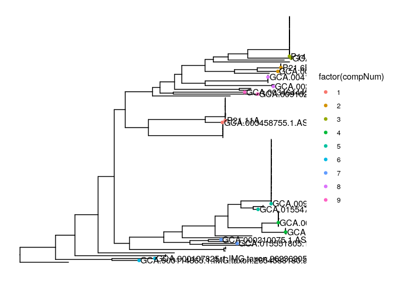
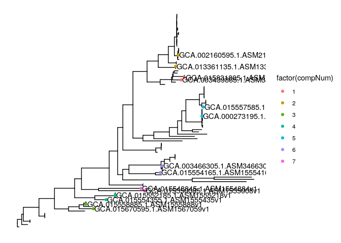
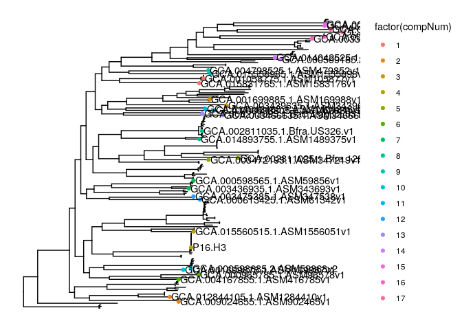
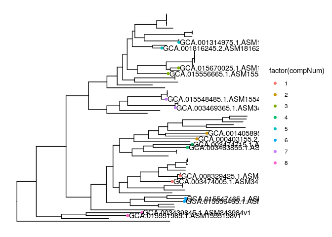

gene\_gain\_loss
================

Run count to assess gene gains and losses

Identify 50 representative strains for each Bacteroides species

Determine gene gain and loss events for phylogenetically independent
comparisons of isolates

Outputs summary files to be used by figures\_tables.Rmd

### Run count

``` r
runCount <- function(species,gain_penalty) {
  #reconstructs ancestral genome content among strain of a given bacteroides species
  #with set gain penalty
  
  #define inputs/outdir
  dir = file.path('results/pangenome',species)
  tree_file = file.path(dir,paste0(species,'.tre'))
  pres_abs_file = file.path(dir,"roary_nosplitparalogs/gene_presence_absence.csv")
  count_outdir = file.path('results/pangenome',species,'gene_gain_loss/count')
  dir.create(count_outdir,recursive = T)
  
  #add nodelabel to tree and output to count folder
  tree <- read.tree(tree_file)
  tree <- makeNodeLabel(tree)
  count_tree_file = file.path(count_outdir,paste0('count_',species,'.tre'))
  write.tree(tree,file=count_tree_file)
  
  #format pres abs table for count
  pres_abs <- read_csv(pres_abs_file, col_types = cols())
  colnames(pres_abs) <- stringr::str_replace_all(colnames(pres_abs),'[_-]','.')
  isblank <-  function(x) { 
    gene_count = as.numeric(str_count(x, pattern = "_"))
    gene_count = if_else(is.na(gene_count),0,gene_count)
    }
  pres_abs <- pres_abs %>% 
    select(Gene,all_of(tree$tip.label))  %>% 
    mutate_at(vars(-Gene),isblank)
  count_pres_abs_file = file.path(count_outdir,'count_pres_abs.txt')
  write_tsv(pres_abs,file=count_pres_abs_file)
  
  #run count
  count_outfile = file.path(count_outdir,paste0('countOutput_',species,'_gainpenalty',gain_penalty))
  print(count_outfile)
  system(paste('java -Xmx2048M -cp bin/Count/Count.jar ca.umontreal.iro.evolution.genecontent.AsymmetricWagner -gain ',
             gain_penalty,
             count_tree_file,
             count_pres_abs_file, '>',
             count_outfile,sep=' '))
  system(paste0("grep '# CHANGE' ",count_outfile," | sed 's/# //' > ",count_outfile,".CHANGE"))
  system(paste0("grep '# PRESENT' ",count_outfile," | sed 's/# //' > ",count_outfile,".PRESENT"))
  system(paste0("grep '# FAMILY' ",count_outfile," | sed 's/# //' > ",count_outfile,".FAMILY"))
  
  family <- read_tsv(paste0(count_outfile,".FAMILY"),col_types = cols()) %>% 
    dplyr::rename('Gene'='name') %>%
    select(-FAMILY)
  write_tsv(family,paste0(count_outfile,".FAMILY"))
  
  #compare # of genes in ancestral genomes vs extant genomes
  present <- read.table(paste0(count_outfile,".PRESENT"),sep='\t',header=TRUE)
  res <- present %>% 
    mutate(istip = if_else(node %in% tree$tip.label,'tip','node')) %>% 
    rstatix::kruskal_test(genes ~ istip)
  print(res)
  
}
```

### Compare gain penalty of 1 vs 2

``` r
runCount('Bacteroides_xylanisolvens', 1)
```

    ## [1] "results/pangenome/Bacteroides_xylanisolvens/gene_gain_loss/count/countOutput_Bacteroides_xylanisolvens_gainpenalty1"
    ## # A tibble: 1 x 6
    ##   .y.       n statistic    df        p method        
    ## * <chr> <int>     <dbl> <int>    <dbl> <chr>         
    ## 1 genes   267      14.8     1 0.000118 Kruskal-Wallis

``` r
runCount('Bacteroides_xylanisolvens', 2)
```

    ## [1] "results/pangenome/Bacteroides_xylanisolvens/gene_gain_loss/count/countOutput_Bacteroides_xylanisolvens_gainpenalty2"
    ## # A tibble: 1 x 6
    ##   .y.       n statistic    df     p method        
    ## * <chr> <int>     <dbl> <int> <dbl> <chr>         
    ## 1 genes   267      1.13     1 0.289 Kruskal-Wallis

### Run count on other Bt species with gp 2

``` r
runCount('Bacteroides_ovatus', 2)
runCount('Bacteroides_fragilis', 2)
runCount('Bacteroides_thetaiotaomicron', 2)
```

### Determine 50 representative strains for each Bacteroides species

calculate phylogenetic distance and gene content distance among all
pairwise combinations

``` r
identify_pw_50strain = function(species) {
  #reads in relevant data files
  #identify 50strains based on hclust of tree distances 
  #returns flattened dist matrix of all 1225 pw comparison and metadata
  
  #read in input files
  dir = paste0('results/pangenome/',species)
  outfile = file.path(dir,'gene_gain_loss/pw_50strain.txt')
  metadata = read_tsv(file.path(dir,'metadata.txt'),col_types = cols())
  pres_abs <- read_csv(file.path(dir,'roary_nosplitparalogs/gene_presence_absence.csv'),
                       col_types = cols())
  tree = read.tree(file.path(dir,paste0("phylogeny/RAxML_bipartitions.",species)))

  #create distance matrix from tree
  outgroup = metadata %>% filter(taxonomy_Species!=species) %>% pull(isolate)
  host_missing = metadata %>% filter(host=='missing') %>% pull(isolate)
  tree = drop.tip(tree,outgroup)
  tree = drop.tip(tree,host_missing)
  tree_dist <- cophenetic.phylo(tree)
  
  #dereplication closely related strains
  set.seed(123)
  hc = hclust(as.dist(tree_dist))
  cl = cutree(hc,k=50)
  df = data.frame(cl) %>% 
    rownames_to_column(var='isolate') %>%
    group_by(cl) %>% sample_n(1)
  rep50 <- df$isolate
  
  #phylogenetic distance
  tree_dist <- cophenetic.phylo(tree)[rep50,rep50]
  tree_dist = melt_dist(tree_dist) %>%
    dplyr::rename(tree_dist=dist) 
  
  #gene content distance
  isblank <- function(x) {as.numeric(str_count(x, pattern = "_"))}
  gene_table <- pres_abs %>% 
      select(Gene,all_of(rep50))  %>%
      mutate_at(vars(-Gene),isblank) %>%
      column_to_rownames(var = 'Gene') %>% 
      as.matrix()
  gene_table[is.na(gene_table)] <- 0
  dist_bray <- as.matrix(vegdist(t(gene_table), method="bray",full=T))
  dist_bray = dist_bray[rep50,rep50]
  dist_bray = melt_dist(dist_bray) %>%
      dplyr::rename(bray_curtis=dist) 
  pw_df = tree_dist %>% 
    left_join(dist_bray,by=c('iso2','iso1')) 
  #add metadata to pw comparisons
  metadata_subset <- metadata %>% dplyr::select(isolate,host,sample,taxonomy_Species)
  pw_df  <- pw_df  %>%  
    mutate(comp = paste(iso1,iso2,sep='_'))   %>%
    left_join(metadata_subset,by=c('iso1'='isolate')) %>%  #add metadata for individual1 and 
    left_join(metadata_subset,by=c('iso2'='isolate'),suffix = c(".iso1", ".iso2")) 
  write_tsv(pw_df,file.path(outfile))
  return(pw_df)
 
}

Bxy_pw = identify_pw_50strain('Bacteroides_xylanisolvens')
Bov_pw = identify_pw_50strain("Bacteroides_ovatus")
Bfr_pw = identify_pw_50strain("Bacteroides_fragilis")
Bth_pw = identify_pw_50strain("Bacteroides_thetaiotaomicron")
```

### Identify phylogenetically independent contrasts for each Bacteroides species

Start with Bxy strain and determine min phylogenetic distance cutoff
that gets 3 comparisons between captive ape associated strains and
closest human associated strain.

Determine how many sd this value is below the mean and then apply
similar phylogenetic distance cutoff to other Bacteroides species.

``` r
get_phylo_independent_comps = function(species,cutoff,outfile) {
  #identify phylogenetically independent pairs of strains
  #given the min cutoff tree dist
  
  #read in input files
  print(c(species,cutoff))
  dir = paste0('results/pangenome/',species)
  outfile = file.path(dir,'gene_gain_loss/PI_comps.txt')
  metadata = read_tsv(file.path(dir,'metadata.txt'),col_types = cols())
  tree = read.tree(file.path(dir,paste0(species,'.tre')))
  outgroup = metadata %>% filter(taxonomy_Species!=species) %>% pull(isolate)
  tree = drop.tip(tree,outgroup)
  tree_dist <- cophenetic.phylo(tree)
  pw_df <- melt_dist(tree_dist) %>% 
    dplyr::rename(tree_dist=dist) %>% 
    filter(tree_dist > as.numeric(cutoff)) #filter out comparison below cutoff
  
  #add metadata to pw comparisons
  metadata_subset <- metadata %>% dplyr::select(isolate,host,sample,taxonomy_Species)
  pw_df_meta  <- pw_df  %>%    
    left_join(metadata_subset,by=c('iso1'='isolate')) %>%  #add metadata for individual1 and 
    left_join(metadata_subset,by=c('iso2'='isolate'),suffix = c(".iso1", ".iso2")) %>%
    filter(host.iso1 != 'missing',host.iso2 != 'missing') %>%
    mutate(diff_host = if_else(host.iso1 != host.iso2, 1, 0)) %>%
    mutate(ape_host = if_else(host.iso1 %in% c('chimp','bonobo','orangutan','gorilla')|
                                host.iso2 %in% c('chimp','bonobo','orangutan','gorilla'),1,0)) %>%
    arrange(desc(diff_host),tree_dist) %>% 
    mutate(comp = paste(iso1,iso2,sep='_')) 
  
  identify_taxa <- function(iso1,iso2) {
      #determine all isolates that have the same MRCA as two input isolates
      node = getMRCA(tree,c(iso1,iso2))
      subtree = extract.clade(tree, node)
      return(subtree$tip.label)
      }
  
  taxa = c() #start with blank list of taxa to exclude
  rows = c() #start with blank list of PICs
  for (row in 1:nrow(pw_df_meta)) { #loop through tree distm
    iso1=pw_df_meta[row,1]
    iso2=pw_df_meta[row,2]
    subtree_taxa = identify_taxa(iso1,iso2)
    #add row to list if there's no phylogenetic overlap 
    if (length(intersect(subtree_taxa,taxa))==0){ 
        taxa = c(taxa,subtree_taxa)  #keep track of isolates included in comparisons            
        rows=c(rows,row)
        }
      }
  PI_comps = pw_df_meta[rows,]
  PI_comps$compNum = paste0('P',as.list(1:nrow(PI_comps)))
  write_tsv(PI_comps,file = outfile)
  
  #sanity check to be sure the pairs are independent
  test = PI_comps %>% 
    mutate(compNum = 1:nrow(PI_comps)) %>% 
    tidyr::pivot_longer(cols=c(iso1,iso2), names_to='1vs2') %>%
    dplyr::rename('iso'='value') %>%
    select(iso,everything())
  
  test_tree <- ggtree(tree) %<+% test + 
    geom_tippoint(aes(subset=(label%in%test$iso),color = factor(compNum))) +
    geom_tiplab(aes(subset=(label%in%test$iso)))
  print(test_tree)
  
  return(PI_comps)
  }

Bxy_cutoff = .008
Bxy_PIC = get_phylo_independent_comps('Bacteroides_xylanisolvens',Bxy_cutoff)
```

    ## [1] "Bacteroides_xylanisolvens" "0.008"

<!-- -->

``` r
sd_from_mean = (Bxy_cutoff - mean(Bxy_pw$tree_dist))/sd(Bxy_pw$tree_dist)

#apply cutoff same sd below mean for other Bt species
Bov_cutoff = mean(Bov_pw$tree_dist)+sd_from_mean*sd(Bov_pw$tree_dist)
Bov_PIC = get_phylo_independent_comps('Bacteroides_ovatus',Bov_cutoff)
```

    ## [1] "Bacteroides_ovatus"  "0.00872960318295377"

<!-- -->

``` r
Bfr_cutoff = mean(Bfr_pw$tree_dist)+sd_from_mean*sd(Bfr_pw$tree_dist)
Bfr_PIC = get_phylo_independent_comps('Bacteroides_fragilis',Bfr_cutoff)
```

    ## [1] "Bacteroides_fragilis" "0.00479880289508962"

<!-- -->

``` r
Bth_cutoff = mean(Bth_pw$tree_dist)+sd_from_mean*sd(Bth_pw$tree_dist)
Bth_PIC = get_phylo_independent_comps('Bacteroides_thetaiotaomicron',Bth_cutoff)
```

    ## [1] "Bacteroides_thetaiotaomicron" "0.00816877504324712"

<!-- -->

``` r
source('scripts/pangenome_analyses/gene_gain_loss_functions.R')
```

### Determine gene loss/gain across PIC using either 1 or 2 gain penalty and a windowsize of 5 or 1 genes

``` r
pairwise_gene_gain_runner = function(iso1,iso2,species,gp,window_size) {
  #set input filepaths to run pairwise_gene_gain
  dir = paste0('results/pangenome/',species)
  metadata = read_tsv(file.path(dir,'metadata.txt'),col_types = cols())
  pres_abs_file <- file.path(dir,'roary_nosplitparalogs/gene_presence_absence.csv')
  pw_outdir = file.path(dir,'gene_gain_loss/PIC_gene_gain_loss')
  dir.create(pw_outdir)
  iso1_old = metadata$isolate_old[metadata$isolate==iso1]
  iso2_old = metadata$isolate_old[metadata$isolate==iso2]
  iso1_gff_file = paste0('results/pangenome/prokka/',iso1_old,'/',iso1_old,'.gff')
  iso2_gff_file = paste0('results/pangenome/prokka/',iso2_old,'/',iso2_old,'.gff')
  countTREE_file=file.path(dir,paste0("gene_gain_loss/count/count_",species,".tre"))
  countOutput_file=file.path(dir,paste0(
    "gene_gain_loss/count/countOutput_",species,"_gainpenalty",gp,".FAMILY"))
  pairwise_gene_gain(
    #loaded from functions script
    pres_abs_file  = pres_abs_file,
    iso1=iso1,
    iso2=iso2,
    iso1_gff_file = iso1_gff_file,
    iso2_gff_file = iso2_gff_file,
    window_size = window_size,
    countTREE_file=countTREE_file,
    countOutput_file=countOutput_file,
    pw_outdir = pw_outdir,
    gainPenalty=gp)
}

Bxy_PIC = read_tsv('results/pangenome/Bacteroides_xylanisolvens/gene_gain_loss/PI_comps.txt',col_types = cols())
Bov_PIC = read_tsv('results/pangenome/Bacteroides_ovatus/gene_gain_loss/PI_comps.txt',col_types = cols())
Bfr_PIC = read_tsv('results/pangenome/Bacteroides_fragilis/gene_gain_loss/PI_comps.txt',col_types = cols())
Bth_PIC = read_tsv('results/pangenome/Bacteroides_thetaiotaomicron/gene_gain_loss/PI_comps.txt',col_types = cols())

#test command
pairwise_gene_gain_runner('P21.11A','GCA.003458755.1.ASM345875v1','Bacteroides_xylanisolvens',gp = 2,window_size =5)
```

### Run gene gain loss on all PIC

``` r
#Bxy
mapply(pairwise_gene_gain_runner,Bxy_PIC$iso1,Bxy_PIC$iso2,'Bacteroides_xylanisolvens',window_size = 5,gp = 2)
mapply(pairwise_gene_gain_runner,Bxy_PIC$iso1,Bxy_PIC$iso2,'Bacteroides_xylanisolvens',window_size = 1,gp = 2)
#Bov
mapply(pairwise_gene_gain_runner,Bov_PIC$iso1,Bov_PIC$iso2,'Bacteroides_ovatus',window_size = 5, gp = 2)
#Bfr
mapply(pairwise_gene_gain_runner,Bfr_PIC$iso1,Bfr_PIC$iso2,'Bacteroides_fragilis',window_size = 5, gp = 2)
#Bth
mapply(pairwise_gene_gain_runner,Bth_PIC$iso1,Bth_PIC$iso2,'Bacteroides_thetaiotaomicron',window_size = 5, gp = 2)
```

    get_summary_output <- function(species,suffix){
      #outputs various summary files of varying detail; 
      #summary df is the highest level, each row represents a PIC
      #gff is detailed each row represents a GeneID with its island,start and stop position
      #island output each row represents an indivdiual genomic island
      #copynumber table preserves copy numbers of each HGG
    
      dir = paste0('results/pangenome/',species)
      pw_outdir = file.path(dir,'gene_gain_loss/PIC_gene_gain_loss')
      summary_outdir = file.path(dir,'gene_gain_loss/PIC_gene_gain_loss_summary')
      dir.create(summary_outdir)
      all_files = list.files(file.path('results/pangenome',species,'gene_gain_loss/PIC_gene_gain_loss'))
      select_files = all_files[str_detect(all_files,suffix)]
      
      summary_files = select_files[str_detect(select_files,'summary')]
      summary_files = unlist(paste0(file.path(pw_outdir),'/',summary_files))
      summary_df  = rbindlist(lapply(summary_files,function(x){read.csv(x,sep='\t')}))
      outfile = file.path(summary_outdir,paste0(species,'_',suffix,'_summary.txt'))
      write_tsv(summary_df,file=outfile)
      
      gff_files = select_files[str_detect(select_files,'gff')]
      gff_files = unlist(paste0(file.path(pw_outdir),'/',gff_files))
      gff_df  = rbindlist(lapply(gff_files,function(x){read.csv(x,sep='\t')}))
      outfile = file.path(summary_outdir,paste0(species,'_',suffix,'_gff.txt'))
      write_tsv(gff_df,file=outfile)
      
      copynum_files = select_files[str_detect(select_files,'copynum')]
      copynum_files = unlist(paste0(file.path(pw_outdir),'/',copynum_files))
      copynum_df  = rbindlist(lapply(copynum_files,function(x){read.csv(x,sep='\t')}))
      outfile = file.path(summary_outdir,paste0(species,'_',suffix,'_copynum.txt'))
      write_tsv(copynum_df,file=outfile)
    
      island_files = select_files[str_detect(select_files,'island')]
      island_files = unlist(paste0(file.path(pw_outdir),'/',island_files))
      island_df  = rbindlist(lapply(island_files,function(x){read.csv(x,sep='\t')}))
      outfile = file.path(summary_outdir,paste0(species,'_',suffix,'_island.txt'))
      write_tsv(island_df,file=outfile)  
    }
    
    get_summary_output('Bacteroides_xylanisolvens','window5_gp2')
    get_summary_output('Bacteroides_xylanisolvens','window1_gp2')
    get_summary_output('Bacteroides_ovatus','window5_gp2')
    get_summary_output('Bacteroides_fragilis','window5_gp2')
    get_summary_output('Bacteroides_thetaiotaomicron','window5_gp2')
