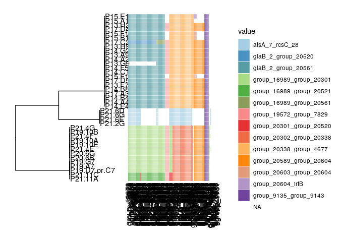
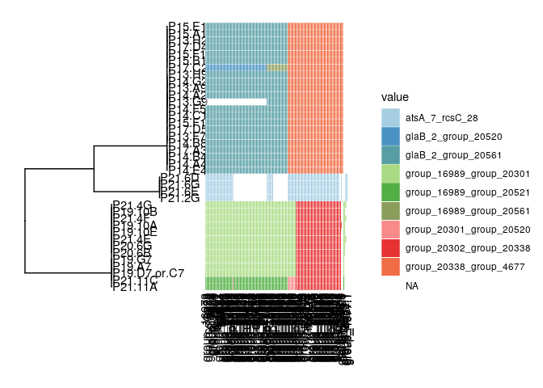
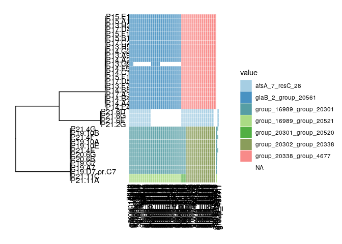

output\_PUL\_fasta
================

\-Identifies genomic islands for 178 HGGs that are convergently gained
by captive ape-associated strains

\-Output fastas for each island plus 100 genes upstream and downstream

### Identify genomic islands

``` r
source('scripts/pangenome_analyses/gene_gain_loss_functions.R')
#calls get_genomic_island function 

Bxydir = 'results/pangenome/Bacteroides_xylanisolvens'
metadata_file = file.path(Bxydir,'metadata.txt')
Bxy_metadata = read_tsv(metadata_file,col_types = cols())
window_size = 5

#define outdir for fastas
dir.create(file.path(Bxydir,"output_PUL_fasta/gff_window5"),recursive = T)

#identify genomic islands for 178 HGGs across all captive ape isolates  
get_captive_convergent_genes = function(isolate){
    #clusters genes within an isolate into genomic islands based on a given window size
    isolate_old = Bxy_metadata$isolate_old[Bxy_metadata$isolate==isolate]
    gff_file = paste0('results/pangenome/prokka/',isolate_old,'/',isolate_old,'.gff')
    genomic_islands_outfile =   file.path(
      Bxydir,'output_PUL_fasta', paste0('gff_window',window_size), paste0( #outfile dir
        isolate,'_window',window_size,'_island_gff.txt')) #outfile name
    gff_islands = get_genomic_island(pres_abs=pres_abs,
                               list_of_genes=captive_convergent_genes,
                               isolate=isolate,
                               gff_file=gff_file,
                               window_size = window_size,
                               outfile=genomic_islands_outfile)
}


pres_abs =  read_csv(file= file.path(Bxydir,'roary_nosplitparalogs/gene_presence_absence.csv'),
                      col_types = cols())
captive_convergent_genes = readRDS(file=file.path(Bxydir,'output_PUL_fasta/gene_list.RDS'))
print(length(captive_convergent_genes))
```

    ## [1] 178

``` r
get_captive_convergent_genes('P17.C2')
```

    ## [1] "Found  178 of 178 genes families provided. 182 gene copies belonging to this families found on 15 genomic islands using window size 5"

``` r
captive_isolates = Bxy_metadata$isolate[Bxy_metadata$human_ape=='ape']
#lapply(captive_isolates,get_captive_convergent_genes) #uncomment to run on all captive ape strains
```

### Visualize genomic islands

``` r
#generate heatmap only with clusters longer than 5 genes
captive_convergent_table = data.frame(Gene=captive_convergent_genes)
for  (isolate in captive_isolates) {
  #read in output
  genomic_islands_outfile = file.path(
    Bxydir,'output_PUL_fasta',paste0('gff_window',window_size), #outfile dir
     paste0(isolate,'_window',window_size,'_island_gff.txt')) #outfile name
  iso = read_tsv(file=genomic_islands_outfile)
  iso = iso %>% filter(size>5) %>%
    select(Gene,gene_span) %>% 
    mutate(Gene=make.names(Gene, unique=TRUE)) 
  colnames(iso) = c('Gene',isolate)
  captive_convergent_table = captive_convergent_table %>% full_join(iso,by='Gene')}

#heatmap matrix and tree
captive_convergent_tableM = captive_convergent_table %>% #format for heatmap
  column_to_rownames(var='Gene') %>%
  arrange_all() %>% 
  t()

Bxy_tree = read.tree(file = file.path(Bxydir,'Bacteroides_xylanisolvens.tre'))
not_captive = Bxy_tree$tip.label[!Bxy_tree$tip.label %in% captive_isolates] 
Bxy_tree_captive = drop.tip(Bxy_tree,not_captive) #remove not captive ape strains
write.tree(Bxy_tree_captive,file.path(Bxydir,'output_PUL_fasta/Bxy_tree_captive.tre'))

(captive_convergent_heatmap <- gheatmap(
                              ggtree(Bxy_tree_captive) + geom_tiplab() + ylim(-10,NA),
                              captive_convergent_tableM,
                              colnames_angle=90,
                              hjust=1,
                              offset = .01) +
    scale_fill_manual(values=colorRampPalette(brewer.pal(17, "Paired"))(17)))
```

<!-- -->

### subset to PUL region

``` r
table(captive_convergent_table$P21.4G) #appears the majority on genes are on two islands
```

    ## 
    ## group_16989_group_20301  group_19572_group_7829 group_20302_group_20338 
    ##                      87                       8                      42 
    ## group_20589_group_20604   group_9135_group_9143 
    ##                      22                       9

``` r
captive_PUL_table = captive_convergent_table %>% #select genes located on these 2 islands
  filter(P21.4G == 'group_16989_group_20301' | P21.4G == 'group_20302_group_20338') %>%
  separate(col = 'Gene',into=c('Gene'),extra='drop',sep='.1') 
#get names of islands in other strains 
(PUL_span = unique(unlist(select(captive_PUL_table,-Gene)))) 
```

    ##  [1] "group_16989_group_20561" "glaB_2_group_20520"     
    ##  [3] "group_20338_group_4677"  NA                       
    ##  [5] "glaB_2_group_20561"      "group_16989_group_20301"
    ##  [7] "group_20302_group_20338" "atsA_7_rcsC_28"         
    ##  [9] "group_16989_group_20521" "group_20301_group_20520"

``` r
#reselect any island from any strain in that list
captive_PUL_table = captive_convergent_table %>% 
  filter_at(vars(-Gene), all_vars(. %in% PUL_span)) 
#get rid of colnames that are all na
captive_PUL_table = captive_PUL_table %>%  
  filter(rowSums(is.na(captive_PUL_table)) != ncol(captive_PUL_table)-1) 

#number of HGGs in PUL = 126
captive_PUL_table$Gene
```

    ##   [1] "group_7689"   "group_16986"  "group_16987"  "group_16988"  "group_16989" 
    ##   [6] "group_7690"   "group_16973"  "rcsC_28"      "group_16984"  "glaB_2"      
    ##  [11] "group_20295"  "group_20296"  "group_20297"  "group_20298"  "group_20299" 
    ##  [16] "group_20300"  "group_20301"  "group_20302"  "group_20303"  "group_20304" 
    ##  [21] "rhmA"         "group_20306"  "gabD"         "group_20308"  "group_20309" 
    ##  [26] "hypBA1_1"     "gci"          "rhaT_1"       "ftsH_1"       "ywlE"        
    ##  [31] "group_20315"  "group_20316"  "group_20317"  "group_20318"  "group_20319" 
    ##  [36] "group_20320"  "prpC"         "group_20322"  "group_20323"  "group_20324" 
    ##  [41] "group_20325"  "group_20326"  "group_20327"  "group_20328"  "group_20329" 
    ##  [46] "group_20330"  "group_20331"  "group_20332"  "group_20333"  "pgpA_1"      
    ##  [51] "group_20336"  "group_20337"  "group_20338"  "group_20927"  "group_3074"  
    ##  [56] "group_4677"   "group_4678"   "kdpB_1"       "group_7683"   "group_7684"  
    ##  [61] "group_7685"   "glaB_1"       "group_7687"   "atsA_7"       "group_7854"  
    ##  [66] "group_20520"  "group_20521"  "glcC"         "lutR_1"       "group_20524" 
    ##  [71] "tatA_1"       "group_20526"  "group_20527"  "group_20528"  "group_20529" 
    ##  [76] "group_20530"  "group_20531"  "group_20704"  "group_4681"   "group_4682"  
    ##  [81] "group_20334"  "group_20561"  "group_20562"  "group_20563"  "group_20564" 
    ##  [86] "group_20565"  "group_20566"  "group_20567"  "group_20568"  "group_20569" 
    ##  [91] "group_20570"  "group_20571"  "group_20572"  "group_20573"  "group_20532" 
    ##  [96] "group_20533"  "group_20534"  "group_20535"  "group_20536"  "group_20537" 
    ## [101] "group_20538"  "group_20539"  "group_20540"  "group_20541"  "group_20542" 
    ## [106] "uidA_2"       "group_20544"  "group_20545"  "group_20546"  "group_20547" 
    ## [111] "group_20548"  "group_20549"  "cgiA"         "cglA_1"       "cglA_2"      
    ## [116] "group_20553"  "group_20554"  "group_20555"  "group_20556"  "group_20557" 
    ## [121] "group_20558"  "group_20559"  "group_20560"  "group_4683"   "group_7827"  
    ## [126] "group_7820"   "kdpB_1.1"     "group_4678.1" "group_4683.1" "group_4682.1"
    ## [131] "group_4681.1" "group_4677.1"

``` r
#plot heatmap of PUL subset
captive_PUL_tableM = captive_PUL_table %>% 
  as.data.frame() %>%
  column_to_rownames(var='Gene') %>%
  arrange_all() %>% 
  t()

(captive_convergent_heatmap <- gheatmap(
                              ggtree(Bxy_tree_captive) + geom_tiplab() + ylim(-10,NA),
                              captive_PUL_tableM,
                              colnames_angle=90,
                              hjust=1,
                              offset = .01) +
    scale_fill_manual(values=colorRampPalette(brewer.pal(17, "Paired"))(17)))
```

<!-- -->

``` r
#examine gff file
isolate = 'P17.C2'
P17.C2_gff_file = genomic_islands_outfile = 
      file.path(Bxydir,'output_PUL_fasta',paste0('gff_window',window_size),
                    paste0(isolate,'_window',window_size,'_island_gff.txt'))
P17.C2_gff = read_tsv(P17.C2_gff_file) 
P17.C2_gff = P17.C2_gff %>% filter(gene_span %in% PUL_span)
P17.C2_gff %>% group_by(contig,gene_span) %>%
  summarise(min(start),max(end))
```

    ## # A tibble: 3 x 4
    ## # Groups:   contig [2]
    ##   contig                gene_span               `min(start)` `max(end)`
    ##   <chr>                 <chr>                          <dbl>      <dbl>
    ## 1 scaffold11_size214356 glaB_2_group_20520            112010     214151
    ## 2 scaffold11_size214356 group_16989_group_20561        90457     107721
    ## 3 scaffold31_size67155  group_20338_group_4677          1775      67117

``` r
#merge glaB_2_group_20520 and group_16989_group_20561 bc upstream and downstream 
#regions will overlap
P17.C2_gff = P17.C2_gff %>% mutate(gene_span = recode(gene_span, 
                                      'glaB_2_group_20520' = 'glaB_2_group_20561',
                                      'group_16989_group_20561' = 'glaB_2_group_20561'))
write_tsv(P17.C2_gff, file = P17.C2_gff_file)


#merge islands and report lengths
PUL_span = c(PUL_span,'atsA_7_rcsC_28','glaB_2_group_20561')

get_length_genomic_islands <- function(isolate) {
  gff_file = genomic_islands_outfile = 
      file.path(Bxydir,'output_PUL_fasta',paste0('gff_window',window_size),
                    paste0(isolate,'_window',window_size,'_island_gff.txt'))
  df = read_tsv(gff_file)
  len = df %>% filter(gene_span %in% PUL_span) %>%
    group_by(contig,gene_span) %>%
    summarise(length=max(end)-min(start))
  len$isolate = isolate
  len = len %>% select(isolate,everything())
  return(len)
}

PUL_contig_summary = lapply(captive_isolates,get_length_genomic_islands) %>% bind_rows()
total_length = PUL_contig_summary %>% 
  group_by(isolate) %>%
  summarise(total_length = sum(length)) 
#total length of the PUL
table(total_length$total_length)
```

    ## 
    ##  82606 145992 145993 187316 187317 187588 187589 187590 189036 
    ##      1      3      1      1      1      3      5      3     21

``` r
write_tsv(PUL_contig_summary,
          file = file.path(Bxydir,'output_PUL_fasta/PUL_contig_summary.txt'))
            
##recode islands to make new heatmap
captive_PUL_table= captive_PUL_table %>% 
  as.data.frame() %>%
  mutate_all(funs(recode(., 
                         'glaB_2_group_20520' = 'glaB_2_group_20561',
                         'group_16989_group_20561' = 'glaB_2_group_20561'
                         ))) 

captive_PUL_tableM = captive_PUL_table %>%
  column_to_rownames(var='Gene') %>%
  arrange_all() %>% 
  t()
write.table(captive_PUL_tableM,
          file = file.path(Bxydir,'output_PUL_fasta/captive_PUL_tableM.txt'),
                    quote=F,sep='\t')

(captive_convergent_heatmap <- gheatmap(
                              ggtree(Bxy_tree_captive) + geom_tiplab() + ylim(-10,NA),
                              captive_PUL_tableM ,
                              colnames_angle=90,
                              hjust=1,
                              offset = .01) +
    scale_fill_manual(values=colorRampPalette(brewer.pal(17, "Paired"))(17)))
```

<!-- -->

### Output fasta

``` r
get_island_fna = function(isolate,gene_span,updown_size){
    #given isolate and name of genomic island outputs to fna plus X genes upstream and downstream
    isolate_old = Bxy_metadata$isolate_old[Bxy_metadata$isolate==isolate]
    gff_file = paste0('results/pangenome/prokka/',isolate_old,'/',isolate_old,'.gff')
    fna_file = paste0('results/pangenome/prokka/',isolate_old,'/',isolate_old,'.fna')
    genomic_islands_outfile = 
      file.path(Bxydir,'output_PUL_fasta',paste0('gff_window',window_size),
                    paste0(isolate,'_window',window_size,'_island_gff.txt'))
    island_fasta_outfile = 
      file.path(Bxydir,'output_PUL_fasta',
              paste0('fna_window',window_size,'updown',updown_size),
                 gene_span,paste0(isolate,'_',gene_span,'_updown_',updown_size,'.fna'))
    print(island_fasta_outfile)
    output_island_fasta(
          isolate=isolate,
          gene_span = gene_span,
          genomic_islands_outfile = genomic_islands_outfile,
          island_fasta_outfile  = island_fasta_outfile,
          updown_size = updown_size ,
          fna_file = fna_file,
          gff_file = gff_file
          )
}

#output fnas for test isolate
get_island_fna(isolate='P17.C2',gene_span='glaB_2_group_20561',updown=0)
```

    ## [1] "results/pangenome/Bacteroides_xylanisolvens/output_PUL_fasta/fna_window5updown0/glaB_2_group_20561/P17.C2_glaB_2_group_20561_updown_0.fna"
    ## [1] "P17.C2"             "glaB_2_group_20561"

    ## [1] "output genomic island glaB_2_group_20561 containing 76 genes plus 0 genes on either side, total length is 123694"

``` r
#output fnas for all isolates
#mcmapply(get_island_fna,
#  PUL_contig_summary$isolate,PUL_contig_summary$gene_span,rep(100,nrow(PUL_contig_summary)) ,
#  mc.cores=8)
#mcmapply(get_island_fna,
#  PUL_contig_summary$isolate,PUL_contig_summary$gene_span,rep(0,nrow(PUL_contig_summary)) ,
#  mc.cores=8)
```
