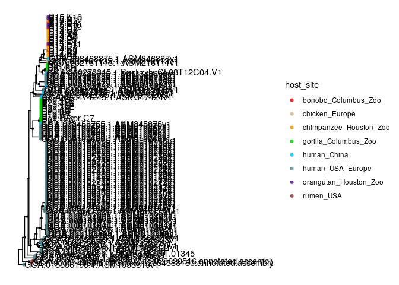

Processing pangenome
================

Edits metadata, filters out low quality genomes, runs prokka on genome
assemblies, sets up files to run roary pangenome, generates phylogeny,
compares annotations from dbcan, sulfatlas, eggnog, and KEGG for
homologous gene groups,

### Merge NCBI and isolate metadata

``` r
#read in metadata for isolates downloaded from ncbi
ncbi <- read_tsv('data/ncbi_genomes/ncbi_genome_assembly_quality.txt',col_types = cols())
ncbi <- ncbi %>% mutate(dataset = 'ncbi_genomes')
#read in metadata for isolates sequenced by this study
strain <- read_tsv('metadata/strain_metadata_assembly_quality.txt',col_types = cols())
strain <- strain %>% mutate(dataset = 'isolate_genomes',
                            isolation_source = 'stool',
                            infection_status = FALSE) 
Bt_species = c('Bacteroides fragilis','Bacteroides ovatus',
               'Bacteroides thetaiotaomicron','Bacteroides xylanisolvens')
BfrA_outgroup = c('GCA_016864615.1_ASM1686461v1',
                  'GCA_001695355.1_ASM169535v1',
                  'GCA_003471745.1_ASM347174v1')
#identify MAG genomes that snuck into isolate genomes
(MAG_samples <- c(as.character(ncbi$isolate[str_detect(ncbi$isolate, '_SRR')]),
                 as.character(ncbi$isolate[str_detect(ncbi$isolate, '_ERR')])))
```

    ## [1] "GCA_905199765.1_SRR7721867-mag-bin.16"
    ## [2] "GCA_905207945.1_SRR341607-mag-bin.2"  
    ## [3] "GCA_900227845.1_SRR1027519"           
    ## [4] "GCA_905193355.1_ERR1190731-mag-bin.2" 
    ## [5] "GCA_905205635.1_ERR1430437-mag-bin.20"
    ## [6] "GCA_905188165.1_ERR748050-mag-bin.3"

``` r
metadata <- bind_rows(strain,ncbi) %>% 
  dplyr::rename(Genome.size='Genome size',
         predicted.genes = "# predicted genes") %>%
  filter(taxonomy_Species%in%Bt_species|isolate%in%BfrA_outgroup) %>%
  filter(!isolate %in% MAG_samples)


ggplot(metadata, aes(x=Completeness,y=Contamination)) + geom_point() + theme_bw()
```

<!-- -->

``` r
#several ncbi genomes have high contamination eliminate outliers
metadata <- metadata %>% 
  mutate(included_analysis = if_else(Contamination<5 & Completeness>95, 1 ,0),
         taxonomy_Species = str_replace_all(taxonomy_Species,' ','_'),
         isolate_old = isolate,
         isolate = str_replace_all(isolate,'[_-]','.'))  %>%
  unite(host_site, host, site, sep = "_", remove = FALSE) 

metadata %>% group_by(included_analysis,dataset) %>% tally()
```

    ## # A tibble: 3 x 3
    ## # Groups:   included_analysis [2]
    ##   included_analysis dataset             n
    ##               <dbl> <chr>           <int>
    ## 1                 0 ncbi_genomes       23
    ## 2                 1 isolate_genomes    54
    ## 3                 1 ncbi_genomes      431

``` r
TableS1 = metadata %>% filter(dataset == 'isolate_genomes')
write_tsv(TableS1,'metadata/TableS1_isolate_genomes.txt')
TableS2 = metadata %>% filter(dataset == 'ncbi_genomes')
write_tsv(TableS2,'metadata/TableS2_ncbi_genomes.txt')

metadata_included <- metadata %>% filter(included_analysis == 1) 

metadata_included %>% 
  group_by(taxonomy_Species,dataset) %>% 
  tally()  %>% 
  pivot_wider(names_from = dataset,values_from = n,values_fill = 0)
```

    ## # A tibble: 5 x 3
    ## # Groups:   taxonomy_Species [5]
    ##   taxonomy_Species             isolate_genomes ncbi_genomes
    ##   <chr>                                  <int>        <int>
    ## 1 Bacteroides_fragilis                      12          170
    ## 2 Bacteroides_fragilis_A                     0            3
    ## 3 Bacteroides_ovatus                         3           92
    ## 4 Bacteroides_thetaiotaomicron               0           74
    ## 5 Bacteroides_xylanisolvens                 39           92

### Contamination and completeness are not correlated with \# of predicted genes

``` r
#subset to Bxy strains
Bxy_metadata <- metadata_included %>% filter(taxonomy_Species== 'Bacteroides_xylanisolvens')
#summary(lm_robust(Genome.size ~ Contamination + Completeness + host, data=Bxy_metadata))
pred.genes.lm = lm_robust(predicted.genes ~ Contamination + Completeness + host, data=Bxy_metadata)
summary(pred.genes.lm)
```

    ## 
    ## Call:
    ## lm_robust(formula = predicted.genes ~ Contamination + Completeness + 
    ##     host, data = Bxy_metadata)
    ## 
    ## Standard error type:  HC2 
    ## 
    ## Coefficients:
    ##                Estimate Std. Error t value  Pr(>|t|) CI Lower   CI Upper  DF
    ## (Intercept)    15282.79    5414.10  2.8228 5.561e-03  4565.04 26000.5420 122
    ## Contamination    126.38     126.05  1.0026 3.180e-01  -123.14   375.8966 122
    ## Completeness    -103.44      53.35 -1.9389 5.482e-02  -209.05     2.1713 122
    ## hostchicken     -556.24     105.43 -5.2759 5.818e-07  -764.96  -347.5319 122
    ## hostchimpanzee   -73.22      37.20 -1.9682 5.132e-02  -146.86     0.4251 122
    ## hostgorilla     -418.78      62.68 -6.6809 7.501e-10  -542.86  -294.6897 122
    ## hosthuman        237.39     103.07  2.3031 2.297e-02    33.35   441.4324 122
    ## hostmissing     -236.80     147.64 -1.6039 1.113e-01  -529.06    55.4735 122
    ## hostorangutan    -29.88      62.02 -0.4818 6.308e-01  -152.64    92.8888 122
    ## 
    ## Multiple R-squared:  0.6004 ,    Adjusted R-squared:  0.5742 
    ## F-statistic: 323.8 on 8 and 122 DF,  p-value: < 2.2e-16

### Run prokka on assemblies

(Can’t use CheckM prokka output bc CheckM removes full fasta from end of
gff file, so roary doesn’t take it)

``` r
#output list of files to run prokka on that run_prokka.sh takes as input
dir.create('results/pangenome/prokka')
```

    ## Warning in dir.create("results/pangenome/prokka"): 'results/pangenome/prokka'
    ## already exists

``` r
prokka_done = list.files('results/pangenome/prokka')
print(paste(length(prokka_done),'genomes done with prokka'))
```

    ## [1] "520 genomes done with prokka"

``` r
get_file_path <- function(isolate,dataset) {
  if (dataset=='ncbi_genomes') {
    filePath = paste0('data/ncbi_genomes/isolate_genomes/',isolate,'.fna')
  } else {
    filePath = paste0('results/isolate_genomes/',isolate,'/',isolate,'.fna')
  }
  return(filePath)
  }
#genomes left to run prof
setdiff(metadata_included$isolate_old,as.character(prokka_done))
```

    ## character(0)

``` r
metadata_prokka_todo <- metadata_included %>% 
  filter(!isolate_old %in% as.character(prokka_done)) 
if (nrow(metadata_prokka_todo)>0) {
metadata_prokka_todo <- metadata_prokka_todo  %>%
mutate(filepath = get_file_path(isolate,dataset)) 
#print(metadata_prokka_todo$isolate)
write.table(metadata_prokka_todo$filepath,file='results/pangenome/prokka/todo.txt', #output todo list
            col.names = F,
            row.names = F,
            quote = F)
}
```

### Run prokka on commandline

./scripts/run\_prokka.sh

### Copy files for roary runs

Adds three outgroup assemblies for each Bacteroides species

``` r
#outgroup all isolate genomes plus outgroup to species folders 

#Bacteroides xylanisolvens
Bov_outgroup = c('GCA_002959635.1_ASM295963v1',
  'GCA_007012325.1_ASM701232v1',
  'GCA_015557725.1_ASM1555772v1')
Bxy_metadata <- metadata_included %>% 
  filter(taxonomy_Species == 'Bacteroides_xylanisolvens' | 
           isolate_old %in% Bov_outgroup) 
system(paste0('mkdir -pv results/pangenome/Bacteroides_xylanisolvens/faa'))
for (isolate_old in Bxy_metadata$isolate_old) {
    infile = paste0('results/pangenome/prokka/',isolate_old,'/',isolate_old,'.faa')
    isolate = str_replace_all(isolate_old,'[_-]','.')
    outfile = paste0('results/pangenome/Bacteroides_xylanisolvens/faa/',isolate,'.faa')
    #system(paste0('cp ',infile,' ',outfile))
    }  
system(paste0('mkdir -pv results/pangenome/Bacteroides_xylanisolvens/gff'))
for (isolate_old in Bxy_metadata$isolate_old) {
    infile = paste0('results/pangenome/prokka/',isolate_old,'/',isolate_old,'.gff')
    isolate = str_replace_all(isolate_old,'[_-]','.')
    outfile = paste0('results/pangenome/Bacteroides_xylanisolvens/gff/',isolate,'.gff')
    #system(paste0('cp ',infile,' ',outfile))
    }       
#sanity check # of genomes in metadata = # of gff and faa files
write_tsv(Bxy_metadata, file= "results/pangenome/Bacteroides_xylanisolvens/metadata.txt")
nrow(Bxy_metadata)
```

    ## [1] 134

``` r
length(list.files('results/pangenome/Bacteroides_xylanisolvens/gff/')) 
```

    ## [1] 134

``` r
length(list.files('results/pangenome/Bacteroides_xylanisolvens/faa/'))
```

    ## [1] 134

``` r
#Bacteroides fragilis
BfrA_outgroup = c('GCA_016864615.1_ASM1686461v1','GCA_001695355.1_ASM169535v1','GCA_003471745.1_ASM347174v1')
Bfr_metadata <- metadata_included %>% 
  filter(taxonomy_Species == 'Bacteroides_fragilis' | isolate_old %in% BfrA_outgroup)
system(paste0('mkdir -pv results/pangenome/Bacteroides_fragilis/faa'))
for (isolate_old in Bfr_metadata$isolate_old) {
    infile = paste0('results/pangenome/prokka/',isolate_old,'/',isolate_old,'.faa')
    isolate = str_replace_all(isolate_old,'[_-]','.')
    outfile = paste0('results/pangenome/Bacteroides_fragilis/faa/',isolate,'.faa')
    #system(paste0('cp ',infile,' ',outfile))
    }   
system(paste0('mkdir -pv results/pangenome/Bacteroides_fragilis/gff'))
for (isolate_old in Bfr_metadata$isolate_old) {
    infile = paste0('results/pangenome/prokka/',isolate_old,'/',isolate_old,'.gff')
    isolate = str_replace_all(isolate_old,'[_-]','.')
    outfile = paste0('results/pangenome/Bacteroides_fragilis/gff/',isolate,'.gff')
    #system(paste0('cp ',infile,' ',outfile))
}
#sanity check # of genomes in metadata = # of gff and faa files
write_tsv(Bfr_metadata, 
          file= "results/pangenome/Bacteroides_fragilis/metadata.txt")
nrow(Bfr_metadata)
```

    ## [1] 185

``` r
length(list.files('results/pangenome/Bacteroides_fragilis/gff/'))
```

    ## [1] 185

``` r
length(list.files('results/pangenome/Bacteroides_fragilis/faa/'))
```

    ## [1] 185

``` r
#Bacteroides ovatus
Bxy_outgroup = c('P19-10A','GCA_009102165.1_ASM910216v1','GCA_003436085.1_ASM343608v1')
Bov_metadata <- metadata_included %>% 
  filter(taxonomy_Species == 'Bacteroides_ovatus' | isolate_old %in% Bxy_outgroup)
system(paste0('mkdir -pv results/pangenome/Bacteroides_ovatus/faa'))
for (isolate_old in Bov_metadata$isolate_old) {
    infile = paste0('results/pangenome/prokka/',isolate_old,'/',isolate_old,'.faa')
    isolate = str_replace_all(isolate_old,'[_-]','.')
    outfile = paste0('results/pangenome/Bacteroides_ovatus/faa/',isolate,'.faa')
    #system(paste0('cp ',infile,' ',outfile))
    }  
system(paste0('mkdir -pv results/pangenome/Bacteroides_ovatus/gff'))
for (isolate_old in Bov_metadata$isolate_old) {
    infile = paste0('results/pangenome/prokka/',isolate_old,'/',isolate_old,'.gff')
    isolate = str_replace_all(isolate_old,'[_-]','.')
    outfile = paste0('results/pangenome/Bacteroides_ovatus/gff/',isolate,'.gff')
    #system(paste0('cp ',infile,' ',outfile))
} 
#sanity check # of genomes in metadata = # of gff and faa files
write_tsv(Bov_metadata, 
          file= "results/pangenome/Bacteroides_ovatus/metadata.txt")
nrow(Bov_metadata)
```

    ## [1] 98

``` r
length(list.files('results/pangenome/Bacteroides_ovatus/gff/'))
```

    ## [1] 98

``` r
length(list.files('results/pangenome/Bacteroides_ovatus/faa/'))
```

    ## [1] 98

``` r
#Bacteroides theta
Bxy_outgroup = c('P19-10A','GCA_009102165.1_ASM910216v1','GCA_003436085.1_ASM343608v1')
Bth_metadata <- metadata_included %>% 
  filter(taxonomy_Species == 'Bacteroides_thetaiotaomicron' | isolate_old %in% Bxy_outgroup)
system(paste0('mkdir -pv results/pangenome/Bacteroides_thetaiotaomicron/faa'))
for (isolate_old in Bth_metadata$isolate_old) {
    infile = paste0('results/pangenome/prokka/',isolate_old,'/',isolate_old,'.faa')
    isolate = str_replace_all(isolate_old,'[_-]','.')
    outfile = paste0('results/pangenome/Bacteroides_thetaiotaomicron/faa/',isolate,'.faa')
    #system(paste0('cp ',infile,' ',outfile))
    }  
system(paste0('mkdir -pv results/pangenome/Bacteroides_thetaiotaomicron/gff'))
for (isolate_old in Bth_metadata$isolate_old) {
    infile = paste0('results/pangenome/prokka/',isolate_old,'/',isolate_old,'.gff')
    isolate = str_replace_all(isolate_old,'[_-]','.')
    outfile = paste0('results/pangenome/Bacteroides_thetaiotaomicron/gff/',isolate,'.gff')
    #system(paste0('cp ',infile,' ',outfile))
    }  
#sanity check # of genomes in metadata = # of gff and faa files
write_tsv(Bth_metadata, 
          file= "results/pangenome/Bacteroides_thetaiotaomicron/metadata.txt")
nrow(Bth_metadata)
```

    ## [1] 77

``` r
length(list.files('results/pangenome/Bacteroides_thetaiotaomicron/gff/'))
```

    ## [1] 77

``` r
length(list.files('results/pangenome/Bacteroides_thetaiotaomicron/faa/'))
```

    ## [1] 77

### run roary on commandline

run roary no-split-paralogs analysis, raxml phylogeny, eggnog mapper

scripts/pangenome\_processing\_annotation/run\_pangenome.sh

### Reroot phylogenies

``` r
reroot_phylogeny = function(species) {
  
  #read-in metadata
  dir = file.path('results/pangenome',species)
  metadata_file = file.path(dir,"metadata.txt")
  metadata = read_tsv(metadata_file,col_types = cols())

  #root tree
  outgroup_names <- metadata %>% 
    filter(taxonomy_Species!=species) %>% 
    pull(isolate)
  tree_file = file.path(dir,paste0("phylogeny/RAxML_bipartitions.",species))
  tree <- ape::read.tree(tree_file)
  tree$tip.label = str_replace_all(tree$tip.label,'[_-]','.') #clean up names
  tree <- root(tree,outgroup=outgroup_names) 
  write.tree(tree,file = file.path(dir,paste0(species,'.tre')))
  
  #visualize tree
  tree_plot <- ggtree(tree) %<+% metadata +
    geom_nodepoint(aes(subset = suppressWarnings(as.numeric(label)) > 75),size=.75) +
    geom_tippoint(aes(color=host), alpha=0.8)  + 
    geom_tiplab() 
  print(tree_plot)
}

reroot_phylogeny('Bacteroides_xylanisolvens')
```

    ## Warning: `data_frame()` was deprecated in tibble 1.1.0.
    ## Please use `tibble()` instead.

    ## Warning: `mutate_()` was deprecated in dplyr 0.7.0.
    ## Please use `mutate()` instead.
    ## See vignette('programming') for more help

<!-- -->

``` r
reroot_phylogeny('Bacteroides_fragilis')
```

<!-- -->

``` r
reroot_phylogeny('Bacteroides_ovatus')
```

<!-- -->

``` r
reroot_phylogeny('Bacteroides_thetaiotaomicron')
```

<!-- -->

### Annotations for Bacteroides xylanisolvens orthologous gene groups

#### Dbcan

``` r
dir = 'results/pangenome/Bacteroides_xylanisolvens'
pan_genome_fasta <- read.fasta(file.path(dir,'roary_nosplitparalogs/pan_genome_reference.fa'),whole.header = T)
nseqs = length(pan_genome_fasta)
half= nseqs/2
part1 = pan_genome_fasta[1:half] 
part2 = pan_genome_fasta[(half+1):nseqs] 
system(paste0('mkdir -pv ',file.path(dir,'dbcan')))
seqinr::write.fasta(part1,names=names(part1),
                    file=file.path(dir,'dbcan/pan_genome_reference_part1.fa'))
seqinr::write.fasta(part2,names=names(part2),
                    file=file.path(dir,'dbcan/pan_genome_reference_part2.fa'))
```

``` bash
#wget http://bcb.unl.edu/dbCAN2/data/blast/20210413144512/overview.txt -O results/pangenome/Bacteroides_xylanisolvens/dbcan/dbDCAN_part1.txt
#wget http://bcb.unl.edu/dbCAN2/data/blast/20210413153256/overview.txt -O results/pangenome/Bacteroides_xylanisolvens/dbcan/dbDCAN_part2.txt
```

``` r
dbcan_p1 <- read.table(file.path(dir,'dbcan/dbDCAN_part1.txt'),sep='\t',header=T)
dbcan_p2 <- read.table(file.path(dir,'dbcan/dbDCAN_part2.txt'),sep='\t',header=T)

dbcan <- dbcan_p1 %>% 
  add_row(dbcan_p2) %>% #add part2 to end of part2
  separate(col='Gene.ID',into=c('Gene','ID'),sep='_',extra='drop') %>%
  unite(col='Gene.ID',Gene:ID,sep='_') %>%
  mutate_all(as.character) 
dbcan = dbcan %>%
  separate(HMMER,sep='[(_]',into = c('HMMER'),extra = 'drop') %>%
  mutate(HMMER = ifelse(HMMER=='N',NA,as.character(HMMER)),
         DIAMOND = ifelse(DIAMOND=='N',NA,as.character(DIAMOND)),
         Hotpep = ifelse(Hotpep=='N',NA,as.character(Hotpep)))


colnames(dbcan) = c("Gene.ID","dbcan_HMMER","dbcan_Hotpep","dbcan_DIAMOND","dbcan_Signalp","dbcan_X")
head(dbcan)
```

    ##          Gene.ID dbcan_HMMER   dbcan_Hotpep dbcan_DIAMOND dbcan_Signalp dbcan_X
    ## 1 BALBAENG_00750        GH88           GH88          GH88             N       3
    ## 2 BALBAENG_00752        GH29           GH29          GH29       Y(1-26)       3
    ## 3 BALBAENG_00757        PL12           PL12        PL12_2       Y(1-21)       3
    ## 4 BALBAENG_00759       GH141            GH0           GH0             N       3
    ## 5 BALBAENG_00833        GH10 GH10+CBM0+CBM4     CBM4+GH10             N       3
    ## 6 BALBAENG_00836        GH10           GH10          GH10       Y(1-25)       3

``` r
write_tsv(dbcan,file.path(dir,'dbcan/dbDCAN_final.txt'))
```

#### Kofam Koala

``` r
dir = 'results/pangenome/Bacteroides_xylanisolvens'
pan_genome_fasta <- read.fasta(file.path(dir,'roary_nosplitparalogs/pan_genome_reference_prot.faa'),whole.header = T)
nseqs = length(pan_genome_fasta)
third= nseqs/3
part1 = pan_genome_fasta[1:third] 
part2 = pan_genome_fasta[(third+1):(2*third)] 
part3 = pan_genome_fasta[(2*third+1):nseqs] 
system(paste0('mkdir -pv ',file.path(dir,'koala')))
seqinr::write.fasta(part1,names=names(part1),
                    file=file.path(dir,'koala/pan_genome_reference_part1.fa'))
seqinr::write.fasta(part2,names=names(part2),
                    file=file.path(dir,'koala/pan_genome_reference_part2.fa'))
seqinr::write.fasta(part3,names=names(part3),
                    file=file.path(dir,'koala/pan_genome_reference_part3.fa'))
```

``` r
koala_p1 <- read_table(file.path(dir,'koala/koala_part1.txt'),skip = 2, col_names = F,col_types = cols())
koala_p2 <- read_table(file.path(dir,'koala/koala_part2.txt'),skip = 2, col_names = F,col_types = cols())
koala_p3 <- read_table(file.path(dir,'koala/koala_part3.txt'),skip = 2, col_names = F,col_types = cols())

koala <- koala_p1 %>% 
  add_row(koala_p2) %>% #add part2 to end of part2
  add_row(koala_p3) %>% 
  select(-X1)
colnames(koala) <- c('Gene.ID', 'koala_KO','koala_threshold','koala_HMM_score','koala_E-value','koala_Definition')
koala = koala %>%
  separate(col='Gene.ID',into=c('Gene','ID'),sep='_',extra='drop') %>%
  unite(col='Gene.ID',Gene:ID,sep='_') %>%
  mutate_all(as.character) %>%
  group_by(Gene.ID) %>%
  slice_min(order_by=koala_HMM_score,n=1) %>%
  as.data.frame()
head(koala)
```

    ##          Gene.ID koala_KO koala_threshold koala_HMM_score koala_E-value
    ## 1 AAFILABK_00006   K21572           53.53           257.7       1.2e-76
    ## 2 AAFILABK_00007   K21573          607.33           937.1      5.9e-282
    ## 3 AAFILABK_00009   K01190          363.87           565.6      7.8e-170
    ## 4 AAFILABK_00011   K01190          363.87           498.5      1.5e-149
    ## 5 AAFILABK_00013   K02510           101.5           248.4       4.2e-74
    ## 6 AAFILABK_00018   K09955          108.83           366.3      1.4e-109
    ##                                            koala_Definition
    ## 1   starch-binding outer membrane protein, SusD/RagB family
    ## 2 TonB-dependent starch-binding outer membrane protein SusC
    ## 3                          beta-galactosidase [EC:3.2.1.23]
    ## 4                          beta-galactosidase [EC:3.2.1.23]
    ## 5       4-hydroxy-2-oxoheptanedioate aldolase [EC:4.1.2.52]
    ## 6                                   uncharacterized protein

``` r
write_tsv(koala,file.path(dir,'koala/koala_final.txt'))
```

#### Sulfatlas

``` bash
#wget http://application.sb-roscoff.fr/blast/blast_sulfatlas/data/sequences/sulfatlas_v1.3.faa 
#mv sulfatlas_v1.3.faa results/pangenome/Bacteroides_xylanisolvens/sulfatlas/sulfatlas_v1.3.faa
#makeblastdb -in results/pangenome/Bacteroides_xylanisolvens/sulfatlas/sulfatlas_v1.3.faa -dbtype prot
#mkdir results/pangenome/Bacteroides_xylanisolvens/sulfatlas
#transeq -sequence results/pangenome/Bacteroides_xylanisolvens/roary_nosplitparalogs/pan_genome_reference.fa -outseq results/pangenome/Bacteroides_xylanisolvens/roary_nosplitparalogs/pan_genome_reference_prot.faa
#blastp -query results/pangenome/Bacteroides_xylanisolvens/roary_nosplitparalogs/pan_genome_reference_prot.faa -db results/pangenome/Bacteroides_xylanisolvens/sulfatlas/sulfatlas_v1.3.faa -out results/pangenome/Bacteroides_xylanisolvens/sulfatlas/pan_genome_reference.txt -max_target_seqs 10 -outfmt "6 qseqid sseqid salltitles pident evalue" 
```

``` r
sulfatlas <- read_tsv(file = file.path(dir,'sulfatlas/pan_genome_reference.txt'),
                      comment='#',col_names = FALSE, col_types = cols())
```

    ## Warning: 27 parsing failures.
    ##   row col  expected    actual                                                                             file
    ## 12720  -- 5 columns 3 columns 'results/pangenome/Bacteroides_xylanisolvens/sulfatlas/pan_genome_reference.txt'
    ## 13098  -- 5 columns 3 columns 'results/pangenome/Bacteroides_xylanisolvens/sulfatlas/pan_genome_reference.txt'
    ## 14029  -- 5 columns 3 columns 'results/pangenome/Bacteroides_xylanisolvens/sulfatlas/pan_genome_reference.txt'
    ## 23632  -- 5 columns 3 columns 'results/pangenome/Bacteroides_xylanisolvens/sulfatlas/pan_genome_reference.txt'
    ## 24946  -- 5 columns 3 columns 'results/pangenome/Bacteroides_xylanisolvens/sulfatlas/pan_genome_reference.txt'
    ## ..... ... ......... ......... ................................................................................
    ## See problems(...) for more details.

``` r
colnames(sulfatlas) <- c('Gene.ID', 'sseqid','salltitles', 'pident', 'evalue_sulfa')
sulfatlas <- sulfatlas %>%
  mutate(Gene.ID=str_sub(Gene.ID, end=-3)) %>% 
  filter(pident > 85 & evalue_sulfa < 1e-5)

sulfatlas <- sulfatlas %>% 
  separate(col = 'salltitles',into=c(NA,'id','full_descripton'),extra='drop',sep='[|]') %>%
  separate(col='id',into=c('lcl','sulfatase_family','sulfatase_subfamily'),sep='_') %>%
  separate(col='full_descripton',into=c('description','species'),sep='OS=') %>%
  separate(col='description',into=c('front','description'),sep='BACE |BACOV |BACO1 |_BACSE ')  %>%
  separate(col='species',into=c('species',NA),sep='OX=') 
```

    ## Warning: Expected 2 pieces. Missing pieces filled with `NA` in 5 rows [327, 329,
    ## 332, 335, 337].

``` r
sulfatlas <- sulfatlas %>% 
  select('Gene.ID', 'sseqid','pident', 'evalue_sulfa',
                  'sulfatase_family','sulfatase_subfamily','description','species') 
sulfatlas <- sulfatlas %>%  group_by(Gene.ID) %>%
             top_n(n = 1, wt = pident) %>%
             group_by(Gene.ID) %>%
             top_n(n = 1, wt = sseqid) %>%
             as.data.frame()
colnames(sulfatlas) = c("Gene.ID","sulfatlas_sseqid","sulfatlas_pident","sulfatlas_evalue","sulfatlas_family",
                        "sulfatlas_subfamily","sulfatlas_description","sulfatlas_species")
head(sulfatlas)
```

    ##          Gene.ID              sulfatlas_sseqid sulfatlas_pident
    ## 1 KENJADKH_00343  lcl|W6P3I2_S1_8|W6P3I2_9BACE          100.000
    ## 2 KENJADKH_00378 lcl|D4VSL5_S1_15|D4VSL5_9BACE          100.000
    ## 3 KENJADKH_00964 lcl|W6P944_S1_20|W6P944_9BACE          100.000
    ## 4 KENJADKH_01220 lcl|D4VQA1_S1_15|D4VQA1_9BACE          100.000
    ## 5 KENJADKH_01499  lcl|D4VPE1_S1_4|D4VPE1_9BACE           99.829
    ## 6 KENJADKH_01500  lcl|D4VPE2_S1_8|D4VPE2_9BACE           99.775
    ##   sulfatlas_evalue sulfatlas_family sulfatlas_subfamily
    ## 1                0               S1                   8
    ## 2                0               S1                  15
    ## 3                0               S1                  20
    ## 4                0               S1                  15
    ## 5                0               S1                   4
    ## 6                0               S1                   8
    ##                  sulfatlas_description                   sulfatlas_species
    ## 1 Sulfatase domain-containing protein  Bacteroides xylanisolvens SD CC 1b 
    ## 2                       Arylsulfatase  Bacteroides xylanisolvens SD CC 1b 
    ## 3                       Arylsulfatase  Bacteroides xylanisolvens SD CC 1b 
    ## 4                       Arylsulfatase  Bacteroides xylanisolvens SD CC 1b 
    ## 5                       Arylsulfatase  Bacteroides xylanisolvens SD CC 1b 
    ## 6                       Arylsulfatase  Bacteroides xylanisolvens SD CC 1b

``` r
write_tsv(sulfatlas,file=file.path(dir,'sulfatlas/pan_genome_reference_sulfatlas_annotation.txt'))
```

#### Eggnog annotation

``` r
eggnog <- readr::read_tsv(
  file.path(dir,'eggnog_mapper/pan_genome_reference.emapper.annotations'),
  comment = '##',
  col_types = cols())
eggnog <- eggnog %>% 
   dplyr::rename('Gene.ID'='#query') %>% 
   select(Gene.ID,evalue,best_OG_cat,best_OG_name,best_OG_desc)
colnames(eggnog) = c("Gene.ID","eggnog_evalue","eggnog_best_OG_cat","eggnog_best_OG_name","eggnog_best_OG_desc")
head(eggnog)
```

    ## # A tibble: 6 x 5
    ##   Gene.ID   eggnog_evalue eggnog_best_OG_c… eggnog_best_OG_… eggnog_best_OG_desc
    ##   <chr>             <dbl> <chr>             <chr>            <chr>              
    ## 1 KENJADKH…       1.4e-16 S                 30W8V@2|Bacteria Domain of unknown …
    ## 2 KENJADKH…       3.3e-22 U                 COG3451@2|Bacte… multi-organism pro…
    ## 3 KENJADKH…       0       U                 COG3451@2|Bacte… multi-organism pro…
    ## 4 KENJADKH…       1.2e-16 -                 2ZF0G@2|Bacteria -                  
    ## 5 KENJADKH…       8.2e-47 -                 33W1R@2|Bacteria -                  
    ## 6 KENJADKH…       5.8e-15 S                 2ZWJY@2|Bacteria Domain of unknown …

``` r
write_tsv(eggnog,
  file=file.path(dir,'eggnog_mapper/eggnog_annotation.txt'))
```

#### Merge annotations from roary,eggnog,dbcan,sulfatlas,koala

``` r
pres_abs <- read.csv(file.path(dir,'roary_nosplitparalogs/gene_presence_absence.csv'))
annotation <- pres_abs %>% select(Gene,Annotation,No..isolates,No..sequences) 
pan_genome_fasta <- read.fasta(
  file.path(dir,'roary_nosplitparalogs/pan_genome_reference.fa'), 
  whole.header = T)
full_sequence_names <- names(pan_genome_fasta) #link between Gene and Gene.ID
full_sequence_names <- as.data.frame(full_sequence_names) %>%
  separate(full_sequence_names,sep=' ',into=c('Gene.ID','Gene'))
annotation <- annotation %>%
   left_join(full_sequence_names,by='Gene')

eggnog = read_tsv(file.path(dir,'eggnog_mapper/eggnog_annotation.txt'),col_types=cols())
dbcan = read_tsv(file.path(dir,'dbcan/dbDCAN_final.txt'),col_types=cols())
koala = read_tsv(file=file.path(dir,'koala/koala_final.txt'),col_types=cols())
sulfatlas = read_tsv(file=file.path(dir,'sulfatlas/pan_genome_reference_sulfatlas_annotation.txt'),col_types=cols())

annotation <- annotation %>%
  left_join(koala,by='Gene.ID') %>%
   left_join(eggnog, by = 'Gene.ID') %>%
   left_join(dbcan,by='Gene.ID') %>%
   left_join(sulfatlas,by='Gene.ID') 
colnames(annotation)
```

    ##  [1] "Gene"                  "Annotation"            "No..isolates"         
    ##  [4] "No..sequences"         "Gene.ID"               "koala_KO"             
    ##  [7] "koala_threshold"       "koala_HMM_score"       "koala_E-value"        
    ## [10] "koala_Definition"      "eggnog_evalue"         "eggnog_best_OG_cat"   
    ## [13] "eggnog_best_OG_name"   "eggnog_best_OG_desc"   "dbcan_HMMER"          
    ## [16] "dbcan_Hotpep"          "dbcan_DIAMOND"         "dbcan_Signalp"        
    ## [19] "dbcan_X"               "sulfatlas_sseqid"      "sulfatlas_pident"     
    ## [22] "sulfatlas_evalue"      "sulfatlas_family"      "sulfatlas_subfamily"  
    ## [25] "sulfatlas_description" "sulfatlas_species"

``` r
COG_group <- annotation %>%  
  group_by(eggnog_best_OG_name,koala_KO,dbcan_HMMER,Annotation) %>%
  tally() %>%
  add_count(eggnog_best_OG_name,name = "eggnog_count")

# Merge OGG into larger functional categories first by EggCOG,koala,GH
annotation <- annotation %>%  
  mutate(func_group = paste(eggnog_best_OG_name,koala_KO,dbcan_HMMER,sep='_')) %>%
  group_by(func_group) %>%
  mutate(func_annot = paste0(unique(Annotation), collapse = ","))
write_tsv(annotation, file= file.path(dir,'Bxy_roary_nosplitparalogs_annotation.txt'))
```

#### Aggregate Bxy faas files into a single faa file

``` bash
ls results/pangenome/Bacteroides_xylanisolvens/faa/
cat results/pangenome/Bacteroides_xylanisolvens/faa/* > results/pangenome/Bacteroides_xylanisolvens/all_prot.faa
```

### Edit Bxy metadata

Label major clades and strain lineages isolated from captive apes in
metadata

``` r
#read-in metadata
Bxy_metadata_file = file.path(dir,"metadata.txt")
Bxy_metadata = read_tsv(Bxy_metadata_file,col_types = cols())
Bxy_metadata <- Bxy_metadata %>%
  mutate(taxonomy_Species = str_replace_all(taxonomy_Species,' ','_'),
         isolate = str_replace_all(isolate,'[_-]','.'),
         site = recode(site,'USA: Cambridge'='USA_Europe','USA:Boston'='USA_Europe',
                       'China: Shenzhen'='China','USA:Seattle'='USA_Europe',     
                       'USA:Baltimore'='USA_Europe', 'not applicable'='siteUnknown',
                       'not determined'='siteUnknown','Norway:Oslo'='USA_Europe',
                       'missing'='siteUnknown')) %>%
  unite(host_site, host, site, sep = "_", remove = FALSE) 
outgroup_names = Bxy_metadata %>% filter(taxonomy_Species == 'Bacteroides_ovatus') %>% pull(isolate)

##### Move this section
table(Bxy_metadata$host_site)
```

    ## 
    ##    bonobo_Columbus_Zoo    chicken_siteUnknown chimpanzee_Houston_Zoo 
    ##                      4                      2                     13 
    ##   gorilla_Columbus_Zoo            human_China      human_siteUnknown 
    ##                     17                      9                      5 
    ##              human_USA       human_USA_Europe    missing_siteUnknown 
    ##                      7                     69                      3 
    ##  orangutan_Houston_Zoo 
    ##                      5

``` r
#look up and recode metadata missing from select samples
Bxy_metadata$isolate[Bxy_metadata$host_site=='missing_siteUnknown']
```

    ## [1] "GCA.002959635.1.ASM295963v1"                            
    ## [2] "GCA.900107825.1.IMG.taxon.2623620516.annotated.assembly"
    ## [3] "GCA.900114865.1.IMG.taxon.2654588180.annotated.assembly"

``` r
Bxy_metadata$host_site[Bxy_metadata$isolate %in% 
                         c("GCA.900114865.1.IMG.taxon.2654588180.annotated.assembly",
                           "GCA.900107825.1.IMG.taxon.2623620516.annotated.assembly")
                         ] <- 'rumen_USA'
Bxy_metadata$host[Bxy_metadata$isolate %in% 
                         c("GCA.900114865.1.IMG.taxon.2654588180.annotated.assembly",
                           "GCA.900107825.1.IMG.taxon.2623620516.annotated.assembly")
                         ] <- 'rumen'

#Bxy_metadata$isolate[Bxy_metadata$host=='chicken']
Bxy_metadata$host_site[Bxy_metadata$isolate %in%
                         c("GCA.002161135.1.ASM216113v1","GCA.002161115.1.ASM216111v1")
                         ] <- 'chicken_Europe'

Bxy_metadata$isolate[Bxy_metadata$host_site=='human_siteUnknown']
```

    ## [1] "GCA.000273315.1.Bact.xyla.CL03T12C04.V1"
    ## [2] "GCA.902374095.1.MGYG.HGUT.01345"        
    ## [3] "GCA.000178215.1.ASM17821v1"             
    ## [4] "GCA.000178295.1.ASM17829v1"             
    ## [5] "GCA.000210075.1.ASM21007v1"

``` r
Bxy_metadata$host_site[Bxy_metadata$isolate %in% 
                         c("GCA.002959635.1.ASM295963v1",
                           "GCA.000273315.1.Bact.xyla.CL03T12C04.V1",
                           "GCA.000178215.1.ASM17821v1",
                           "GCA.000210075.1.ASM21007v1",
                           "GCA.000178295.1.ASM17829v1",
                           "GCA.902374095.1.MGYG.HGUT.01345")] <- 'human_USA_Europe'
Bxy_metadata$host[Bxy_metadata$isolate %in% 
                         c("GCA.002959635.1.ASM295963v1",
                           "GCA.000273315.1.Bact.xyla.CL03T12C04.V1",
                           "GCA.000178215.1.ASM17821v1",
                           "GCA.000210075.1.ASM21007v1",
                           "GCA.000178295.1.ASM17829v1",
                           "GCA.902374095.1.MGYG.HGUT.01345")] <- 'human'

Bxy_metadata <- Bxy_metadata %>%
  mutate(host_site = recode(host_site,'human_Norway'='human_USA_Europe',
                            'human_USA'='human_USA_Europe'))
table(Bxy_metadata$host_site)
```

    ## 
    ##    bonobo_Columbus_Zoo         chicken_Europe chimpanzee_Houston_Zoo 
    ##                      4                      2                     13 
    ##   gorilla_Columbus_Zoo            human_China       human_USA_Europe 
    ##                     17                      9                     82 
    ##  orangutan_Houston_Zoo              rumen_USA 
    ##                      5                      2

``` r
######

Bxy_tree <- ape::read.tree(file.path(dir,'Bacteroides_xylanisolvens.tre'))
Bxy_tree$tip.label = str_replace_all(Bxy_tree$tip.label,'[_-]','.') #clean up names
tree_plot <- ggtree(Bxy_tree) %<+% Bxy_metadata +
   geom_nodepoint(aes(subset = suppressWarnings(as.numeric(label)) > 75),size=.75) +
   geom_tippoint(aes(color=host_site), alpha=0.8)  + 
   geom_tiplab() + 
   xlim(NA,.5)

Bxy_tree <- drop.tip(Bxy_tree,outgroup_names)
#setdiff(Bxy_tree$tip.label,Bxy_metadata$isolate)
#setdiff(Bxy_metadata$isolate,Bxy_tree$tip.label)

get_color_palette <- function(tips) {
  Bxy_metadata <- Bxy_metadata %>% filter(isolate %in% tips)
  vec <- sort(unique(Bxy_metadata$host_site))
  return(recode(vec,
                          'human_USA_Europe'='cadetblue4',
                          'human_China' = 'deepskyblue',
                          'rumen_USA' = 'brown4',
                          'bonobo_Columbus_Zoo'='red2',
                          'chimpanzee_Houston_Zoo'='orange2',
                          'orangutan_Houston_Zoo'='purple4',
                          'gorilla_Columbus_Zoo'='green3',
                          'chicken_Europe'='tan',
                          'missing_siteUnknown'='brown4'))}
host_site_color <- get_color_palette(Bxy_tree$tip.label)
(Bxy_tree_plot <- ggtree(Bxy_tree) %<+% Bxy_metadata +
  geom_nodepoint(aes(subset = suppressWarnings(as.numeric(label)) > 90),size=.75) +
  geom_tippoint(aes(color=host_site), alpha=0.8)  + 
  scale_colour_manual(values=get_color_palette(Bxy_tree$tip.label)) + 
  geom_tiplab() + 
  xlim(NA,.5) +
  geom_treescale(x=.15,y=.25))
```

<!-- -->

``` r
cladeA_MCRA <- ape::getMRCA(Bxy_tree,
                            c('P17.D4','GCA.003474245.1.ASM347424v1'))
cladeA_tree <- extract.clade(Bxy_tree,cladeA_MCRA)
cladeA_tree_plot <- ggtree(cladeA_tree) %<+% Bxy_metadata +
  geom_nodepoint(aes(subset = suppressWarnings(as.numeric(label)) > 50),size=.75) +
  geom_tippoint(aes(color=host_site), alpha=0.8)  +
  scale_colour_manual(values=get_color_palette(cladeA_tree$tip.label)) + 
  geom_tiplab() +
  xlim(NA,.5)

cladeB_MCRA <- ape::getMRCA(Bxy_tree,
                            c('P21.4E','GCA.009102685.1.ASM910268v1'))
cladeB_tree <- extract.clade(Bxy_tree,cladeB_MCRA)
cladeB_tree_plot <- ggtree(cladeB_tree) %<+% Bxy_metadata +
  geom_nodepoint(aes(subset = suppressWarnings(as.numeric(label)) > 50),size=.75) +
  geom_tippoint(aes(color=host_site), alpha=0.8)  +
  scale_colour_manual(values=get_color_palette(cladeB_tree$tip.label)) + 
  geom_tiplab() +
  xlim(NA,.5)

cladeC_MCRA <- ape::getMRCA(Bxy_tree,
                            c('GCA.009102525.1.ASM910252v1','GCA.902374095.1.MGYG.HGUT.01345'))
cladeC_tree <- extract.clade(Bxy_tree,cladeC_MCRA)
cladeC_tree_plot <- ggtree(cladeC_tree) %<+% Bxy_metadata +
  geom_nodepoint(aes(subset = suppressWarnings(as.numeric(label)) > 50),size=.75) +
  geom_tippoint(aes(color=host_site), alpha=0.8)  +
  scale_colour_manual(values=get_color_palette(cladeC_tree$tip.label)) + 
  geom_tiplab() +
  xlim(NA,.5)

Bxy_metadata <- Bxy_metadata %>% mutate(clade = ifelse(
  isolate %in% cladeA_tree$tip.label,'cladeA',
    ifelse(isolate %in% cladeB_tree$tip.label,'cladeB',
      ifelse(isolate %in% cladeC_tree$tip.label,'cladeC','unassigned'))))

mixedhostNode  <- ape::getMRCA(Bxy_tree,c('P14.E4','P15.E10'))
mixedhostHuman <- c("GCA.003468875.1.ASM346887v1")
mixedhosttree <- extract.clade(Bxy_tree,mixedhostNode)
gorilla1Node  <- ape::getMRCA(Bxy_tree,c('P21.6D','P21.2G'))
gorilla1tree <- extract.clade(Bxy_tree,gorilla1Node)
gorilla1Human <- c("GCA.003458755.1.ASM345875v1")
gorilla2Node  <- ape::getMRCA(Bxy_tree,c('P21.4G','P21.11A'))
gorilla2tree <- extract.clade(Bxy_tree,gorilla2Node)
gorilla2Human <- c("GCA.003458755.1.ASM345875v1")
Bxy_metadata <- Bxy_metadata %>% mutate(captive_clade = ifelse(
  isolate %in% mixedhosttree$tip.label,'mixedhost',
    ifelse(isolate %in% gorilla1tree$tip.label,'gorilla1',
      ifelse(isolate %in% gorilla2tree$tip.label,'gorilla2','unassigned'))))
Bxy_metadata <- Bxy_metadata %>% 
  mutate(human_ape = 
  if_else(host %in% c('chimpanzee','bonobo','gorilla','orangutan'),
                                                  'ape',host))
#write out metadata
write_tsv(Bxy_metadata,file=file.path(dir,'metadata.txt'))

(Bxy_tree_plot_cladelabels <- ggtree(Bxy_tree) %<+% 
  Bxy_metadata +
  geom_nodepoint(aes(subset = suppressWarnings(as.numeric(label)) > 50),size=.75) +
  geom_tippoint(aes(color=host_site), alpha=0.8)  + 
  scale_colour_manual(values=get_color_palette(Bxy_tree$tip.label)) + 
  xlim(NA,.5)+ 
  geom_cladelabel(node=mixedhostNode, color='black', offset=.01,
                  label="Mixed-host clade") + 
  geom_cladelabel(node=gorilla1Node, color='black', offset=.01,label="Gorilla clade1") +
  geom_cladelabel(node=gorilla2Node, color='black', offset=.01,label="Gorilla clade2") +
  geom_cladelabel(node=cladeA_MCRA, color='black', offset=.14,label="CladeA") + 
  geom_cladelabel(node=cladeB_MCRA, color='black', offset=.13,label="CladeB") +
  geom_cladelabel(node=cladeC_MCRA, color='black', offset=.02,label="CladeC") +
  xlim(NA,.5) +
  geom_treescale(x=.05,y=.05))
```

    ## Scale for 'x' is already present. Adding another scale for 'x', which will
    ## replace the existing scale.

<!-- -->
